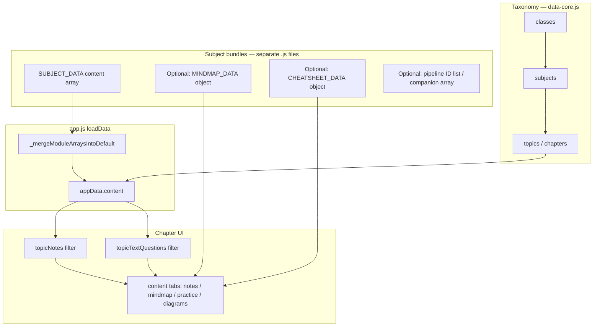

# StudyHub — Complete Feature Guide

**StudyHub** is a progressive web app (PWA) for **ICSE Class 8** students. It combines structured notes, exam-style practice, progress tracking, and Biology-specific revision tools (mind maps, cheat sheets, diagram MCQs, and one-word vocabulary drills).

**Live app:** https://drajays.github.io/class8/  
**Repository:** https://github.com/drajays/class8

---

## Table of contents

1. [Overview](#1-overview)
2. [Subjects and chapters](#2-subjects-and-chapters)
3. [Navigation and layout](#3-navigation-and-layout)
4. [Home dashboard](#4-home-dashboard)
5. [Chapter study modes](#5-chapter-study-modes)
6. [Notes and concepts](#6-notes-and-concepts)
7. [Practice questions](#7-practice-questions)
8. [Diagram MCQs (Biology)](#8-diagram-mcqs-biology)
9. [Mind maps (Biology)](#9-mind-maps-biology)
10. [Cheat sheets (Biology)](#10-cheat-sheets-biology)
11. [One-word vocabulary (Biology)](#11-one-word-vocabulary-biology)
12. [Practice quiz mode](#12-practice-quiz-mode)
13. [Quiz builder](#13-quiz-builder)
14. [Revision hub](#14-revision-hub)
15. [Progress, mastery, and analytics](#15-progress-mastery-and-analytics)
16. [Spaced repetition (SRS)](#16-spaced-repetition-srs)
17. [Daily goals and streaks](#17-daily-goals-and-streaks)
18. [Search](#18-search)
19. [Content management](#19-content-management)
20. [Import and export](#20-import-and-export)
21. [Theme, PWA, and offline](#21-theme-pwa-and-offline)
22. [Cross-linking between notes and questions](#22-cross-linking-between-notes-and-questions)
23. [Data architecture and regeneration](#23-data-architecture-and-regeneration)
24. [Biology content scale](#24-biology-content-scale)
25. [AI guide: adding a new subject](#25-ai-guide-adding-a-new-subject) — **read this before extending the app**

---

## 1. Overview

StudyHub is a single-page application that stores user progress locally in the browser. Content is bundled as JavaScript data modules and merged at load time. No server or login is required.

**Core capabilities:**

| Area | What it does |
|------|----------------|
| **Learn** | Collapsible notes with teacher tips and exam tips |
| **Practice** | MCQs, true/false, fill-in-the-blank, match, short answer |
| **Revise** | Mind maps, cheat sheets, one-word cards, diagram MCQs |
| **Track** | Coverage, accuracy, section heatmaps, mistakes, bookmarks |
| **Quiz** | Focused one-question-at-a-time sessions with SRS |

---

## 2. Subjects and chapters

### Class

- **Class 8** (expandable structure supports more classes via data)

### Subjects (6)

| Subject | Icon | Chapters |
|---------|------|----------|
| Physics | ⚛️ | 8 (Matter → Electricity) |
| Chemistry | 🧪 | 9 (Matter → Carbon compounds) |
| Biology | 🧬 | 9 (Transport in plants → Food production) |
| Geography | 🌏 | 8 |
| History | 📜 | 10 |
| Civics | ⚖️ | 4 |

### Biology chapters (richest content)

| ID | Chapter |
|----|---------|
| `bio-ch1` | Transportation in Plants |
| `bio-ch2` | Reproduction in Plants |
| `bio-ch3` | Reproduction in Humans |
| `bio-ch4` | Ecosystems |
| `bio-ch5` | Endocrine System & Adolescence |
| `bio-ch6` | The Circulatory System |
| `bio-ch7` | Nervous System |
| `bio-ch8` | Diseases and First Aid |
| `bio-ch9` | Food Production |

Mind maps, cheat sheets, and one-word cards are **fully built for Biology** (`bio-ch1` … `bio-ch9`). Physics and Chemistry have optional mind map / cheat sheet bundles; other subjects use Notes + Practice only unless you add Tier B assets (see [§25](#25-ai-guide-adding-a-new-subject)).

---

## 3. Navigation and layout

### Header bar

- **Logo** — returns to home via breadcrumb
- **Theme toggle** — light / dark mode (persisted)
- **Export** — download JSON backup
- **Import** — restore from JSON backup
- **Manage** — open content manager
- **Add New** — create notes or questions

### Sidebar

- **Search box** — full-text search across all content
- **Revision** — quick link to Revision Hub (with mistake count badge)
- **Class** — select class
- **Subjects** — appears after class is selected
- **Chapters** — appears after subject is selected; shows item count per chapter

### Breadcrumb

Shows path: Home → Class → Subject → Chapter (or Revision / Practice Quiz).

### Mobile

- Hamburger menu opens/closes sidebar
- Responsive grid layouts for cards, notes, and question lists
- Sticky chapter tabs on mobile scroll

### Subject accent colours

UI tint changes per subject (Physics purple, Biology pink, Chemistry green, etc.) via `data-subject` on the body.

---

## 4. Home dashboard

### Continue where you left off

Remembers the last opened chapter (`studyhub_last_topic` in localStorage) and offers a one-tap resume card.

### Learning journey row

| Card | Action |
|------|--------|
| **Mistake Book** | Opens Revision Hub → Mistakes |
| **Due Today** | Starts quiz from SRS queue, or opens empty Due tab |
| **Start Quiz** | Opens Quiz Builder |
| **Saved** | Opens Revision Hub → Bookmarks |

### Daily goal strip

- Target: **15 MCQs per day**
- Shows progress bar and **day streak** (consecutive days with at least one MCQ attempt)

### Progress dashboard

- **Accuracy ring** — overall % correct on attempted questions
- **Syllabus covered** — % of gradable questions tried at least once
- **Questions tried / Correct** — raw counts
- **Per-subject bars** — coverage and accuracy for each subject
- **Reset all** — clears all progress (with confirmation)

### Class selection

Grid of class cards showing subject count, chapter count, and total content items.

---

## 5. Chapter study modes

When you open a chapter, **study mode tabs** appear at the **top** (below the chapter title). Available tabs depend on subject and content:

| Tab | Label | Available for |
|-----|-------|---------------|
| Notes | 📝 Notes | All chapters |
| Mind Map | 🧠 Mind Map | Chapters with `*_MINDMAP_DATA[topicId]` (Biology, Physics, Chemistry when built) |
| Cheat Sheet | ⚡ Cheat Sheet | Chapters with `*_CHEATSHEET_DATA[topicId]` |
| One Word | 🔤 One Word | Chapters with `wordCards` in cheat sheet data (Biology: 30 cards) |
| Practice | ❓ Practice | All chapters (text questions) |
| Diagrams | 🖼️ Diagrams | Chapters with diagram MCQs (`image` field on questions) |

A hint line under the tabs lists available revision tools for Biology chapters.

### Chapter stat cards

Quick metrics and shortcuts:

| Stat | Description |
|------|-------------|
| Notes | Count of note sections |
| Text MCQs | MCQs excluding diagram-based |
| Diagram MCQs | Tap → opens Diagrams tab |
| ⚡ Cheat Sheet | Tap → opens Cheat Sheet tab |
| 🔤 One Word | Tap → opens One Word tab (shows 30) |
| Coverage | % of chapter questions attempted |
| Accuracy ↺ | % correct; tap to reset chapter progress |
| Mistakes | Tap → opens quiz from chapter mistakes |

### Section strength heatmap

Colour-coded pills per note section showing:

- Section name (shortened)
- Attempted / total questions linked to that section
- Accuracy % (green ≥80%, amber ≥50%, red below, grey if not tried)

### Practice Quiz button

Top-right **▶ Practice Quiz** opens Quiz Builder pre-filled for the current chapter (20 questions).

---

## 6. Notes and concepts

### Note structure

Each note includes:

| Field | Purpose |
|-------|---------|
| **Subtopic** | Section title |
| **Content** | Main explanation (supports `**bold**` markdown) |
| **Explanation** | Simpler restatement for students |
| **Teacher's Tip** | Teaching hint (green tip box) |
| **Exam Tip** | Exam-focused advice (accent tip box) |
| **Source chip** | `ICSE` for textbook-linked Biology sections |

### Note interactions

- **Collapse / expand** — click note header; chevron indicates state
- **Expand all / Collapse all** — toolbar above note list
- **📚 Advance Reading** — collapsible deeper material; add/edit with admin password (`1234`, set in `index.html` as `window.__STUDYHUB_ADMIN_PW`)
- **Test yourself bar** on every note:
  - **▶ Practice N linked MCQs** — via `linksTo` or `linkedQuestionIds` on the note
  - **→ MCQ / T/F / Fill / Q&A** — jump to a question of that type
- **Edit / Delete** — for user-created or all content (bundled items can be deleted locally)

### Note sorting

Notes are sorted by section number extracted from subtopic titles (e.g. "1.2 …" before "3. …").

### Expert revision note format (Physics & Biology)

Physics (`phy-s*`) and Biology (`bio-rev-*`) use a **uniform expert layout** rendered by `renderNoteMarkdown()` in `app.js`:

| Block | Purpose |
|-------|---------|
| **Executive summary** | 1–2 sentence overview |
| **Must know** | Exam-critical bullets |
| Body sections | Definitions, pathways, examples |
| **📊 Chart** | Comparison tables (markdown) |
| **Cornell cues** | Self-test prompts |
| **Definitions / Exam traps** | High-yield traps |
| **From linked questions** | Facts pulled from matched MCQs |
| **🔗 Links** | Prev/next note in chapter |

Biology revision notes live in `data/biology-revision-notes/ch*.json` → built to `biology-revision-notes.js`.  
Physics authored notes live in `data/physics-authored/` → built to `physics-neet.js`.

Legacy ICSE textbook sections (`source: "icse"`) may still exist in older banks but are **hidden** when a pipeline note set exists for that chapter.

---

## 7. Practice questions

### Question types

| Type | Interaction |
|------|-------------|
| **MCQ** | Tap option A–D; instant correct/wrong highlight |
| **True / False** | Tap True or False |
| **Fill in the blank** | Type answer, tap Check |
| **Match the following** | Column A vs shuffled Column B (display) |
| **Short / Long answer** | Show answer reveal |

### Practice tab features

- **Type filter tabs** — All, T/F, Fill, MCQ, Match, Short Answer (with counts)
- **Diagram MCQs excluded** — text practice is separate from Diagrams tab
- **Show Answer & Explanation** — expandable reveal with answer, tips, note link
- **🔖 Save** — bookmark for revision
- **▶ Practice** — single-question quiz session
- **↩ Back to Notes** — jump to linked section note
- **Source chip** — ICSE for textbook MCQs
- **Targeted re-render** — answering updates only that card (fast on 200+ question chapters)

### Progress recording

Every graded attempt records:

- Correct / wrong
- Timestamp
- Guessed flag (in quiz mode)
- SRS schedule update

---

## 8. Diagram MCQs (Biology)

**Location:** 🖼️ Diagrams tab (Biology chapters only)

### Content

- **312 diagram MCQs** from **104 textbook figures**
- **3 MCQs per figure** (NEET-style)
- Images stored in `/images/` (JPG)

### Layout

- Grouped by figure with caption heading
- Large hero image per figure
- **▶ Quiz this figure (3)** — mini-quiz for that diagram only
- **▶ Mixed diagram quiz** — 15 random diagram MCQs from the chapter

### Behaviour

- Diagram questions never appear in the main Practice tab
- Jumping to a diagram question from elsewhere opens the Diagrams tab
- Quiz Builder includes **Diagram MCQs** pool option

---

## 9. Mind maps (Biology)

**Location:** 🧠 Mind Map tab

### Purpose

Idea-connecting maps — **not** a mirror of note section titles. Shows how concepts relate across a chapter.

### Structure

- **14 mind maps** across 9 Biology chapters (large chapters split into parts)
- **Central hub** — chapter theme or part title
- **Idea flow strip** — ordered story (tap steps to highlight branches)
- **Idea hubs (branches)** — e.g. "Xylem ↑ vs Phloem ↓", "Root absorption"
- **Concept bullets** — definitions and connecting statements
- **Labeled link chips** — e.g. `water enters via → Root absorption`
- **📄 Note chips** — supporting section notes (multiple per hub)

### Interactions

- Tap branch → highlight + scroll
- Tap link chip → jump to related branch
- Tap 📄 note chip → open full section note
- Multi-part chapters: tabs switch between map parts (e.g. Food Production has 4 maps)

### Data source

Auto-generated from `notes.json` + curated themes in `biology8/chapters/mindmap_themes.json`.

---

## 10. Cheat sheets (Biology)

**Location:** ⚡ Cheat Sheet tab

### Purpose

High-yield **last-minute revision** — condensed exam-ready points.

### Sections per chapter

| Group | Content |
|-------|---------|
| 🧭 **Core story** | 8 big-picture bullets from mind-map themes |
| 📌 **Must-know definitions** | Top scored definitions (MCQ-weighted) |
| ⚖️ **Compare & contrast** | Xylem vs phloem, etc. |
| 🔄 **Pathways & processes** | Flow statements (from → to) |
| 🎯 **Exam quick hits** | Numbers, "only/always", key traps |

### Top 12 cram box

Highlighted box at top — **highest-yield one-liners** to read first.

### Actions

| Button | Action |
|--------|--------|
| **📋 Copy all** | Copies full cheat sheet as plain text |
| **🖨️ Print** | Opens print-friendly view |
| **▶ Quick quiz** | 15-question chapter quiz |

Linked lines tap through to the supporting section note.

---

## 11. One-word vocabulary (Biology)

**Location:** 🔤 One Word tab (30 cards per chapter)

### Purpose

Vocabulary drill — tap a **single word or short phrase** to reveal its definition.

### Layout

- **Reveal panel** at top — shows definition when a word is selected
- **Grid of 30 word buttons**
- Tap word → show meaning; tap again → hide
- Active word highlighted

### Actions

| Button | Action |
|--------|--------|
| **🔀 Shuffle** | Randomise card order |
| **📋 Show all** | Full term + definition list |
| **📄 Full notes** | Jump to source section (when linked) |

### Card selection

Auto-picked from chapter definitions, section titles, and key points — prioritising single-word terms and MCQ-linked sections. Exactly **30 cards** per Biology chapter.

---

## 12. Practice quiz mode

Focused **one question at a time** with instant feedback.

### Supported in quiz mode

- MCQ (4 options)
- True / False
- Fill in the blank

### Quiz UI

- Progress bar and "Question N of M"
- **🎲 Guessed** — mark uncertain answers (counted as mistakes even if correct)
- **🔖 Save / Saved** — bookmark during quiz
- Instant feedback with answer, teacher tip, exam tip
- **↩ Revise** — jump to linked note after answering
- **Next →** / **See results**

### Quiz completion

- Score ring (correct / total)
- Encouragement message based on score
- **Revise mistakes** — new quiz from wrong answers
- **Open Revision Hub**
- **Back to chapter** or Home

### Exit

**✕ Exit** — confirms before leaving; saves answers so far.

---

## 13. Quiz builder

**Open from:** Home, chapter header, Revision Hub, cheat sheet, diagram toolbar

### Question pools

| Pool | Description |
|------|-------------|
| **Chapter** | Text MCQs and objective questions for selected chapter |
| **Diagram MCQs** | Figure-based NEET questions |
| **Mistake Book** | Wrong and guessed answers |
| **Due Today** | Spaced revision queue |
| **Saved** | Bookmarked questions |

### Options

- **Chapter filter** — optional; all chapters if blank
- **Count** — 10, 20, 30, or 50 questions
- **Pool hint** — shows how many questions available

Questions are shuffled each session.

---

## 14. Revision hub

**Location:** Sidebar → 📕 Revision

### Tabs

| Tab | Contents |
|-----|----------|
| **Mistakes** | Wrong answers + guessed-but-correct |
| **Due Today** | SRS-scheduled reviews |
| **Saved** | Bookmarked questions |

### Each revision item shows

- Chapter name and badge (Wrong / Guessed / Review)
- Question preview (truncated)
- **↩ Back to Notes** — if linked
- **Retry** — single-question quiz
- **Remove** — for bookmarks only

### Actions

- **▶ Practice N now** — quick quiz (up to 20)
- **⚙️ Custom quiz** — opens Quiz Builder for that pool

---

## 15. Progress, mastery, and analytics

### Per-question progress (`studyProgress`)

Stored in localStorage for each question ID:

- `attempts`, `correct`, `wrong`
- `lastResult` — `correct` | `wrong`
- `guessed` — boolean
- `lastAttempt` — timestamp
- `nextReview` — SRS due date
- `srsLevel` — 0–4

### Chapter mastery

| Metric | Formula |
|--------|---------|
| **Coverage** | Attempted gradable questions ÷ total gradable |
| **Accuracy** | Correct ÷ attempted (excluding unattempted) |

### Subject and overall mastery

Aggregated from all chapters in subject / entire app.

### Accuracy colour bands

| Class | Accuracy |
|-------|----------|
| Good (green) | ≥ 80% |
| Mid (amber) | ≥ 50% |
| Low (red) | < 50% |
| None (grey) | Not attempted |

### Reset progress

- **Chapter** — tap Accuracy stat card in chapter view
- **All** — Home dashboard → Reset all

### Chapter cards (subject view)

Each chapter card shows:

- Notes, MCQs, diagram count, other questions
- Practiced N/total bar
- Accuracy pill

---

## 16. Spaced repetition (SRS)

When a question is answered incorrectly or marked **Guessed**:

- It enters the **Mistake Book**
- SRS schedule: review after **1, 3, 7, 14 days**
- Correct answers advance the level; wrong answers reset toward 1 day

**Due Today** tab and home card show questions whose `nextReview` ≤ today.

---

## 17. Daily goals and streaks

| Setting | Value |
|---------|-------|
| Daily MCQ goal | 15 |
| Streak | Consecutive calendar days with ≥1 recorded MCQ attempt |

Displayed on home dashboard goal strip.

---

## 18. Search

**Location:** Sidebar search box

- Debounced (160 ms) full-text search
- Searches: subtopic, note content, question text, answer text
- Results show note cards or question previews with chapter name
- Clears back to normal view when search box is emptied

---

## 19. Content management

### Add New (modal)

Create content for any class / subject / chapter:

- **Types:** Note, True/False, Fill blank, MCQ, Match, Short answer
- **Fields vary by type** — options for MCQ, pairs for match, blank answer, etc.
- **New topic** — type a new chapter name inline

### Manage (content manager)

Filter by class, subject, content type. List all items with edit/delete.

### Edit / Delete

Available on individual notes and questions. Deleted bundled content IDs are tracked in `deletedContentIds` so they don't reappear on data merge.

### User-created content

IDs matching `c-{timestamp}` are treated as user-created and preserved during taxonomy reconciliation.

---

## 20. Import and export

### Export

Downloads `studyhub_backup.json` containing:

- All classes, subjects, topics, content
- Progress, bookmarks, activity, deleted IDs
- Data version number

### Import

- Preview: counts of classes, subjects, topics, notes, questions
- **Replace all** — wipe and load file
- **Merge (smart)** — add new items only, no duplicates

Works in browser (localStorage) and NW.js desktop mode (reads/writes `data/studyhub_db.json`).

---

## 21. Theme, PWA, and offline

### Light / dark theme

- Toggle in header
- Persisted in `studyhub_theme`
- CSS variables switch via `data-theme` on `<html>`

### Progressive Web App

- `manifest.webmanifest` for install to home screen
- Service worker (`sw.js`) caches app shell
- **Network-first** for `.js`, `.html`, `.css`, `.json` (updates propagate quickly)
- **Cache-first** for other assets (images, etc.)
- **Version detection:** `version.json` + `BUILD` in `index.html` head (currently **v49**)
- Bump `BUILD`, all `?v=` query strings, `sw.js` `CACHE`, and `version.json` on every release

### Offline Mode tab (v49)

- **📡 Offline** entry in the sidebar (next to Mock Test / Revision) → `navigateTo('offline')` → `renderOfflineView()` in `app.js`
- Status dashboard: connection (live `online`/`offline` events), app-shell cache state, diagram images saved (X / 220), storage used (`navigator.storage.estimate()`)
- **Download all diagrams**: collects every `images/…` reference from `appData.content` (`collectOfflineImageUrls()`), fetches with 5 parallel workers into the `studyhub-media-v1` cache, with progress bar, stop/resume, retry of failures, and remove-downloads action
- Requests persistent storage (`navigator.storage.persist()`) on download so the browser won't evict it
- `studyhub-media-v1` cache **survives version bumps**: excluded from purges in `sw.js` activate, `index.html` boot recovery, and `runAppUpdate()` — diagrams are not re-downloaded after app updates
- Service worker routes runtime-fetched images into `studyhub-media-v1` (other assets stay in the versioned cache)
- Everything else (notes, questions, mind maps, cheat sheets, quizzes, mock tests, progress) already works offline because content ships inside the precached JS bundles

### Desktop (NW.js)

Optional desktop wrapper reads/writes JSON file on disk instead of localStorage.

---

## 22. Cross-linking between notes and questions

StudyHub is built around **note ↔ question** links:

| Direction | How |
|-----------|-----|
| Note → MCQs | "Practice linked MCQs" + type shortcuts |
| Question → Note | "↩ Back to Notes" / "↩ Revise" buttons |
| Mind map → Note | 📄 chips on idea hubs |
| Cheat sheet → Note | Tap linked definition line |
| One word → Note | 📄 Full notes button |
| Diagram MCQ → Note | Same as text MCQs via `linksTo` |

`jumpToNote` expands the target note and flashes it. `jumpToQuestion` opens the correct tab (Practice or Diagrams).

---

## 23. Data architecture and regeneration

### Runtime data model

StudyHub is a **static PWA**. All syllabus content ships as JavaScript arrays merged at load time into `appData`. User progress and edits are stored separately in **localStorage** (delta format — only user changes, not the full bank).

```
┌─────────────────────────────────────────────────────────────┐
│  DEFAULT_DATA (data-core.js)                                │
│    classes[] · subjects[] · topics[] · content[] (seed)     │
└──────────────────────────┬──────────────────────────────────┘
                           │ _mergeModuleArraysIntoDefault()
                           ▼
┌─────────────────────────────────────────────────────────────┐
│  + subject bundles (PHYSICS_NEET_DATA, BIOLOGY_REVISION_…,  │
│    CHEMISTRY_DATA, GEOGRAPHY_DATA, …)                       │
└──────────────────────────┬──────────────────────────────────┘
                           │ loadData() + localStorage delta
                           ▼
┌─────────────────────────────────────────────────────────────┐
│  appData — what the UI reads (notes, questions, taxonomy)   │
└─────────────────────────────────────────────────────────────┘
```

### Client-side script load order (`index.html`)

Scripts must load **before** `app.js`. Order matters only for merge side-effects; each bundle exports one global array or object.

| Script | Global exported | Role |
|--------|-----------------|------|
| `data-core.js` | `DEFAULT_DATA` | Taxonomy + legacy Physics Ch1–2 seed |
| `chapters3to8.js` | `CHAPTERS_3_TO_8` | Physics Ch3–8 legacy content |
| `physics-qbank.js` | `PHYSICS_QBANK` | Extra physics questions |
| `physics-neet.js` | `PHYSICS_NEET_DATA` | **Physics expert notes + MCQs** (`phy-s*`) |
| `physics-mindmaps.js` | `PHYSICS_MINDMAP_DATA` | Optional mind maps |
| `physics-cheatsheets.js` | `PHYSICS_CHEATSHEET_DATA` | Optional cheat sheets |
| `biology.js` | `BIOLOGY_DATA` | Legacy biology content |
| `biology-neet.js` | `BIOLOGY_NEET_DATA` | Legacy ICSE sections + diagram MCQs |
| `biology-olympiad.js` | `BIOLOGY_OLYMPIAD_IDS`, `BIOLOGY_OLYMPIAD_COMPANION` | **Curated Olympiad question bank** |
| `biology-revision-notes.js` | `BIOLOGY_REVISION_NOTES` | **Biology expert notes** (`bio-rev-*`) |
| `biology-mindmaps.js` | `BIOLOGY_MINDMAP_DATA` | Mind maps |
| `biology-cheatsheets.js` | `BIOLOGY_CHEATSHEET_DATA` | Cheat sheets + one-word cards |
| `chemistry.js` | `CHEMISTRY_DATA` | Chemistry notes + questions |
| `chemistry-neet.js` | `CHEMISTRY_NEET_DATA` | Extra chemistry bank |
| `chemistry-mindmaps.js` | `CHEMISTRY_MINDMAP_DATA` | Optional mind maps |
| `chemistry-cheatsheets.js` | `CHEMISTRY_CHEATSHEET_DATA` | Optional cheat sheets |
| `geography.js` | `GEOGRAPHY_DATA` | Geography content |
| `history-civics.js` | `HISTORY_CIVICS_DATA` | History + Civics content |
| `app.js` | — | Merge, UI, filters, progress |
| `exam-panel.js` | — | Mock test CBT UI |
| `github-sync.js` | — | Cloud sync for user edits |

Registration of a new bundle requires **three places**: `index.html` `<script>` tag, `sw.js` `ASSETS` array, and `app.js` → `_mergeModuleArraysIntoDefault()`.

### Merge rules (`loadData` in `app.js`)

| Rule | Behaviour |
|------|-----------|
| Bundled content | Merged by **unique `id`** into `DEFAULT_DATA.content` |
| User edits | Stored in localStorage delta; overrides bundled item with same `id` |
| `editedContentIds` | Tracks bundled IDs the user edited (synced to GitHub) |
| `deletedContentIds` | Bundled IDs hidden locally |
| `DATA_VERSION` | Currently **54** — bump when storage schema changes |
| Taxonomy | `_reconcileTaxonomy()` refreshes labels from `DEFAULT_DATA`; won't delete topics that have user `c-*` content |

### Build scripts (repo root `scripts/`)

| Script | Input | Output |
|--------|-------|--------|
| `build-physics-neet-authored.js` | `data/physics-authored/*.json` | `physics-neet.js` |
| `enrich-physics-notes-from-mcqs.js` | physics-authored + question JSON | Updates note `explanation` blocks |
| `build-biology-revision-notes.js` | `data/biology-revision-notes/ch*.json` | `biology-revision-notes.js` |
| `upgrade-biology-revision-notes.js` | same | Normalises notes to expert format |
| `build-biology-olympiad-app.js` | `data/biology-audit-selected-v2.json` | `biology-olympiad.js` |

External Python pipelines (optional, `biology8/` repo) still generate mind maps, cheat sheets, and diagram MCQs.

---

## 24. Biology content scale

| Asset | Count |
|-------|-------|
| NEET records (notes + questions) | ~2,219 |
| Text MCQs per major chapter | 200+ (Human Reproduction, Circulatory, etc.) |
| Diagram MCQs | 312 (104 figures × 3) |
| Mind maps | 14 maps, 55 idea hubs |
| Cheat sheet items | ~25–40 per chapter |
| One-word cards | 30 per chapter |
| Textbook images | 104 JPGs in `/images/` |

---

## Quick reference — where to find Biology revision tools

1. Open **Class 8 → Biology → any chapter**
2. At the **top**, use tabs or stat cards:

```
📝 Notes  |  🧠 Mind Map  |  ⚡ Cheat Sheet  |  🔤 One Word  |  ❓ Practice  |  🖼️ Diagrams
```

3. If tabs don't appear after an update: **hard refresh** the browser or reinstall the PWA (service worker cache may need updating).

---

---

## 25. AI guide: adding a new subject

> **Purpose:** This section is written for AI coding agents. Follow it end-to-end when adding a subject (e.g. Mathematics, Computer Science) so the subject appears in navigation, loads content correctly, and optional premium features (mind maps, pipeline filters) work.

### 25.1 Architecture in one diagram



### 25.2 Subject integration tiers

Pick the tier that matches how much content you are shipping.

| Tier | When to use | What you add |
|------|-------------|--------------|
| **A — Simple** | Starter subject, notes + mixed questions only (like Geography, History) | Taxonomy + one `SUBJECT_DATA` array + 3-file registration |
| **B — Standard+** | Rich subject with mind maps / cheat sheets (like Chemistry) | Tier A + `SUBJECT_MINDMAP_DATA` + `SUBJECT_CHEATSHEET_DATA` objects |
| **C — Pipeline** | Curated expert notes + separate question bank (like Physics, Biology) | Tier A + `app.js` topic ID set + `isSubjectTopic()` + note/question filter functions + build scripts |

**Default for a new subject:** start at **Tier A**. Upgrade to B/C only when you have structured assets ready.

### 25.3 Taxonomy — `data-core.js`

Every subject needs entries in `DEFAULT_DATA`:

```javascript
// 1. Subject (id must be lowercase slug, used everywhere)
{ id: "mathematics", classId: "class8", name: "Mathematics", icon: "📐", color: "mathematics" }

// 2. One topic per chapter (topicId referenced by all content items)
{ id: "math-ch1", subjectId: "mathematics", classId: "class8", name: "Chapter 1: Rational Numbers", icon: "🔢" }
```

**ID conventions (follow existing patterns):**

| Entity | Pattern | Examples |
|--------|---------|----------|
| Class | `class8`, `class9` | `class8` |
| Subject | short slug | `physics`, `biology`, `mathematics` |
| Topic / chapter | `{subject-prefix}-ch{n}` | `bio-ch1`, `chem-ch3`, `math-ch1` |
| Note (simple) | `{prefix}-c{n}n{m}` | `geo-c1n1` |
| Note (pipeline) | `{subject}-rev-ch{n}-{nn}` or `phy-s{n}-sec_{nn}` | `bio-rev-ch1-01`, `phy-s1-sec_01` |
| Question | `{prefix}-mcq{n}`, `-tf`, `-fb`, `-sa` | `ch1mcq1`, `b1kb-ar3` |
| User-created | `c-{timestamp}` | `c-1718123456789` |

**Rules:**

- Every content item **must** have `topicId` matching a topic in `DEFAULT_DATA.topics`.
- Content `id` values must be **globally unique** across all bundles.
- `subject.color` must match a CSS block in `styles.css` (see §25.8).

### 25.4 Content item schema

All items live in flat arrays. The `type` field drives rendering.

#### Note (`type: "note"`)

```javascript
{
  id: "math-ch1n01",
  topicId: "math-ch1",
  type: "note",
  subtopic: "1. Introduction to Rational Numbers",
  content: "**Executive summary:** …\n\n**Must know**\n• …",
  explanation: "**📊 Chart — …**\n| A | B |\n…",
  teacherTip: "Optional mnemonic",
  examTip: "Optional exam advice",
  source: "revision",           // optional: "revision" | "icse" | omit
  linkedQuestionIds: ["math-ch1-mcq1"],  // optional — powers ▶ Practice linked Qs
  linkedMcqCount: 1,            // optional — set by build script
  advanceReading: "Optional deeper text",  // optional — admin-editable in UI
}
```

#### MCQ (`type: "mcq"`)

```javascript
{
  id: "math-ch1-mcq1",
  topicId: "math-ch1",
  type: "mcq",
  subtopic: "Objective Questions",
  question: "Which of the following is a rational number?",
  options: ["√2", "π", "3/4", "√5"],
  correctOption: 2,               // 0-based index
  answer: "3/4 is rational because it can be written as p/q where q≠0.",
  linksTo: "math-ch1n01",         // optional — back-link to note
  teacherTip: "…",
  examTip: "…"
}
```

#### Other question types

| type | Required fields |
|------|-----------------|
| `true_false` | `question`, `correctAnswer` (`"true"`/`"false"`), `answer` |
| `fill_blank` | `question`, `blankAnswer`, `answer` |
| `match` | `question`, `pairs: [{left, right}, …]`, `answer` |
| `short_answer` | `question`, `answer` |

#### Diagram MCQ (Biology-style)

Any question with an `image` field (path under `/images/`) is treated as a diagram MCQ and routed to the **Diagrams** tab, not Practice.

```javascript
{ …, type: "mcq", image: "images/bio_ch6_heart.jpg", caption: "Fig 6.1 …" }
```

### 25.5 Tier A checklist — simple subject (copy for AI agents)

Use subject slug `mathematics` / prefix `math` as example. Replace with your subject.

- [ ] **1. Taxonomy** — Edit `data-core.js`:
  - Add subject to `DEFAULT_DATA.subjects`
  - Add all chapters to `DEFAULT_DATA.topics`
- [ ] **2. Content bundle** — Create `mathematics.js`:
  ```javascript
  const MATHEMATICS_DATA = [
    { id: "math-ch1n01", topicId: "math-ch1", type: "note", subtopic: "…", content: "…", explanation: "…" },
    { id: "math-ch1-mcq1", topicId: "math-ch1", type: "mcq", … },
    // …
  ];
  ```
- [ ] **3. Register merge** — Edit `app.js` → `_mergeModuleArraysIntoDefault()`:
  ```javascript
  typeof MATHEMATICS_DATA !== 'undefined' ? MATHEMATICS_DATA : null,
  ```
- [ ] **4. Register script** — Edit `index.html` (before `app.js`):
  ```html
  <script src="mathematics.js?v=48"></script>
  ```
  Bump `?v=` on **all** scripts when releasing.
- [ ] **5. Service worker** — Edit `sw.js` → add `'./mathematics.js'` to `ASSETS`; bump `CACHE` name.
- [ ] **6. Accent colour** — Edit `styles.css`:
  ```css
  [data-subject="mathematics"]{ --accent:#…; --accent-ink:#…; --accent-soft:rgba(…,.13); }
  [data-theme="dark"][data-subject="mathematics"]{ --accent:#…; }
  ```
- [ ] **7. Verify** — Open app → Class 8 → new subject → each chapter shows Notes + Practice tabs with content.
- [ ] **8. Release** — Bump `BUILD` in `index.html` head, `version.json`, `sw.js` cache, all `?v=` tags.

**No `app.js` filter changes needed for Tier A.** `topicNotes()` and `topicTextQuestions()` return all non-pipeline content for unknown subjects.

### 25.6 Tier B — mind maps and cheat sheets

Optional tabs appear automatically when data exists for the chapter `topicId`.

#### Mind map object (`SUBJECT_MINDMAP_DATA`)

```javascript
const MATHEMATICS_MINDMAP_DATA = {
  "math-ch1": {
    topicId: "math-ch1",
    chapterTitle: "Rational Numbers",
    center: "Short hub label",
    maps: [{
      id: "map-1",
      title: "Part title",
      center: "Map centre label",
      flow: [{ id: "step1", label: "Step label" }],
      branches: [{
        id: "branch1",
        title: "Branch title",
        bullets: ["Concept one", "Concept two"],
        links: [{ label: "relates to →", targetId: "branch2" }],
        noteRefs: [{ noteId: "math-ch1n01", label: "📄 Section 1" }]
      }]
    }]
  }
};
```

Copy structure from `biology-mindmaps.js`. Register file + global in merge (mind maps are **not** merged into `content[]` — they are read via `chapterMindmap()` in `app.js`).

#### Cheat sheet object (`SUBJECT_CHEATSHEET_DATA`)

```javascript
const MATHEMATICS_CHEATSHEET_DATA = {
  "math-ch1": {
    topicId: "math-ch1",
    title: "Rational Numbers — Cheat Sheet",
    topCram: ["One-liner 1", "One-liner 2"],
    sections: [
      { title: "Must-know definitions", items: [{ text: "…", noteId: "math-ch1n01" }] }
    ],
    wordCards: [{ term: "Rational", definition: "…", noteId: "math-ch1n01" }]
    // wordCards with length > 0 enables 🔤 One Word tab
  }
};
```

Extend `chapterMindmap()` / `chapterCheatSheet()` in `app.js` if you use a new global name (copy the Chemistry pattern).

### 25.7 Tier C — pipeline subject (Physics / Biology pattern)

Use when the subject has **two content layers** (legacy bank + curated expert bank) and you only want the curated set visible.

#### Step C1 — Topic ID registry (`app.js`)

```javascript
const MATHEMATICS_TOPIC_IDS = new Set(['math-ch1', 'math-ch2', …]);
function isMathematicsTopic(topicId) { return MATHEMATICS_TOPIC_IDS.has(topicId); }
```

#### Step C2 — Pipeline ID prefixes

```javascript
function isMathematicsPipelineNote(c) {
  return !!(c && c.id && String(c.id).startsWith('math-rev-'));
}
function isMathematicsPipelineQuiz(c) {
  if (!c || c.type === 'note') return false;
  if (String(c.id).startsWith('math-ol-')) return true;
  const ids = getMathematicsOlympiadIds(); // from MATHEMATICS_OLYMPIAD_IDS array
  return ids ? ids.has(c.id) : false;
}
```

#### Step C3 — Wire filters (mirror Biology)

Update these functions in `app.js`:

| Function | Add branch for new subject |
|----------|---------------------------|
| `topicNotes()` | Return only `isMathematicsPipelineNote(c)` when `isMathematicsTopic(topicId)` |
| `topicTextQuestions()` | Return only `isMathematicsPipelineQuiz(c)` |
| `diagramQuestions()` | If diagram MCQs use pipeline filter |
| `subjectMastery()` / `gradableQuestions()` | Include subject in physics/biology-style branches if using Olympiad bank |
| `chapterContentStats()` | Optional stats helper like `biologyContentStats()` |

#### Step C4 — Source JSON + build script

```
data/mathematics-revision-notes/ch1.json   ← array of notes
data/mathematics-audit-selected.json       ← curated questions (optional)
scripts/build-mathematics-revision-notes.js → mathematics-revision-notes.js
scripts/build-mathematics-olympiad-app.js   → mathematics-olympiad.js
```

Follow `scripts/build-biology-revision-notes.js` and `scripts/build-biology-olympiad-app.js` as templates.

#### Step C5 — Expert note format

Run content through the same sections as Physics/Biology (Executive summary, Must know, Chart, Cornell cues, traps, linked MCQs). Use `scripts/upgrade-biology-revision-notes.js` as a transformation reference.

### 25.8 UI integration points

| Concern | File | What to do |
|---------|------|------------|
| Sidebar subject list | auto | Appears when subject is in `appData.subjects` |
| Subject accent tint | `styles.css` | `[data-subject="your-id"]` CSS variables |
| Chapter tabs | `renderContent()` | Mind map / cheat sheet / one-word tabs appear if `chapterMindmap()` / `chapterCheatSheet()` return data |
| Practice linked Qs | `getQuestionsLinkedToNote()` | Works with `linksTo` on questions OR `linkedQuestionIds` on notes |
| Search index | auto | All `appData.content` is indexed |
| Mock test | `exam-panel.js` | Works with any gradable questions in `appData` |
| Cloud sync | `github-sync.js` | Syncs user edits only (delta), not full bank |

### 25.9 Files you must touch (summary table)

| File | Required for Tier A | Also for B | Also for C |
|------|---------------------|------------|------------|
| `data-core.js` | ✅ subjects + topics | | |
| `{subject}.js` | ✅ content array | | |
| `index.html` | ✅ script tag + BUILD bump | ✅ extra script tags | ✅ extra script tags |
| `sw.js` | ✅ ASSETS + CACHE bump | ✅ | ✅ |
| `app.js` `_mergeModuleArraysIntoDefault` | ✅ | ✅ mindmap/cheatsheet globals | ✅ filters + topic set |
| `styles.css` | ✅ accent colours | | |
| `version.json` | ✅ on release | ✅ | ✅ |
| `data/{subject}-…/*.json` | | optional | ✅ source of truth |
| `scripts/build-*.js` | | optional | ✅ |

### 25.10 What NOT to do

- **Do not** put the full question bank in localStorage — use bundled JS + delta edits only.
- **Do not** reuse content `id` values across subjects or chapters.
- **Do not** add a subject only to `index.html` without `_mergeModuleArraysIntoDefault()` — it will not appear in content.
- **Do not** forget to bump `BUILD` / `version.json` / `sw.js` CACHE — users will stay on stale cached bundles.
- **Do not** add pipeline filters unless you have pipeline-prefixed notes/questions — otherwise the chapter will look empty.
- **Do not** change `topicId` on existing content without updating every reference (`linksTo`, mind map `noteRefs`, etc.).

### 25.11 Verification script (manual)

After adding a subject, confirm:

1. Home → Class 8 → subject card shows correct chapter + item counts.
2. Each chapter → **Notes** tab lists notes sorted by section number.
3. Each chapter → **Practice** tab shows questions; filters work.
4. If Tier B: mind map / cheat sheet / one-word tabs render.
5. If Tier C: only pipeline notes/questions visible (legacy hidden).
6. ▶ Practice linked Qs works on at least one note.
7. Hard refresh / Update tab shows latest `BUILD`.

### 25.12 Example: minimal new subject skeleton

**`data-core.js`** (excerpt):

```javascript
{ id: "mathematics", classId: "class8", name: "Mathematics", icon: "📐", color: "mathematics" },
{ id: "math-ch1", subjectId: "mathematics", classId: "class8", name: "Chapter 1: Rational Numbers", icon: "🔢" },
```

**`mathematics.js`**:

```javascript
const MATHEMATICS_DATA = [
  {
    id: "math-ch1n01", topicId: "math-ch1", type: "note",
    subtopic: "1. Rational Numbers",
    content: "A **rational number** is any number that can be written as p/q …",
    explanation: "Think of fractions and integers on the number line.",
    teacherTip: "R = Q in short.", examTip: "0 is rational; write as 0/1."
  },
  {
    id: "math-ch1-mcq1", topicId: "math-ch1", type: "mcq",
    subtopic: "Objective Questions",
    question: "Which is rational?", options: ["√2", "π", "7/9", "√3"],
    correctOption: 2, answer: "7/9 = p/q.", linksTo: "math-ch1n01"
  }
];
```

**`app.js`** (`_mergeModuleArraysIntoDefault`):

```javascript
typeof MATHEMATICS_DATA !== 'undefined' ? MATHEMATICS_DATA : null,
```

Then register script + sw + CSS as in §25.5.

---

*Last updated: June 2026 — includes expert revision notes, advance reading, version.json updates (v48), and AI subject integration guide.*
