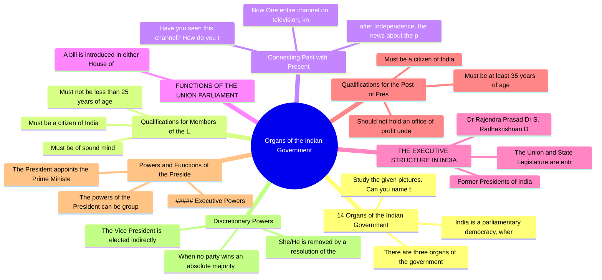

# Chapter 1: Organs of the Indian Government

## High-Yield Facts
- Study the given pictures. Can you name these Prime Ministers of India?
- India is a parliamentary democracy, where the supreme power resides with the people of the country. The Indian Constitution has declared India to be a Union of States. In India, power is distributed between the central and the state governments.
- There are three organs of the government of India.
- Must not be less than 25 years of age
- after Independence, the news about the proceedings of the Lok Sabha was transmitted through newspapers and radio. The radio typically broadcasted the morning and the evening Lok Sabha news.
- Now One entire channel on television, known as the Lok Sabha TV, focuses completely on the affairs of the Lok Sabha.
- Have you seen this channel? How do you think the media helps us to understand government affairs better?
- A bill is introduced in either House of the Parliament, if it is an ordinary bill. A bill is a draft of a proposed law presented to the Parliament for discussion. However, a money bill can only be introduced in the Lok Sabha. A bill goes through three stages of reading. In the first stage, the bill is introduced in the House. In the second stage, voting on the bill takes place after the debate. Then the bill is sent to the other House, where the same procedure is followed. In case of a money bill, the Rajya Sabha is given only 14 days to consider the bill. In the third stage, the bill is sent to the President for his assent. The President can either sign the bill or send it back for reconsideration to the House, where the bill was presented. When the President signs the bill, the bill becomes an Act.
- The Union and State Legislature are entrusted with the task of making laws. Similarly, the Union and State Executives are entrusted with the task of enforcing laws throughout the country. The Executive
- Dr Rajendra Prasad Dr S. Radhakrishnan Dr Zakir Husain
- Must be at least 35 years of age
- Should not hold an office of profit under the government—Centre, state or local level
- The powers of the President can be grouped under the following heads:
- The President appoints the Prime Minister, who is the leader of the single largest party in the Lok Sabha or the leader of the coalition that wins the elections.
- When no party wins an absolute majority in the Lok Sabha, the President can appoint the Prime Minister of her/his choice—a person, who she/he thinks, can command a majority in the House.
- The Vice President is elected indirectly by an electoral college consisting only of members from both Houses of Parliament. The term of office of Vice President is 5 years.
- She/He is removed by a resolution of the Rajya Sabha, passed by a majority of its members. It has to be agreed by the Lok Sabha.
- The Vice President, is the ex-officio Chairperson of the Rajya Sabha. She/He regulates debates and proceedings of the House. She/He decides the admissibility of resolutions and questions in the House in case of grave disorder. She/He heads various committees and coordinates their working.
- While the President is the $ \underline{\text{nominal or
- constitutional head}} \underline{\text{government}} $. The Prime Minister is the pivot on which the whole constitutional machinery runs.
- ##### Former Prime Ministers of India

## Notes (Expert Revision)
### 1. 14 Organs of the Indian Government

**Executive summary:** Study the given pictures. Can you name these Prime Ministers of India?

**Must know**
• Study the given pictures. Can you name these Prime Ministers of India?
• India is a parliamentary democracy, where the supreme power resides with the people of the country. The Indian Constitution has declared India to be a Union of States. In India, power is distributed between the central and the state governments.
• There are three organs of the government of India.
• Legislature—makes laws
• Judiciary—interprets the laws and checks the working of the legislature and executive
• Executive—executes the laws

Study the given pictures. Can you name these Prime Ministers of India?

India is a parliamentary democracy, where the supreme power resides with the people of the country. The Indian Constitution has declared India to be a Union of States. In India, power is distributed between the central and the state governments.

There are three organs of the government of India.

Legislature—makes laws

Judiciary—interprets the laws and checks the working of the legislature and executive

Executive—executes the laws

##### WHO MAKES OUR LAWS?

Legislature is a part of the government, which makes and amends laws. The Indian Parliament, known as the Sansad, is the law-making body at the central level. The state legislatures make laws at the state level. The legislature makes laws on subjects given in three lists—Union List, State List and Concurrent List (Refer to the table given on the next page).

### 2. Qualifications for Members of the Lok Sabha

**Executive summary:** Must be a citizen of India

**Must know**
• Must be a citizen of India
• Must not be less than 25 years of age
• Must be of sound mind
• Must not be bankrupt or convicted in any criminal case
• The term of the Lok Sabha is five years.
• The President has the power to dissolve the Lok Sabha before its term ends.

Must be a citizen of India

Must not be less than 25 years of age

Must be of sound mind

Must not be bankrupt or convicted in any criminal case

The term of the Lok Sabha is five years.

The President has the power to dissolve the Lok Sabha before its term ends.

The term of the House can be extended during the Proclamation of Emergency.

### 3. Connecting Past with Present

**Executive summary:** after Independence, the news about the proceedings of the Lok Sabha was transmitted through newspapers and radio. The radio typically broadcasted the morning and the evening Lok Sa

**Must know**
• after Independence, the news about the proceedings of the Lok Sabha was transmitted through newspapers and radio. The radio typically broadcasted the morning and the evening Lok Sabha news.
• Now One entire channel on television, known as the Lok Sabha TV, focuses completely on the affairs of the Lok Sabha.
• Have you seen this channel? How do you think the media helps us to understand government affairs better?
• ##### Sessions of the House
• A session means a period during which the House meets to conduct business.
• The two sessions of the Parliament are summoned by the President. However, 6 months must not lapse between two sessions.

after Independence, the news about the proceedings of the Lok Sabha was transmitted through newspapers and radio. The radio typically broadcasted the morning and the evening Lok Sabha news.

Now One entire channel on television, known as the Lok Sabha TV, focuses completely on the affairs of the Lok Sabha.

Have you seen this channel? How do you think the media helps us to understand government affairs better?

##### Sessions of the House

A session means a period during which the House meets to conduct business.

The two sessions of the Parliament are summoned by the President. However, 6 months must not lapse between two sessions.

The Speaker is the presiding officer of the Lok Sabha.

Lok Sabha conducts three sessions in a year, namely, the Budget Session, the Monsoon Session and the Winter Session.

### 4. FUNCTIONS OF THE UNION PARLIAMENT

**Executive summary:** A bill is introduced in either House of the Parliament, if it is an ordinary bill. A bill is a draft of a proposed law presented to the Parliament for discussion. However, a money 

**Must know**
• A bill is introduced in either House of the Parliament, if it is an ordinary bill. A bill is a draft of a proposed law presented to the Parliament for discussion. However, a money bill can only be introduced in the Lok Sabha. A bill goes through three stages of reading. In the first stage, the bill is introduced in the House. In the second stage, voting on the bill takes place after the debate. Then the bill is sent to the other House, where the same procedure is followed. In case of a money bill, the Rajya Sabha is given only 14 days to consider the bill. In the third stage, the bill is sent to the President for his assent. The President can either sign the bill or send it back for reconsideration to the House, where the bill was presented. When the President signs the bill, the bill becomes an Act.

A bill is introduced in either House of the Parliament, if it is an ordinary bill. A bill is a draft of a proposed law presented to the Parliament for discussion. However, a money bill can only be introduced in the Lok Sabha. A bill goes through three stages of reading. In the first stage, the bill is introduced in the House. In the second stage, voting on the bill takes place after the debate. Then the bill is sent to the other House, where the same procedure is followed. In case of a money bill, the Rajya Sabha is given only 14 days to consider the bill. In the third stage, the bill is sent to the President for his assent. The President can either sign the bill or send it back for reconsideration to the House, where the bill was presented. When the President signs the bill, the bill becomes an Act.

### 5. THE EXECUTIVE STRUCTURE IN INDIA

**Executive summary:** The Union and State Legislature are entrusted with the task of making laws. Similarly, the Union and State Executives are entrusted with the task of enforcing laws throughout the c

**Must know**
• The Union and State Legislature are entrusted with the task of making laws. Similarly, the Union and State Executives are entrusted with the task of enforcing laws throughout the country. The Executive
• Former Presidents of India
• Dr Rajendra Prasad Dr S. Radhakrishnan Dr Zakir Husain
• Dr Fakhruddin Ali Ahmed
• Dr A.P.J. Abdul Kalam
• Pratibha Devisingh Patil

The Union and State Legislature are entrusted with the task of making laws. Similarly, the Union and State Executives are entrusted with the task of enforcing laws throughout the country. The Executive

Former Presidents of India

Dr Rajendra Prasad Dr S. Radhakrishnan Dr Zakir Husain

Dr Fakhruddin Ali Ahmed

Dr A.P.J. Abdul Kalam

Pratibha Devisingh Patil

includes the Prime Minister, the President, the Governor and other ministers.

There are two sets of government in India—one at the Centre and the other at the state level. At the Centre, the Executive comprises the President, the Vice President, the Prime Minister and the Council of Ministers. At the state level, the Executive comprises the Governor, the Chief Minister and the Council of Ministers.

### 6. Qualifications for the Post of President

**Executive summary:** Must be a citizen of India

**Must know**
• Must be a citizen of India
• Must be at least 35 years of age
• Should not hold an office of profit under the government—Centre, state or local level
• Must be qualified to become a member of the Lok Sabha
• Rashtrapati Bhavan, New Delhi
• ##### Election and Removal

Must be a citizen of India

Must be at least 35 years of age

Should not hold an office of profit under the government—Centre, state or local level

Must be qualified to become a member of the Lok Sabha

Rashtrapati Bhavan, New Delhi

##### Election and Removal

The President is elected indirectly by an electoral college consisting of the Members of Parliament (MPs), and the Members of Legislative Assemblies (MLAs) of the states.

The President is elected for a period of five years. She/He can be re-elected for another term.

### 7. Powers and Functions of the President

**Executive summary:** The powers of the President can be grouped under the following heads:

**Must know**
• The powers of the President can be grouped under the following heads:
• ##### Executive Powers
• The President appoints the Prime Minister, who is the leader of the single largest party in the Lok Sabha or the leader of the coalition that wins the elections.
• The President also appoints the Council of Ministers on the advice of the Prime Minister.
• The President appoints and removes the high dignitaries of the states. They include , Comptroller
• and Auditor General of India, Governors of states, ambassadors, members of the Finance Commission and Union Public Service Commission, Chief Election Commissioner, and Chief Commissioner's of Union Territories.

The powers of the President can be grouped under the following heads:

##### Executive Powers

The President appoints the Prime Minister, who is the leader of the single largest party in the Lok Sabha or the leader of the coalition that wins the elections.

The President also appoints the Council of Ministers on the advice of the Prime Minister.

The President appoints and removes the high dignitaries of the states. They include , Comptroller

and Auditor General of India, Governors of states, ambassadors, members of the Finance Commission and Union Public Service Commission, Chief Election Commissioner, and Chief Commissioner's of Union Territories.

Judges of the Supreme Court and High Courts are also appointed by the President.

##### Military Powers

### 8. Discretionary Powers

**Executive summary:** When no party wins an absolute majority in the Lok Sabha, the President can appoint the Prime Minister of her/his choice—a person, who she/he thinks, can command a majority in the 

**Must know**
• When no party wins an absolute majority in the Lok Sabha, the President can appoint the Prime Minister of her/his choice—a person, who she/he thinks, can command a majority in the House.
• The Vice President is elected indirectly by an electoral college consisting only of members from both Houses of Parliament. The term of office of Vice President is 5 years.
• She/He is removed by a resolution of the Rajya Sabha, passed by a majority of its members. It has to be agreed by the Lok Sabha.
• The Vice President acts on behalf of the President under the following circumstances:
• If the President resigns
• If the President dies in

When no party wins an absolute majority in the Lok Sabha, the President can appoint the Prime Minister of her/his choice—a person, who she/he thinks, can command a majority in the House.

The Vice President is elected indirectly by an electoral college consisting only of members from both Houses of Parliament. The term of office of Vice President is 5 years.

She/He is removed by a resolution of the Rajya Sabha, passed by a majority of its members. It has to be agreed by the Lok Sabha.

The Vice President acts on behalf of the President under the following circumstances:

If the President resigns

If the President dies in

If the President is illness or , or any other reason

### 9. Powers and Functions of the Vice President

**Executive summary:** The Vice President, is the ex-officio Chairperson of the Rajya Sabha. She/He regulates debates and proceedings of the House. She/He decides the admissibility of resolutions and que

**Must know**
• The Vice President, is the ex-officio Chairperson of the Rajya Sabha. She/He regulates debates and proceedings of the House. She/He decides the admissibility of resolutions and questions in the House in case of grave disorder. She/He heads various committees and coordinates their working.

The Vice President, is the ex-officio Chairperson of the Rajya Sabha. She/He regulates debates and proceedings of the House. She/He decides the admissibility of resolutions and questions in the House in case of grave disorder. She/He heads various committees and coordinates their working.

### 10. Prime Minister

**Executive summary:** While the President is the $ \underline{\text{nominal or

**Must know**
• While the President is the $ \underline{\text{nominal or
• constitutional head}} \underline{\text{government}} $. The Prime Minister is the pivot on which the whole constitutional machinery runs.
• ##### Former Prime Ministers of India

While the President is the $ \underline{\text{nominal or

constitutional head}} \underline{\text{government}} $. The Prime Minister is the pivot on which the whole constitutional machinery runs.

##### Former Prime Ministers of India

## Mind Map

## Cheat Sheet

- Study the given pictures. Can you name these Prime Ministers of India?
- India is a parliamentary democracy, where the supreme power resides with the people of the country. The Indian Constitution has declared India to be a Union of States. In India, power is distributed between the central and the state governments.
- There are three organs of the government of India.
- Must not be less than 25 years of age
- after Independence, the news about the proceedings of the Lok Sabha was transmitted through newspapers and radio. The radio typically broadcasted the morning and the evening Lok Sabha news.
- Now One entire channel on television, known as the Lok Sabha TV, focuses completely on the affairs of the Lok Sabha.
- Have you seen this channel? How do you think the media helps us to understand government affairs better?
- A bill is introduced in either House of the Parliament, if it is an ordinary bill. A bill is a draft of a proposed law presented to the Parliament for discussion. However, a money bill can only be introduced in the Lok Sabha. A bill goes through three stages of reading. In the first stage, the bill is introduced in the House. In the second stage, voting on the bill takes place after the debate. Then the bill is sent to the other House, where the same procedure is followed. In case of a money bill, the Rajya Sabha is given only 14 days to consider the bill. In the third stage, the bill is sent to the President for his assent. The President can either sign the bill or send it back for reconsideration to the House, where the bill was presented. When the President signs the bill, the bill becomes an Act.
- The Union and State Legislature are entrusted with the task of making laws. Similarly, the Union and State Executives are entrusted with the task of enforcing laws throughout the country. The Executive
- Dr Rajendra Prasad Dr S. Radhakrishnan Dr Zakir Husain
- Must be at least 35 years of age
- Should not hold an office of profit under the government—Centre, state or local level
- The powers of the President can be grouped under the following heads:
- The President appoints the Prime Minister, who is the leader of the single largest party in the Lok Sabha or the leader of the coalition that wins the elections.
- When no party wins an absolute majority in the Lok Sabha, the President can appoint the Prime Minister of her/his choice—a person, who she/he thinks, can command a majority in the House.
- The Vice President is elected indirectly by an electoral college consisting only of members from both Houses of Parliament. The term of office of Vice President is 5 years.
- She/He is removed by a resolution of the Rajya Sabha, passed by a majority of its members. It has to be agreed by the Lok Sabha.
- The Vice President, is the ex-officio Chairperson of the Rajya Sabha. She/He regulates debates and proceedings of the House. She/He decides the admissibility of resolutions and questions in the House in case of grave disorder. She/He heads various committees and coordinates their working.
- While the President is the $ \underline{\text{nominal or
- constitutional head}} \underline{\text{government}} $. The Prime Minister is the pivot on which the whole constitutional machinery runs.
- ##### Former Prime Ministers of India

## One Word (30)

- **The Union and State Legislature** — The Union and State Legislature are entrusted with the task of making laws. Similarly, the Union and State Executives ar
- **The Vice President** — The Vice President is elected indirectly by an electoral college consisting only of members from both Houses of Parliame
- **The Vice President,** — The Vice President, is the ex-officio Chairperson of the Rajya Sabha. She/He regulates debates and proceedings of the Ho
- **While the President** — While the President is the $ \underline{\text{nominal or
- **after Independence, the** — after Independence, the news about the proceedings of the Lok Sabha was transmitted through newspape
- **Now One entire** — Now One entire channel on television, known as the Lok Sabha TV, focuses completely on the affairs o
- **Have you seen** — Have you seen this channel? How do you think the media helps us to understand government affairs bet
- **A bill is** — A bill is introduced in either House of the Parliament, if it is an ordinary bill. A bill is a draft
- **The Union and** — The Union and State Legislature are entrusted with the task of making laws. Similarly, the Union and
- **Dr Rajendra Prasad** — Dr Rajendra Prasad Dr S. Radhakrishnan Dr Zakir Husain
- **Must be at** — Must be at least 35 years of age
- **Should not hold** — Should not hold an office of profit under the government—Centre, state or local level
- **The powers of** — The powers of the President can be grouped under the following heads:
- **The President appoints** — The President appoints the Prime Minister, who is the leader of the single largest party in the Lok 
- **When no party** — When no party wins an absolute majority in the Lok Sabha, the President can appoint the Prime Minist
- **The Vice President** — The Vice President is elected indirectly by an electoral college consisting only of members from bot
- **She/He is removed** — She/He is removed by a resolution of the Rajya Sabha, passed by a majority of its members. It has to
- **The Vice President,** — The Vice President, is the ex-officio Chairperson of the Rajya Sabha. She/He regulates debates and p
- **While the President** — While the President is the $ \underline{\text{nominal or
- **constitutional head}} \underli** — constitutional head}} \underline{\text{government}} $. The Prime Minister is the pivot on which the 
- **##### Former Prime** — ##### Former Prime Ministers of India
- **Study the given** — Study the given pictures. Can you name these Prime Ministers of India?
- **India is a** — India is a parliamentary democracy, where the supreme power resides with the people of the country. 
- **There are three** — There are three organs of the government of India.
- **Must not be** — Must not be less than 25 years of age
- **after Independence, the** — after Independence, the news about the proceedings of the Lok Sabha was transmitted through newspape
- **Now One entire** — Now One entire channel on television, known as the Lok Sabha TV, focuses completely on the affairs o
- **Have you seen** — Have you seen this channel? How do you think the media helps us to understand government affairs bet
- **A bill is** — A bill is introduced in either House of the Parliament, if it is an ordinary bill. A bill is a draft
- **The Union and** — The Union and State Legislature are entrusted with the task of making laws. Similarly, the Union and
