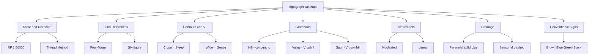

# Chapter 1: Interpreting Topographical Maps
## High-Yield Facts
- Topographical maps show relief and cultural features at large scale (e.g. 1:50,000).
- Survey of India (SOI) is India's national mapping agency.
- RF 1:50,000 means 1 cm on the map represents 50,000 cm (500 m) on the ground.
- Easting is read before northing in a grid reference.
- Four-figure grid references identify a 1 km square.
- Six-figure grid references locate a point within 100 m.
- Contour lines join points of equal height above mean sea level.
- Vertical Interval (VI) is the height difference between adjacent contours.
- Close contour lines indicate a steep slope.
- Widely spaced contours indicate a gentle slope.
- Concentric closed contours indicate a hill or mound.
- V-shaped contours pointing upstream indicate a valley.
- Contours bend upstream along valleys and downstream along spurs.
- A saddle or col appears as an hourglass-shaped contour between peaks.
- Index contours are thicker and labelled with elevation.
- Perennial rivers are shown with continuous blue lines.
- Seasonal streams are shown with dashed blue lines.
- Black symbols represent man-made (cultural) features.
- Brown lines represent relief (contours).
- Green shading commonly represents forest or vegetation.
- Nucleated settlements appear as dense clusters of building symbols.
- Linear settlements develop along roads, rivers, or coasts.
- Dispersed settlements show isolated buildings in farmland.
- Metalled roads are shown in red or black depending on importance.
- Magnetic declination is the angle between true north and magnetic north.
- Grid north is the direction of grid lines on the map.
- Representative Fraction has no units—the ratio is dimensionless.
- Larger-scale maps (smaller RF denominator) show more detail.
- Plateaus show widely spaced, nearly straight contours over large areas.
- Ridges show elongated contours bulging toward lower ground.

## Notes (Expert Revision)
### 1. What Are Topographical Maps?

**Executive summary:** Topographical maps show both natural relief and human features of an area using conventional signs, contours, and a grid system.

**Must know**
• Prepared by Survey of India (SOI) at scales like 1:50,000 and 1:25,000
• Show hills, valleys, rivers, roads, settlements, and vegetation
• Essential for planning, defence, trekking, and land-use studies
• Brown = relief (contours); blue = water; black = cultural features; green = vegetation

Topographical maps are large-scale maps that represent the **shape of the land (relief)** together with **cultural features** such as villages, roads, and railways.

Unlike small-scale atlas maps, toposheets allow you to measure distances, read heights, and identify landforms accurately. Survey of India publishes them with a standard legend so that users anywhere in the country can interpret them uniformly.

**Key skills:** reading scale, finding grid references, tracing contour patterns, and linking symbols to real-world features.

### 2. Map Scale and Measuring Distance

**Executive summary:** Scale expresses the ratio between map distance and ground distance; RF scale allows direct conversion using the map's stated unit.

**Must know**
• Representative Fraction (RF): 1:50,000 means 1 cm on map = 50,000 cm (500 m) on ground
• Statement scale: '2 cm to 1 km' is easy for quick mental conversion
• Measure curved routes along roads or rivers with thread/string, then scale off
• Larger denominator = smaller scale map (less detail per cm)

**RF scale** is written as 1:n where both sides use the same unit. For 1:50,000, multiply map cm by 50,000 to get ground cm (÷100,000 for km).

**Worked example:** 3.2 cm on a 1:25,000 map → 3.2 × 25,000 = 80,000 cm = 800 m.

Always check whether the question gives km, m, or cm—unit errors are the commonest mistake in map-scale sums.

### 3. Grid References and Eastings/Northings

**Executive summary:** The grid on SOI maps uses eastings (vertical lines, read first) and northings (horizontal lines) to give four-figure and six-figure references.

**Must know**
• Four-figure grid reference locates a 1 km square (e.g. 4523)
• Read easting first (45), then northing (23)—'along the corridor, up the stairs'
• Six-figure reference pinpoints 100 m within the square (e.g. 458237)
• Grid north may differ slightly from true/magnetic north—check map margin

To find a **four-figure reference** for a feature:
1. Identify the grid square it lies in.
2. Read the **easting** of the left grid line (first two digits).
3. Read the **northing** of the bottom grid line (last two digits).

For **six-figure** references, estimate tenths within the square: divide the square mentally into 10 parts along easting and northing.

### 4. Contour Lines and Vertical Interval

**Executive summary:** Contours are imaginary lines joining points of equal height; their spacing reveals slope steepness and landform type.

**Must know**
• Vertical Interval (VI): height difference between successive contours (given in map margin)
• Index contours are thicker and labelled with height
• Close contours = steep slope; wide spacing = gentle slope
• Contours never cross each other (except overhanging cliff—rare at this level)

Each brown contour line is a slice through the landscape at a fixed height. If VI = 20 m, adjacent contours differ by 20 m in elevation.

**Reading slope:** Measure horizontal distance between contours using scale—fewer metres between contours means steeper gradient.

**Hilltop:** Outermost closed loop is lowest; inner loops rise to the summit where contours may form small circles.

### 5. Landforms from Contour Patterns

**Executive summary:** Hills, valleys, ridges, spurs, cols, and plateaus each produce distinctive contour arrangements.

**Must know**
• Concentric closed contours → hill or mound
• V-shaped contours pointing uphill → valley (river in the V)
• U-shaped wide spacing → broad valley or plateau edge
• Saddle/col: hourglass shape between two peaks
• Uniform spacing on a line → ridge or escarpment

| Pattern | Landform |
|---------|----------|
| Closed concentric loops | Hill / Dome |
| V contours upstream | Valley |
| V pointing downhill | Spur |
| Elongated parallel contours | Ridge |
| Very wide flat contours | Plateau / Plain |

Rivers cut valleys so contours bend **upstream** into the valley. Spurs are ridges between valleys; their V points **downhill**.

### 6. Settlements and Land Use on Maps

**Executive summary:** Settlement patterns (nucleated, dispersed, linear) appear through building symbols and their relation to relief and transport.

**Must know**
• Nucleated: cluster of building symbols at crossroads or near water
• Dispersed: isolated huts scattered in agricultural areas
• Linear: buildings strung along a road, canal, or valley floor
• Dense black blocks may indicate urban areas or large villages

Settlements choose sites for **water, defence, transport, and fertile land**. On toposheets you infer:

- **Valley-floor villages** near perennial streams (perennial = solid blue line).
- **Linear settlements** along highways or railways (black/red lines).
- **Hill-top forts** or temples on concentric contours with track access.

Land use: yellow wash often shows cultivated land; green shading = forest or orchard (check legend).

### 7. Water Features and Drainage

**Executive summary:** Rivers, streams, tanks, and wells use blue symbols; drainage pattern reflects underlying geology and slope.

**Must know**
• Perennial rivers: solid blue lines; seasonal: dashed blue
• Tributaries join main rivers; contour V's point upstream
• Tanks/reservoirs shown with embankment symbol and water fill
• Dendritic, trellis, radial patterns indicate terrain structure

**Perennial** water flows year-round (important for settlement). **Seasonal** streams appear only in monsoon—dashed lines warn of dry beds.

Watershed divides separate drainage basins—often along ridges where contours form elongated highs. River gradient can be inferred from how quickly contours cross the blue line.

### 8. Conventional Signs and Map Marginal Information

**Executive summary:** SOI conventional signs standardise symbols for cultural and physical features; marginal information gives map metadata.

**Must know**
• Black: cultural (roads, buildings, names)
• Brown: relief contours
• Blue: hydrography
• Green: vegetation
• Red: major roads, grid numbers, sheet edges
• Margin shows scale, VI, magnetic declination, edition date

The **legend (conventional signs)** is your dictionary. Common exam symbols: cart track, metalled road, railway, post office, temple, bridge, embankment, sand area, marsh.

**Marginal information** includes:
- Sheet number and name
- RF scale and contour interval
- Magnetic north and grid north
- Co-ordinates of corners

Always read the margin before interpreting the body of the map.

## Mind Map

## Cheat Sheet

- SOI publishes India's standard topographical maps.
- RF 1:50,000 → 1 cm = 500 m on ground.
- Easting before northing in grid references.
- Four-figure = 1 km square; six-figure ≈ 100 m precision.
- VI = height between adjacent contours (read margin).
- Close contours = steep; wide = gentle.
- Concentric contours = hill; V uphill = valley.
- V downhill = spur; hourglass = saddle/col.
- Brown = relief; blue = water; green = vegetation; black = cultural.
- Perennial river = solid blue; seasonal = dashed blue.
- Nucleated = cluster; linear = along road/river; dispersed = scattered.
- Thread method for curved distances.
- Index contours are thick and numbered.
- Spot heights mark precise elevations.
- Larger scale (1:25,000) shows more detail than 1:50,000.
- Watershed divides drainage basins along ridges.
- Cross-section plots height along a transect line.
- Magnetic declination corrects compass to map north.
- Interpolation estimates height between contours.
- Conventional signs = national standard legend.
- Trellis drainage → folded rock; radial → central uplift.
- Tank bunds store water in drier regions.
- Bridges show river crossings and connectivity.
- Map edition date shows how current features are.
- Bench marks are survey elevation control points.

## One Word (30)

- **Topographical map** — Large-scale map showing relief and ground features using contours and conventional signs.
- **Survey of India** — National agency responsible for mapping and publishing SOI toposheets.
- **Representative Fraction** — Scale written as 1:n comparing map distance to ground distance in the same unit.
- **Easting** — East-west grid coordinate; read first in a grid reference.
- **Northing** — North-south grid coordinate; read second in a grid reference.
- **Contour line** — Line joining points of equal height above mean sea level.
- **Vertical Interval** — Height difference between successive contour lines on a map.
- **Index contour** — Thicker contour line labelled with elevation at regular intervals.
- **Spot height** — Precisely surveyed elevation marked at a specific point.
- **Bench mark** — Permanent survey reference point with known elevation.
- **Steep slope** — Terrain where contours are closely spaced.
- **Gentle slope** — Terrain where contours are widely spaced.
- **Valley** — Low ground between hills; contours form V shapes pointing upstream.
- **Spur** — Ridge extension between valleys; contour V points downhill.
- **Ridge** — Elongated high ground separating valleys or basins.
- **Saddle (Col)** — Low pass between two peaks; hourglass contour pattern.
- **Plateau** — Elevated flat area with widely spaced, nearly straight contours.
- **Watershed** — Divide separating one drainage basin from another.
- **Perennial river** — Stream flowing throughout the year; solid blue line on SOI maps.
- **Seasonal stream** — Watercourse flowing mainly in wet season; dashed blue line.
- **Nucleated settlement** — Buildings clustered at a central site such as a crossroads.
- **Dispersed settlement** — Isolated buildings spread across farmland.
- **Linear settlement** — Buildings arranged along a line such as a road or river.
- **Conventional signs** — Standard symbols and colours used on SOI maps.
- **Magnetic declination** — Angle between true north and magnetic north at a location.
- **Grid north** — Direction parallel to vertical grid lines on the map.
- **Cross-section** — Profile showing relief along a line between two map points.
- **Dendritic drainage** — Tree-like branching pattern on uniform slopes.
- **Trellis drainage** — Tributaries join main river at right angles on folded rock.
- **Radial drainage** — Streams flowing outward from a central high point.
