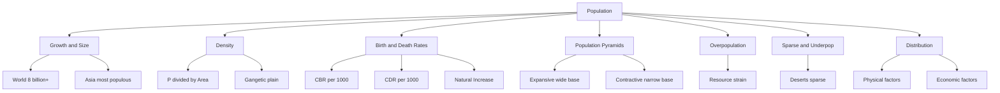

# Chapter 2: Population
## High-Yield Facts
- Population is the total number of people in an area at a given time.
- Population density = Total population ÷ Area (persons per sq km).
- Crude Birth Rate (CBR) = live births per 1,000 people per year.
- Crude Death Rate (CDR) = deaths per 1,000 people per year.
- Natural increase ≈ Birth rate − Death rate (per 1,000).
- Total population change = natural increase + net migration.
- Asia is the most populous continent.
- A population pyramid shows age and sex structure.
- Expansive pyramid: wide base, young population, high birth rate.
- Contractive pyramid: narrow base, ageing population, low birth rate.
- Overpopulation strains resources—not merely high numbers.
- Underpopulation means fewer people than resources can support efficiently.
- Sparse population occurs in deserts, mountains, and polar regions.
- Fertile river valleys attract dense settlement.
- Industrial and urban areas raise local density.
- Life expectancy has risen due to better health care.
- Infant mortality reflects quality of medical care.
- Family planning helps stabilise population growth.
- Education for women tends to lower birth rates.
- Net migration = immigrants − emigrants.
- Arithmetic density is the standard measure at school level.
- Bangladesh is among the world's most densely populated countries.
- Australia is large but sparsely populated overall.
- India's population concentrates in the northern plains.
- High density can exist without overpopulation if resources are adequate.
- Overpopulation may cause pollution and deforestation.
- Census counts population periodically in India.
- Demography is the statistical study of population.
- Ageing populations need more elderly care.
- Youthful populations need more schools and future jobs.

## Notes (Expert Revision)
### 1. World Population Growth

**Executive summary:** Human numbers have grown rapidly since industrialisation; most people live in Asia and Africa today.

**Must know**
• World population exceeded 8 billion in the 2020s
• Asia has the largest share of global population
• Growth rate is slowing in many countries but absolute numbers still rise
• Medical advances and better food supply reduced death rates
• Distribution is uneven—dense belts vs sparsely settled regions

**Population** is the total number of people living in a country or region at a given time.

For centuries growth was slow. After the **Industrial Revolution**, improved **health care**, **sanitation**, and **agriculture** lowered death rates while birth rates stayed high—causing rapid increase.

Today patterns differ: Japan and parts of Europe grow slowly; many African nations still grow quickly. **India** and **China** are among the world's most populous countries.

### 2. Population Density

**Executive summary:** Population density compares how many people live per unit area, usually per square kilometre.

**Must know**
• Formula: Density = Total Population ÷ Area (sq km)
• High density: Bangladesh, Netherlands, Gangetic plain of India
• Low density: Sahara, Amazon interior, Siberia, interior Australia
• High density does not always mean overpopulation
• Arithmetic density is the standard school-level measure

**Population density** = Population ÷ Area.

**Example:** 50 million people in 100,000 sq km → 50,000,000 ÷ 100,000 = **500 persons/sq km**.

Factors raising density: fertile soil, water, flat land, jobs, good transport.
Factors lowering density: deserts, mountains, extreme cold or heat, lack of water.

### 3. Birth Rate and Death Rate

**Executive summary:** Birth rate and death rate measure live births and deaths per 1,000 people per year.

**Must know**
• Crude Birth Rate (CBR): live births per 1,000 population per year
• Crude Death Rate (CDR): deaths per 1,000 population per year
• Rates are per 1,000, not percentages at this level
• Developing countries often have higher CBR than developed countries
• Better health care lowers CDR and raises life expectancy

**Crude Birth Rate** counts live births yearly per 1,000 people.
**Crude Death Rate** counts deaths yearly per 1,000 people.

Related measures: **infant mortality rate** (deaths under age one per 1,000 live births) and **life expectancy** (average years a person is expected to live).

### 4. Natural Increase and Growth Rate

**Executive summary:** Natural increase equals birth rate minus death rate and drives population change before migration.

**Must know**
• Natural Increase ≈ Birth Rate − Death Rate (per 1,000)
• Positive natural increase means population grows without migration
• Negative natural increase means deaths exceed births
• Total change = natural increase + net migration
• Net migration = immigrants minus emigrants

**Natural increase** = CBR − CDR.

Example: CBR 22, CDR 7 → natural increase = **15 per 1,000** (about 1.5% per year).

**Total population change** = Natural increase + Net migration.

### 5. Population Pyramids

**Executive summary:** Age-sex pyramids show how a population is distributed across age groups and gender.

**Must know**
• Males usually on left, females on right, by age cohorts
• Broad base → high birth rate, young population (expansive)
• Narrow base → low birth rate, ageing population (contractive)
• Bulge in middle may reflect past baby boom or migration
• Used to plan schools, jobs, health care, and pensions

| Pyramid shape | Meaning |
|---------------|---------|
| Wide base, narrow top | Young, fast-growing population |
| Even columns | Stable growth |
| Narrow base, wide top | Ageing, slow or declining growth |

**Expansive** pyramids need more schools; **contractive** pyramids need elderly care.

### 6. Overpopulation and Its Effects

**Executive summary:** Overpopulation occurs when people exceed the carrying capacity of an area, straining resources.

**Must know**
• Depends on resources, not numbers alone
• Pressure on food, water, housing, jobs, and sanitation
• Environmental stress: pollution, deforestation, waste
• Urban slums and congestion in megacities
• Solutions include education, family planning, and sustainable development

**Overpopulation** = too many people relative to **available resources**.

**Effects:** unemployment, overcrowded schools/hospitals, pollution, loss of green cover, water stress.

**Solutions:** family planning, girls' education, better farming, planned cities, conservation.

### 7. Underpopulation and Sparse Population

**Executive summary:** Underpopulation means too few people to use resources efficiently; sparse areas have very low density.

**Must know**
• Underpopulation: labour shortage, underused farmland or minerals
• Sparse population: few people over vast area (deserts, tundra)
• Causes: harsh climate, poor soil, remoteness, lack of water
• Australia and Canada are large but relatively underpopulated
• Governments may encourage settlement in resource-rich sparse areas

**Sparse population** = low density due to difficult physical conditions.

**Underpopulation** = population smaller than the area's **resource potential**.

Examples: **Sahara**, **Amazon interior**, **Ladakh**, **Siberia**.

### 8. Population Distribution and Factors

**Executive summary:** People are unevenly spread; physical and human factors explain clustering and empty lands.

**Must know**
• Dense on fertile plains, river valleys, and coasts
• Sparse in mountains, deserts, and polar regions
• Industry and trade pull people to urban centres
• Transport, history, and government policy also matter
• India's density is highest in the northern plains

**Physical factors:** climate, relief, soil, water, vegetation.

**Human factors:** farming, industry, trade, policy, migration.

**India:** dense along Ganga-Brahmaputra and coastal plains; lower in arid Rajasthan and high Himalayas.

## Mind Map

## Cheat Sheet

- Density = Population ÷ Area (persons/sq km).
- CBR = live births per 1,000/year.
- CDR = deaths per 1,000/year.
- Natural increase = CBR − CDR.
- Total change = natural increase + net migration.
- Asia = most populous continent.
- Expansive pyramid = wide base, young population.
- Contractive pyramid = narrow base, ageing.
- Overpopulation = exceeds resources.
- Sparse = deserts, mountains, polar lands.
- Fertile river valleys = dense settlement.
- Census in India every 10 years.
- Demography = study of population.
- Family planning stabilises growth.
- Girls' education lowers birth rates.
- Infant mortality reflects health care.
- Life expectancy = average years lived.
- Bangladesh = very high density.
- Australia/Canada = large but sparse.
- Gangetic plain = India's dense core.
- Youth bulge needs jobs and schools.
- Ageing society needs elderly care.
- Net migration = immigrants − emigrants.
- Carrying capacity = sustainable limit.
- Population explosion = rapid post-1950 growth.

## One Word (30)

- **Population** — Total number of people living in a defined area at a given time.
- **Population density** — Number of people per unit area, usually per square kilometre.
- **Crude Birth Rate** — Live births per 1,000 population in one year.
- **Crude Death Rate** — Deaths per 1,000 population in one year.
- **Natural increase** — Excess of births over deaths; CBR minus CDR per 1,000.
- **Population pyramid** — Graph showing population by age group and sex.
- **Expansive pyramid** — Wide base pyramid of a young, fast-growing population.
- **Contractive pyramid** — Narrow base pyramid of an ageing, slow-growing population.
- **Overpopulation** — Too many people relative to available resources and services.
- **Underpopulation** — Too few people to use available resources efficiently.
- **Sparse population** — Very few people spread over a large area.
- **Demography** — Statistical study of human population.
- **Census** — Official periodic count of population and its characteristics.
- **Life expectancy** — Average number of years a person is expected to live.
- **Infant mortality rate** — Deaths of infants under one year per 1,000 live births.
- **Net migration** — Number of immigrants minus number of emigrants.
- **Growth rate** — Percentage change in population over a period, usually a year.
- **Carrying capacity** — Maximum population an environment can sustain adequately.
- **Population distribution** — Pattern of where people live across a region.
- **Arithmetic density** — Total population divided by total land area.
- **Age cohort** — Group of people born in the same time period.
- **Youth bulge** — Unusually large proportion of young people in a population.
- **Ageing population** — Rising share of elderly people in total population.
- **Family planning** — Voluntary regulation of number and spacing of children.
- **Population explosion** — Very rapid increase in world population after mid-20th century.
- **Stationary pyramid** — Pyramid with roughly equal cohorts indicating stable population.
- **Vital rates** — Birth and death rates measuring natural population change.
- **Emigrant** — Person who leaves their country to live elsewhere.
- **Immigrant** — Person who enters a country to live permanently or long-term.
- **Gangetic plain** — Fertile, densely populated region of northern India.
