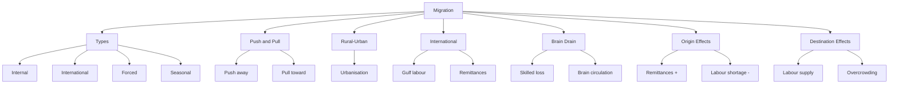

# Chapter 3: Migration
## High-Yield Facts
- Migration is movement across a boundary to settle temporarily or permanently.
- Internal migration stays within one country; international crosses borders.
- Emigration = leaving a country; Immigration = entering a country.
- Push factors drive people away from origin.
- Pull factors attract people to destination.
- Rural-urban migration is the main stream in developing countries.
- Remittances are money sent home by migrants.
- Brain drain = emigration of highly skilled workers.
- Refugees migrate due to war, persecution, or disaster—forced migration.
- Seasonal migration follows harvest or tourism seasons.
- Net migration = immigrants − emigrants.
- Chain migration occurs when earlier migrants sponsor relatives.
- Gulf countries attract many South Asian labour migrants.
- India is a major remittance-receiving country.
- Urbanisation is accelerated by rural-urban migration.
- Young adults migrate more than elderly.
- Counter-urbanisation = movement from city to countryside (developed nations).
- Illegal migration lacks official documents or visas.
- Diaspora = community living outside homeland.
- Brain circulation = skilled return migration with new expertise.
- Migration affects age and sex structure of both regions.
- Slums often grow when urban migration outpaces housing.
- Government visas regulate international migration.
- IDPs are displaced within their own country.
- Economic migration seeks better jobs and wages.
- Social migration joins family or community abroad.
- Environmental migration follows drought, flood, or sea-level rise.
- Mumbai and Delhi grew partly through in-migration.
- Kerala has high emigration and remittance inflows.
- Balanced regional development can reduce excessive migration pressure.

## Notes (Expert Revision)
### 1. What Is Migration?

**Executive summary:** Migration is the movement of people from one place to another to settle temporarily or permanently.

**Must know**
• Differs from daily commuting or short visits
• Can be internal (within country) or international (across borders)
• May be voluntary or forced
• Temporary migrants include seasonal workers and refugees in camps
• Permanent migrants change long-term residence

**Migration** means crossing a defined boundary to live elsewhere. It is a major component of **population change** along with births and deaths.

**Internal migration** moves people within the same country (e.g. village to city).
**International migration** crosses national borders (e.g. India to UAE for work).

Migration reshapes population distribution, culture, economy, and cities.

### 2. Types of Migration

**Executive summary:** Migration is classified by distance, direction, duration, and cause.

**Must know**
• Rural to urban (most common in developing countries)
• Urban to rural (counter-urbanisation in some developed areas)
• International labour migration and student migration
• Forced migration: refugees fleeing war or persecution
• Seasonal migration for harvest or tourism work

| Type | Example |
|------|---------|
| Internal | Bihar to Delhi for work |
| International | Nurse from Kerala to UK |
| Voluntary | Job or education |
| Forced | Refugees from conflict |
| Seasonal | Farm labour during harvest |

**Emigration** = leaving a country; **Immigration** = entering a country.

### 3. Push and Pull Factors

**Executive summary:** People leave places due to push factors and are attracted by pull factors.

**Must know**
• Push: unemployment, poverty, war, famine, natural disaster
• Pull: jobs, higher wages, education, safety, better services
• Push and pull work together in migration decisions
• Family links and chain migration reinforce movement
• Government policy can push or pull (restrictions or incentives)

**Push factors** drive people **away** from origin (lack of jobs, drought, conflict).

**Pull factors** attract people **toward** destination (factories, universities, peace).

Example: A farmer migrates from drought-hit village (**push**) to city for construction work (**pull**).

### 4. Rural-Urban Migration

**Executive summary:** Movement from villages to towns and cities is the dominant migration stream in India and much of the developing world.

**Must know**
• Causes: lack of rural jobs, low farm income, drought, better city services
• Young adults migrate most frequently
• Results in urbanisation and growth of slums if housing lags
• Remittances sent home support rural families
• Cities gain labour but face congestion and pressure on water

**Rural-urban migration** fuels **urbanisation**. Migrants seek **manufacturing**, **services**, and **education**.

**Positive:** labour supply, remittances, cultural exchange.
**Negative:** overcrowding, inadequate housing, strain on transport and sanitation.

Planning **affordable housing** and **rural development** can balance flows.

### 5. International Migration

**Executive summary:** People cross borders for work, study, family reunion, or asylum.

**Must know**
• Gulf countries attract construction and service workers from South Asia
• Developed countries attract skilled professionals and students
• Remittances are major income for countries like India and Philippines
• Border controls, visas, and passports regulate movement
• Diaspora communities maintain cultural ties abroad

**International migrants** face **passport/visa** rules. **Labour migration** to the **Gulf** and **West** is significant for India.

**Remittances** = money sent home by migrants—supports families and national foreign exchange.

**Brain drain** (next topic) is a special form of skilled international emigration.

### 6. Brain Drain

**Executive summary:** Brain drain is the emigration of highly educated and skilled workers from their home country.

**Must know**
• Doctors, engineers, IT professionals, and scientists often move abroad
• Causes: better pay, research facilities, quality of life, political stability
• Origin country loses skilled human capital
• Destination country gains expertise cheaply
• Brain gain possible when migrants return with skills (brain circulation)

**Brain drain** hurts developing nations that invest in education but lose graduates to richer countries.

**India** sees IT professionals and nurses migrate to the USA, UK, Canada, and Gulf.

**Solutions:** better jobs at home, research funding, return incentives, and diaspora engagement.

### 7. Impacts of Migration on Origin

**Executive summary:** Sending areas experience population loss, remittances, and social change.

**Must know**
• Population decreases, especially working-age adults and males
• Remittances reduce poverty and fund education
• Left-behind elderly and children face care challenges
• Skilled emigration slows development (brain drain)
• Some villages become 'empty' of youth

**Origin areas** lose workers but may gain **money** and **ideas**.

**Positive:** remittances, new skills when migrants return, reduced local unemployment pressure.
**Negative:** labour shortage in farms, separated families, loss of educated youth.

### 8. Impacts of Migration on Destination

**Executive summary:** Receiving areas gain labour and diversity but may face integration and infrastructure challenges.

**Must know**
• Labour supply for industry, construction, and services
• Cultural diversity and new cuisines, festivals, ideas
• Pressure on housing, schools, and hospitals if rapid
• Sometimes social tension or competition for jobs
• Migrants fill jobs locals may not want (3D jobs: dirty, dangerous, difficult)

**Destination regions** grow faster with migrant labour. **Cities** like Mumbai, London, and Dubai depend on migrants.

**Challenges:** slums, discrimination, language barriers, illegal migration issues.

**Policy:** registration, work permits, and inclusive urban planning help manage impacts.

## Mind Map

## Cheat Sheet

- Migration = move across boundary to settle.
- Internal = within country; international = across borders.
- Emigrant leaves; immigrant arrives.
- Push = leave (poverty, war, drought).
- Pull = attract (jobs, education, safety).
- Rural-urban = main stream in India.
- Remittances = money sent home.
- Brain drain = skilled emigration.
- Refugees = forced migration.
- Seasonal = temporary harvest work.
- Net migration = immigrants − emigrants.
- Kerala = high remittances.
- Gulf = major labour destination.
- Chain migration follows relatives.
- IDP = displaced inside country.
- Counter-urbanisation = city to rural.
- Voluntary vs forced migration.
- Diaspora = community abroad.
- Brain circulation = skilled return.
- Slums linked to rapid urban in-migration.
- Passport/visa regulate international moves.
- 3D jobs = dirty, dangerous, difficult.
- Origin gains remittances, loses labour.
- Destination gains workers, may overcrowd.
- Balance rural development to reduce drift.

## One Word (30)

- **Migration** — Movement of people across a boundary to settle temporarily or permanently.
- **Emigration** — Leaving one's country to live in another.
- **Immigration** — Entering a foreign country to settle.
- **Internal migration** — Movement within the same country.
- **International migration** — Movement across national borders.
- **Push factor** — Condition that drives people away from an area.
- **Pull factor** — Condition that attracts people to an area.
- **Rural-urban migration** — Movement from countryside to towns and cities.
- **Remittance** — Money earned by migrants and sent to family at home.
- **Brain drain** — Emigration of highly educated and skilled workers.
- **Brain circulation** — Return of skilled migrants bringing new knowledge home.
- **Refugee** — Person forced to flee country due to war or persecution.
- **Forced migration** — Movement compelled by danger or disaster, not free choice.
- **Voluntary migration** — Movement chosen freely for better opportunities.
- **Seasonal migration** — Temporary move linked to seasons, e.g. harvest labour.
- **Net migration** — Immigrants minus emigrants in a period.
- **Diaspora** — Community of people living outside their homeland.
- **Chain migration** — Migration encouraged by relatives already at destination.
- **Counter-urbanisation** — Movement from cities to rural or small-town areas.
- **IDP** — Internally Displaced Person—forced to move within own country.
- **Asylum** — Protection granted to refugees by another country.
- **Visa** — Official permission to enter or stay in a country.
- **Work permit** — Legal authorisation for a foreigner to work in a country.
- **Illegal migration** — Crossing borders or working without proper documents.
- **Step migration** — Movement to destination in stages through intermediate places.
- **Labour migration** — Movement primarily to find employment.
- **Environmental migration** — Movement caused by natural disasters or climate hazards.
- **Emigrant** — Person who leaves their country of origin.
- **Immigrant** — Person who arrives to live in a new country.
- **3D jobs** — Dirty, dangerous, and difficult jobs often filled by migrants.
