# Chapter 4: Urbanization
## High-Yield Facts
- Urbanization = rising share of population living in urban areas.
- Rural-urban migration is the main driver in developing countries.
- Push factors: poverty, drought, few rural jobs.
- Pull factors: jobs, education, healthcare, city lifestyle.
- Industrialisation concentrates factories and workers in cities.
- Megacity = over 10 million urban inhabitants.
- Mumbai, Delhi, Kolkata are Indian megacities.
- Slums = overcrowded informal settlements with poor services.
- Dharavi in Mumbai is a famous large slum area.
- Urban areas contribute a major share of national GDP.
- Congestion and traffic jams waste time and fuel.
- Air pollution from vehicles and industry harms health.
- Solid waste and sewage need proper municipal management.
- Urban sprawl consumes farmland around city edges.
- Informal sector employs many migrant workers.
- Smart Cities Mission targets technology-enabled efficient cities.
- Master plans guide zoning of residential and commercial land.
- Metro rail and BRT reduce private car dependence.
- Affordable housing schemes address shelter shortages.
- PMAY supports housing for economically weaker sections.
- SDG 11 promotes sustainable cities and communities.
- Green buildings use less energy and water.
- Public parks reduce heat and improve mental health.
- Circular migration: temporary city work with rural return.
- Step migration moves through intermediate towns.
- Urbanization increases demand for water and electricity.
- Gated communities highlight urban inequality.
- Slum rehabilitation provides alternative housing.
- Tier-2 cities can reduce pressure on megacities.
- Sustainable urbanization balances growth and environment.
- Census defines urban areas by population and administration.
- Natural increase in cities also adds to urban growth.

## Notes (Expert Revision)
### 1. What Is Urbanization?

**Executive summary:** Urbanization is the growth in the proportion of people living in towns and cities, driven by rural-urban migration and natural increase in urban areas.

**Must know**
• Urban population share rises as villages shrink relatively
• Linked closely to industrialisation and economic development
• UN defines urban areas by population size, density, and governance
• India's urban population is over 35% and rising
• Megacities like Mumbai and Delhi exceed 10 million people

**Urbanization** means more people living in **urban** (city/town) areas compared with **rural** (village) areas.

It happens when:
1. **Rural-urban migration** brings workers to cities.
2. **Natural increase** (births minus deaths) is higher in cities.
3. **Redefinition** of settlements as towns when they grow.

Urban life offers jobs, education, and services—but also congestion, pollution, and housing pressure.

### 2. Causes of Urbanization

**Executive summary:** Push factors in villages and pull factors in cities together explain why people move and why urban areas expand.

**Must know**
• Industrialisation creates factory and service jobs in cities
• Better schools, hospitals, and transport attract migrants
• Rural poverty, land fragmentation, and drought push people out
• Trade, ports, and government offices concentrate in urban centres
• Mechanisation in farming reduces rural labour demand

### Push factors (rural)
- Limited jobs beyond farming
- Drought, floods, or small landholdings
- Poor schools and health facilities

### Pull factors (urban)
- Higher wages and diverse employment
- Universities, entertainment, and urban lifestyle
- Hope for upward social mobility

### Other drivers
**Colonial and modern planning** placed railways, mills, and capitals in cities. **Globalisation** expanded IT, finance, and logistics hubs.

### 3. Rural-Urban Migration and Urban Growth

**Executive summary:** Migration from countryside to city is the main engine of urbanization in developing countries like India.

**Must know**
• Young adults migrate most for work and education
• Step migration may pass through small towns first
• Circular migration: workers visit city seasonally then return home
• Women increasingly migrate for domestic and garment work
• Inter-state migration feeds metros like Mumbai and Bengaluru

**Rural-urban migration** shifts labour to construction, transport, domestic service, and factories.

**Effects on villages:** remittances help families, but labour shortage and left-behind children are social costs.

**Effects on cities:** workforce expands, but if housing and water lag, **slums** and overcrowding appear.

Urban planners track migration streams to forecast demand for schools, buses, and hospitals.

### 4. Impacts of Urbanization — Positive

**Executive summary:** Cities drive economic growth, innovation, and better access to services when managed well.

**Must know**
• Economies of scale in industry and services
• Skilled jobs in IT, finance, health, and education
• Better hospitals, universities, and transport networks
• Cultural exchange, museums, and media hubs
• Higher productivity and tax revenue for development

### Economic benefits
Urban areas contribute a **large share of GDP** with factories, offices, and ports. Specialised workers and infrastructure raise **productivity**.

### Social benefits
Access to **schools, colleges, specialist doctors**, and emergency services is usually better than in remote villages.

### Innovation
Cities concentrate talent—research labs, startups, and creative industries flourish through **agglomeration** (clustering).

### 5. Impacts of Urbanization — Negative

**Executive summary:** Rapid unplanned urbanization brings slums, pollution, traffic, crime, and strain on water and sanitation.

**Must know**
• Slums lack secure tenure, clean water, and drainage
• Air and noise pollution from vehicles and industry
• Traffic jams and long commutes waste time and fuel
• Solid waste and sewage overwhelm municipal systems
• Social inequality between gated communities and poor settlements

### Environmental stress
More vehicles and factories → **smog**, greenhouse gases, and heat islands.

### Housing crisis
When migrants arrive faster than affordable homes are built, **squatter settlements** spread on marginal land.

### Infrastructure gap
Pipes, power lines, and buses may serve planned colonies but not informal areas.

**Urban sprawl** eats farmland around city edges without proper planning.

### 6. Slums and Urban Housing

**Executive summary:** Slums are densely populated informal settlements lacking adequate services; they grow when low-income migrants cannot afford formal housing.

**Must know**
• Dharavi (Mumbai) is one of Asia's largest slum areas
• Kutcha houses, narrow lanes, shared taps and toilets
• Informal sector jobs sustain many slum households
• Eviction and redevelopment remain sensitive policy issues
• Affordable housing schemes aim to reduce homelessness

A **slum** typically has overcrowding, poor sanitation, and insecure land rights—but also vibrant **informal economies**.

**Causes:** rural migration + high land prices + weak rental laws.

**Government responses:**
- **Slum rehabilitation** (new flats for residents)
- **PMAY** (Pradhan Mantri Awas Yojana) for affordable homes
- **Regularisation** of services where relocation is impossible

Sustainable cities must upgrade slums **in situ** where possible rather than only demolishing them.

### 7. Smart Cities and Urban Planning

**Executive summary:** Smart cities use technology, efficient transport, and citizen services to make urban life sustainable; master plans guide land use and infrastructure.

**Must know**
• India's Smart Cities Mission (2015) targets 100 cities
• ICT for traffic control, e-governance, and utility monitoring
• Mixed land use, metro rail, and bus rapid transit (BRT)
• Master plans zone residential, commercial, and green areas
• Disaster-ready drainage and earthquake-resistant buildings

### Smart city ingredients
- **Digital infrastructure** (broadband, sensors)
- **Efficient mobility** (metros, cycling lanes, pedestrian zones)
- **Clean energy and waste management**
- **Participatory governance** (citizen feedback apps)

### Urban planning tools
**Master plans**, **zoning laws**, and **building bye-laws** control height, density, and open spaces.

Without planning, cities grow **haphazardly**—smart planning prevents future crises.

### 8. Sustainable Urban Development

**Executive summary:** Sustainable cities balance growth with clean environment, social equity, and resources for future generations.

**Must know**
• SDG 11: make cities inclusive, safe, resilient, and sustainable
• Green buildings, solar power, and rainwater harvesting
• Public transport reduces fuel use and air pollution
• Urban green spaces and parks improve health and climate
• Decentralised jobs in tier-2 cities reduce megacity pressure

### Sustainability pillars
| Pillar | Urban action |
|--------|----------------|
| Economic | Green jobs, local enterprises |
| Social | Affordable housing, safe streets for all |
| Environmental | Waste recycling, clean rivers, low-carbon transport |

### Strategies
- **Compact cities** instead of endless sprawl
- **Transit-oriented development** near metro stations
- **Wetland and forest protection** within city regions
- **Regional planning** linking towns in clusters

Urbanization will continue—**sustainability** decides whether it becomes opportunity or crisis.

## Mind Map

```mermaid
flowchart TB
  ROOT[Urbanization]
  ROOT --> DEF[Definition]
  ROOT --> CAUSE[Causes]
  ROOT --> MIGRATE[Migration Link]
  ROOT --> POS[Positive Impacts]
  ROOT --> NEG[Negative Impacts]
  ROOT --> SLUM[Slums Housing]
  ROOT --> SMART[Smart Cities]
  ROOT --> SUST[Sustainability]
  DEF --> SHARE[Rising urban share]
  CAUSE --> PUSH[Push from rural]
  CAUSE --> PULL[Pull to city]
  CAUSE --> IND[Industrialisation]
  MIGRATE --> RU[Rural-urban stream]
  MIGRATE --> CIRC[Circular migration]
  POS --> GDP[Economic growth]
  POS --> SERV[Better services]
  NEG --> POLL[Pollution congestion]
  NEG --> SPRAWL[Urban sprawl]
  SLUM --> DAR[Dharavi example]
  SLUM --> PMAY[Affordable housing]
  SMART --> ICT[Digital governance]
  SMART --> METRO[Metro BRT]
  SUST --> SDG[SDG 11]
  SUST --> GREEN[Parks green buildings]
```

## Cheat Sheet

- Urbanization = rising urban population proportion.
- Main driver: rural-urban migration + city jobs.
- Push: poverty, drought, few rural jobs.
- Pull: wages, schools, hospitals, lifestyle.
- Megacity = 10+ million people.
- Mumbai, Delhi = Indian megacities.
- Slums = informal, overcrowded, poor services.
- Dharavi = major Mumbai slum case study.
- Urban sprawl = city spreads into farmland.
- Air pollution from traffic and industry.
- Congestion wastes time and fuel.
- Cities contribute large share of GDP.
- Informal sector = unregulated urban jobs.
- Smart Cities Mission: tech + efficient services.
- Master plan = long-term land-use blueprint.
- Zoning separates residential/commercial/industrial.
- Metro and BRT improve public transport.
- PMAY = affordable housing scheme.
- Slum rehabilitation upgrades shelters.
- SDG 11 = sustainable cities goal.
- Green buildings save energy and water.
- Urban parks reduce heat island effect.
- Tier-2 cities reduce metro pressure.
- Transit-oriented development near stations.
- Sustainable cities balance economy, society, environment.

## One Word (30)

- **Urbanization** — Increase in the proportion of population living in urban areas.
- **Urban area** — Town or city with dense population and non-agricultural economy.
- **Rural area** — Countryside with villages and mainly agricultural livelihoods.
- **Megacity** — Metropolitan area with more than 10 million inhabitants.
- **Metropolis** — Large principal city serving as a regional economic and cultural hub.
- **Rural-urban migration** — Movement of people from villages to towns and cities.
- **Push factor** — Condition in origin that drives people toward cities.
- **Pull factor** — Urban advantage that attracts migrants.
- **Slum** — Overcrowded informal settlement lacking adequate basic services.
- **Squatter settlement** — Housing built without legal land ownership or planning permission.
- **Informal sector** — Urban economic activity outside full government regulation.
- **Urban sprawl** — Unplanned low-density expansion of city into surrounding areas.
- **Suburb** — Residential area on the outskirts of a central city.
- **Commute** — Regular travel between home and workplace, often causing congestion.
- **Congestion** — Overcrowding of roads with slow traffic movement.
- **Air pollution** — Harmful substances in urban air from vehicles and industry.
- **Heat island** — Urban area significantly warmer than nearby rural land.
- **Master plan** — Official long-term blueprint for city land use and infrastructure.
- **Zoning** — Legal division of city into residential, commercial, and industrial zones.
- **Smart city** — City using technology and data for efficient sustainable services.
- **Smart Cities Mission** — Indian programme to develop 100 technology-enabled urban centres.
- **E-governance** — Delivery of government services through digital platforms.
- **BRT** — Bus Rapid Transit system with dedicated lanes and fast stations.
- **Metro rail** — Urban electric railway for high-capacity mass transport.
- **Transit-oriented development** — Compact mixed-use growth centred on public transport hubs.
- **PMAY** — Pradhan Mantri Awas Yojana—affordable housing scheme for poor families.
- **Slum rehabilitation** — Project replacing or upgrading informal settlements with better housing.
- **SDG 11** — UN goal to make cities inclusive, safe, resilient, and sustainable.
- **Sustainable urbanization** — City growth managed to protect environment and social equity.
- **Primate city** — Dominant city much larger than the next biggest in a country.
