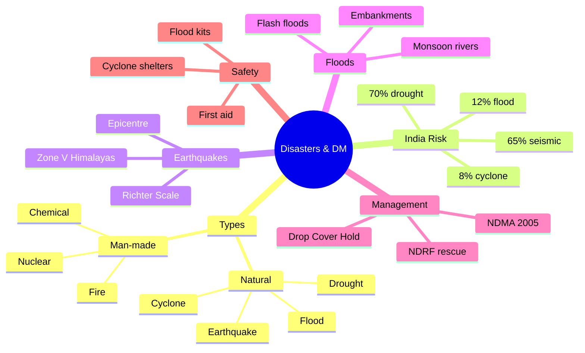

# Chapter 5: Disasters & Disaster Management
## High-Yield Facts
- Disasters cause loss of life, injury, infrastructure damage, livelihood loss, psychological trauma and disease outbreaks.
- Natural disasters arise from natural forces; man-made disasters from human error or intent.
- Hybrid disasters combine human action with natural forces—e.g., deforestation causing landslides.
- About 65% of India's land area is vulnerable to earthquakes.
- About 12% of India is flood-prone; 8% cyclone-prone; 70% drought-prone.
- Earthquakes are studied through seismology and recorded by seismographs.
- Earthquake intensity is measured on the Richter Scale.
- The epicentre is where surface effects are strongest.
- Himalayan belt = Seismic Zone V (very high risk).
- Kachchh and Ganga-Brahmaputra basin = Seismic Zone IV.
- Earthquakes result from tectonic plate collisions along faults.
- Riverine floods mainly occur during south-west monsoon overflow.
- Major flood-prone rivers: Brahmaputra, Ganga, Yamuna, Mahanadi.
- Flash floods can follow dam breaches, cloudbursts or sudden snow melt.
- Cyclones are low-pressure systems over warm oceans with winds up to 300 km/h.
- India's coastline is about 7,516.6 km—vulnerable to Bay of Bengal and Arabian Sea cyclones.
- Cyclone-vulnerable states: West Bengal, Odisha, Andhra Pradesh, Tamil Nadu.
- Drought = prolonged rainfall deficit; about 30% of India is drought-prone.
- Drought-prone states include Rajasthan, Gujarat, MP, Maharashtra, Karnataka, Odisha.
- Bhopal gas tragedy (1984): methyl isocyanate leak from Union Carbide factory.
- Chernobyl nuclear accident occurred in 1986 in Ukraine (former USSR).
- Disaster Management Act passed in 2005; established NDMA.
- NDMA is the apex body for disaster policy and coordination in India.
- Earthquake safety indoors: Drop, Cover, Hold.
- Flood prevention includes embankments, flood shelters and early warning systems.
- Retrofitting strengthens old buildings against seismic shocks.
- NDRF teams assist in rescue and relief operations nationwide.
- School disaster management protects students and maintains education continuity.
- Developing countries suffer more from disasters due to weaker preparedness systems.
- Kerala floods (2018) and Assam floods (2020) affected over 5 million people each.

## Notes (Expert Revision)
### 1. What Are Disasters?

**Executive summary:** Disasters are sudden or slowly developing events causing massive damage to life, property, infrastructure and the environment.

**Must know**
• Unexpected events causing physical damage or drastic environmental change
• Can be sudden (earthquake, cyclone) or slow-onset (drought)
• Long-term impact on society, environment and economy
• Broadly natural or man-made; hybrid disasters combine both
• Loss of life, injury, infrastructure damage, livelihood loss, disease outbreaks

Disasters are unexpected events that cause significant physical damage or destruction to life and property, or result in a drastic change in the environment. While earthquakes, volcanic eruptions, wildfires and hurricanes happen suddenly, droughts may develop slowly and intensify over time. Disasters have long-term impacts on society, the environment and the economy of affected regions. They may have geological, geographical or human causes. Natural disasters include floods, cyclones, earthquakes and droughts; man-made disasters include industrial accidents, transport crashes, terrorism and nuclear incidents. Hybrid disasters arise when human actions amplify natural hazards—for example, deforestation leading to landslides during heavy rain.

### 2. Natural vs Man-made Disasters

**Executive summary:** Natural disasters arise from natural forces; man-made disasters result from human action, error or negligence.

**Must know**
• Natural: caused by natural factors; often large-scale devastation
• Man-made: caused by human error, carelessness or intent
• Natural examples: earthquakes, floods, cyclones, droughts, tsunamis
• Man-made examples: fires, chemical leaks, nuclear accidents, terrorism
• Developing countries suffer more due to weaker disaster-management systems

Natural disasters are events caused by natural forces with major effects on population, infrastructure and biodiversity. Man-made disasters result from human acts—intentionally or unintentionally. Unintentional examples include gas leaks from factories and electrical fires; intentional examples include nuclear warfare. Natural disasters often occur suddenly with little warning, while some man-made crises may give signals. India is highly disaster-prone: about 65% of land area is vulnerable to earthquakes, 12% to floods, 8% to cyclones and 70% to drought. Underdeveloped countries face greater suffering because preparedness and relief systems are weaker.

### 3. Earthquakes — Causes, Zones and Measurement

**Executive summary:** Earthquakes are sudden crustal movements measured on the Richter scale; India has five seismic zones with the Himalayas in Zone V.

**Must know**
• Sudden violent movement of Earth's crust due to plate collision
• Studied through seismology; recorded by seismographs
• Intensity measured on Richter Scale; epicentre faces maximum damage
• Himalayan belt = Seismic Zone V (very high risk)
• Kachchh and Ganga-Brahmaputra basin = Zone IV

An earthquake is a sudden, violent movement of a portion of the Earth's crust caused by disturbance beneath the surface. The study of earthquakes is seismology; seismographs record shocks. The Richter Scale measures magnitude. The epicentre is the point on the surface where effects are strongest. Earth's crust consists of interlocking tectonic plates floating on the mantle; collisions produce vibrations. Poorly constructed buildings collapse first. The entire Himalayan belt lies on the boundary of the Eurasian and Indian plates (Seismic Zone V). Kachchh (Gujarat) and the Ganga-Brahmaputra basin are in Zone IV. Major recent earthquakes include Bhuj (2001), Sikkim (2011), Nepal (2015) and Assam (2021).

### 4. Floods — Causes, Effects and Prevention

**Executive summary:** Floods occur when excess water submerges land; in India, monsoon riverine floods dominate the Indo-Gangetic and Brahmaputra plains.

**Must know**
• Sudden influx of water submerges land and threatens life and property
• Riverine floods from monsoon overflow of Brahmaputra, Ganga, Yamuna, Mahanadi
• Also caused by dam breach, cyclonic storm surges, flash floods
• Removes fertile topsoil; spreads water-borne diseases
• Prevention: embankments, flood shelters, early warning, evacuation plans

A flood occurs when a sudden influx of water submerges land. Riverine floods during the south-west monsoon affect low-lying river basins most severely. The Brahmaputra, Ganga, Yamuna, Mahanadi and Punjab rivers cause major floods. Flash floods result from dam breaches, cloudbursts or sudden snow melt. Floods wash away fertile topsoil, damage crops and property, and force migration. Kerala (2018) and Assam (2020) saw catastrophic flooding affecting millions. Prevention includes maintaining dykes and embankments, establishing flood shelters, stockpiling dry food and medicines, and heeding IMD warnings. Residents should switch off electrical mains, store valuables at height and avoid wading without a stick.

### 5. Cyclones and Droughts

**Executive summary:** Cyclones are intense low-pressure systems over warm seas; droughts are prolonged rainfall deficits affecting agriculture and livelihoods.

**Must know**
• Cyclones: low-pressure systems with winds up to 300 km/h over warm oceans
• India's 7,516.6 km coastline vulnerable in Bay of Bengal and Arabian Sea
• Worst-affected states: West Bengal, Odisha, Andhra Pradesh, Tamil Nadu
• Drought: prolonged insufficient rainfall; 30% of India is drought-prone
• Rajasthan, Gujarat, MP, Maharashtra, Karnataka, Odisha face water scarcity

Cyclones form over warm ocean waters as swirling low-pressure systems with heavy rain, huge waves and violent winds (up to 300 km/h). Storm surges during high tide cause enormous coastal damage. India's long coastline faces severe cyclones from both the Bay of Bengal and Arabian Sea. Droughts result from prolonged rainfall shortage, leading to falling water tables, crop failure, fodder scarcity and migration. Deforestation, groundwater misuse and unscientific farming worsen droughts. About 30% of India's land is drought-prone. Floods and droughts often occur in the same year in different regions, bringing epidemics and human suffering.

### 6. Man-made Disasters — Fires, Chemical and Nuclear

**Executive summary:** Fires, chemical leaks and nuclear accidents cause localized but intense devastation, often preventable through regulation and safety drills.

**Must know**
• Fires: poor wiring, gas leaks, carelessly discarded matches; Uphaar tragedy (1997)
• Chemical disasters: toxic gas release—Bhopal methyl isocyanate leak (1984)
• Nuclear disasters: weapons (Hiroshima, Nagasaki) or reactor accidents (Chernobyl 1986)
• Radiation causes long-term cancers and genetic damage
• Prevention: building codes, industrial safety audits, emergency drills

Man-made disasters include fires, chemical leaks, biological hazards, transport and industrial accidents. Fires often result from faulty electrical wiring, gas leaks or carelessness—the Uphaar cinema fire (Delhi, 1997) showed how crowded spaces with few exits multiply casualties. The Bhopal gas tragedy (1984) from methyl isocyanate leakage killed about 2,500 people with effects spanning generations. Nuclear disasters may be intentional (Hiroshima, Nagasaki—'Little Boy' and 'Fat Man') or accidental (Chernobyl, 1986). Radioactivity causes nausea, cancer and long-term genetic harm. During nuclear emergencies, people should stay indoors with doors and windows closed until official evacuation.

### 7. Disaster Management — Framework and Importance

**Executive summary:** Disaster management covers preparedness, response and recovery before, during and after disasters to minimise suffering and damage.

**Must know**
• Overall preparedness to handle and manage affected regions and people
• Phases: mitigation, preparedness, response, recovery
• Government, NGOs, Red Cross, UN agencies, Army and police coordinate relief
• School disaster management: protect students, ensure education continuity, safety culture
• Community-level stockpiles of food, medicine and shelter material essential

Disaster management is the overall preparedness to handle disasters and efficiently manage affected regions and people. It involves plans before, during and after disasters to reduce suffering and damage. In developing countries like India, the poor suffer most, making prior planning critical. The government sets up dedicated departments, allocates relief funds, installs early-warning systems and runs awareness programmes. NGOs, the Red Cross, UN agencies, police and Army assist in rescue and rehabilitation. Schools should conduct earthquake and fire drills, teach first aid, and maintain evacuation plans. Region-specific communities must keep emergency kits ready.

### 8. NDMA, Safety Measures and Preparedness

**Executive summary:** The Disaster Management Act 2005 created NDMA; safety measures include Drop-Cover-Hold, flood kits, cyclone shelters and retrofitting.

**Must know**
• Disaster Management Act 2005 → NDMA and State DMAs
• NDMA: highest policy body for disaster plans and coordinated response
• Earthquake indoors: Drop, Cover, Hold under sturdy furniture
• Flood safety: heed warnings, switch off mains, store essentials, avoid snake bites
• NDRF teams deployed for rescue (e.g., Himachal floods 2023)

The Government of India enacted the Disaster Management Act in 2005, creating the National Disaster Management Authority (NDMA) and State Disaster Management Authorities. NDMA coordinates mitigation and response and formulates national policies and guidelines. During earthquakes, indoors: drop, cover and hold; outdoors: move to open ground away from buildings and power lines. Old buildings should be retrofitted. Flood-prone residents should maintain food, water and medicines, block toilets with sandbags, and follow IMD alerts. NDRF (National Disaster Response Force) teams assist in rescue operations. Fire safety requires checking wiring, gas pipelines and having fire extinguishers. Preparedness saves more lives than post-disaster relief alone.

## Mind Map

## Cheat Sheet

- Disaster = unexpected event causing major damage to life, property or environment.
- Natural: earthquakes, floods, cyclones, droughts, tsunamis, landslides.
- Man-made: fires, chemical leaks, nuclear accidents, transport crashes, terrorism.
- Hybrid: human action + natural trigger (deforestation → landslide).
- India: 65% earthquake, 12% flood, 8% cyclone, 70% drought vulnerable.
- Seismology + seismographs; Richter Scale = magnitude; epicentre = surface max damage.
- Zone V = Himalayas; Zone IV = Kachchh, Ganga-Brahmaputra basin.
- Riverine floods = SW monsoon; rivers: Brahmaputra, Ganga, Yamuna, Mahanadi.
- Cyclones = low pressure, winds to 300 km/h; coast 7,516.6 km.
- Cyclone states: WB, Odisha, AP, Tamil Nadu.
- Drought = rainfall deficit; 30% India drought-prone; Rajasthan, Gujarat key states.
- Bhopal 1984 = methyl isocyanate; Chernobyl 1986 = nuclear accident.
- DM Act 2005 → NDMA + SDMAs; NDRF = rescue force.
- Earthquake: Drop, Cover, Hold indoors; open ground outdoors.
- Flood: switch off mains, sandbags, stock food/water/medicine, heed IMD.
- Retrofitting = strengthen buildings; embankments prevent river floods.
- NDMA = apex policy body; Red Cross/NGOs assist relief.
- Effects: death, injury, infrastructure loss, livelihood loss, disease, trauma.
- School DM: drills, first aid, evacuation plans, safety culture.
- Poor suffer most—weak housing, hazard-zone settlements, limited relief access.
- Storm tide = storm surge + high tide = maximum coastal damage.
- Aftershocks follow main earthquake—damaged buildings still dangerous.
- Kerala 2018, Assam 2020, Himachal 2023 = recent Indian flood case studies.

## One Word (30)

- **Disaster** — Unexpected event causing major damage to life, property or environment
- **Natural disaster** — Caused by natural forces like earthquakes or floods
- **Man-made disaster** — Caused by human error, negligence or intent
- **Hybrid disaster** — Combines human actions with natural hazards
- **Seismology** — Scientific study of earthquakes
- **Seismograph** — Instrument recording earthquake waves
- **Richter Scale** — Measures earthquake magnitude
- **Epicentre** — Surface point above focus with strongest shaking
- **Focus** — Underground origin of an earthquake
- **Seismic Zone V** — Very high earthquake risk zone including Himalayas
- **Seismic Zone IV** — High risk zone including Kachchh and Ganga basin
- **Riverine flood** — Flood from river overflow especially in monsoon
- **Flash flood** — Sudden flood from intense rain or dam breach
- **Cyclone** — Low-pressure tropical storm over warm oceans
- **Storm surge** — Rise in sea level during a cyclone
- **Storm tide** — Storm surge coinciding with high tide
- **Drought** — Prolonged period of insufficient rainfall
- **NDMA** — National Disaster Management Authority—apex policy body
- **NDRF** — National Disaster Response Force for rescue operations
- **Disaster Management Act** — 2005 legislation creating NDMA and SDMAs
- **Retrofitting** — Strengthening buildings against earthquakes
- **Drop Cover Hold** — Indoor earthquake safety technique
- **Methyl isocyanate** — Toxic gas leaked in Bhopal tragedy 1984
- **Embankment** — Raised bank along river to contain floodwater
- **Flood shelter** — Safe building for evacuation during floods
- **Epicentre damage** — Maximum surface destruction near epicentre
- **Plate tectonics** — Theory explaining crustal movement and earthquakes
- **Aftershock** — Smaller earthquake following the main shock
- **Mitigation** — Steps to reduce disaster impact before it occurs
- **Preparedness** — Planning and resources ready before disaster strikes
