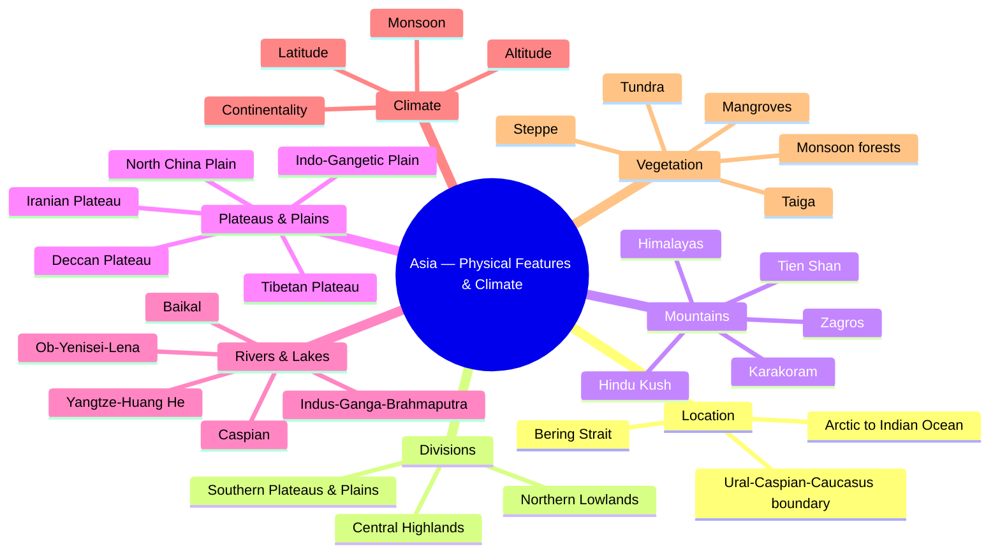

# Chapter 6: Asia — Physical Features & Climate
## High-Yield Facts
- Asia is the largest continent, occupying about one-third of Earth's land area.
- Asia extends from the Arctic Ocean in the north to the Indian Ocean in the south.
- The Pacific Ocean forms Asia's eastern boundary; the Mediterranean and Ural chain form the west.
- Europe–Asia boundary: Ural Mountains, Ural River, Caspian Sea, Caucasus, Black Sea.
- Bering Strait separates Asia from North America.
- Extremes: Cape Chelyuskin (north), Cape Piai (south), Cape Baba (west), Cape Dezhnev (east).
- Asia's physical divisions: Northern Lowlands, Central Highlands, Southern Plateaus/Plains.
- Pamir knot is a junction where major Asian ranges meet.
- Himalayas are young fold mountains and act as a climatic barrier.
- Tibetan Plateau is the highest and largest plateau in the world.
- Indo-Gangetic Plain is one of the most fertile alluvial plains.
- West Siberian Plain is one of the largest lowlands on Earth.
- Major Arctic rivers: Ob, Yenisei, Lena.
- Major Pacific rivers: Yangtze, Huang He, Mekong, Amur.
- Major Indian Ocean rivers: Indus, Ganga, Brahmaputra.
- Tigris and Euphrates drain into the Persian Gulf.
- Caspian Sea is the world's largest inland lake.
- Lake Baikal is the world's deepest freshwater lake.
- Aral Sea has shrunk due to diversion of its feeder rivers.
- Asia has climate zones from tundra to equatorial rainforest.
- Continentality causes extreme temperature ranges in Central Asia.
- Altitude lowers temperature; high mountains block moist winds.
- Monsoon is a seasonal reversal of winds, not just rainfall.
- South-west monsoon brings summer rain to South Asia.
- North-east monsoon is dry; Tamil Nadu gets winter rain from it.
- Western disturbances bring winter rain to north-west India and Pakistan.
- Typhoons are tropical cyclones over the western Pacific.
- Tundra vegetation includes mosses and lichens; taiga has conifers.
- Steppe grasslands dominate semi-arid interiors of Central Asia.
- Mangroves thrive in delta regions like the Sundarbans.

## Notes (Expert Revision)
### 1. Location & Extent of Asia

**Executive summary:** Asia is the largest continent, stretching from the Arctic Ocean in the north to the Indian Ocean in the south and from the Mediterranean in the west to the Pacific in the east.

**Must know**
• Largest continent: about one-third of Earth's land area
• Northern boundary: Arctic Ocean; southern boundary: Indian Ocean
• Western boundary: Ural Mountains, Ural River, Caspian Sea, Caucasus, Black Sea
• Eastern boundary: Pacific Ocean; north-east separated from North America by Bering Strait
• Extremes: Cape Chelyuskin (north), Cape Piai (south), Cape Baba (west), Cape Dezhnev (east)

Asia occupies the eastern and northern parts of the land hemisphere. It extends from the Arctic Ocean in the north to the Indian Ocean in the south, and from the Mediterranean Sea and Ural Mountains in the west to the Pacific Ocean in the east. Asia is separated from Europe by the Ural Mountains, Ural River, the Caspian Sea, the Caucasus Mountains and the Black Sea. The Bering Strait separates Asia from North America. Its extreme points include Cape Chelyuskin in the north, Cape Piai in the south, Cape Baba in the west and Cape Dezhnev in the east. This vast latitudinal span explains Asia's enormous climatic variety.

### 2. Physical Divisions of Asia

**Executive summary:** Asia has three broad physical divisions: Northern Lowlands, Central Highlands and Southern Plateaus/Plains.

**Must know**
• Northern Lowlands: West Siberian Plain and Turan Lowland
• Central Highlands: mountains and plateaus—Pamir, Tien Shan, Kunlun, Himalayas
• Southern Plateaus: Arabian and Deccan plateaus; Indo-Gangetic and Chinese plains
• Central Highlands act as a climate barrier
• Plains are densely populated and agriculturally rich

Asia can be broadly divided into three physical divisions. The Northern Lowlands include the West Siberian Plain and Turan Lowland, drained by rivers like Ob, Yenisei and Lena. The Central Highlands comprise the world's highest mountains and plateaus—Pamir (the 'Roof of the World'), Tien Shan, Kunlun, Karakoram and the Himalayas. These highlands influence river systems and block moist winds. The Southern Plateaus and Plains include the Arabian and Deccan plateaus, and vast alluvial plains such as the Indo-Gangetic and North China plains. These plains support dense populations and intensive agriculture.

### 3. Mountain Systems

**Executive summary:** Asia's mountain systems include the Himalayas, Karakoram, Hindu Kush, Tien Shan, Kunlun, Altai, Zagros and Arakan Yoma ranges.

**Must know**
• Himalayas: world's highest mountain system, young fold mountains
• Karakoram and Hindu Kush meet near the Pamir knot
• Tien Shan and Kunlun form inner Asian ranges
• Altai separates Siberia from Central Asia
• Zagros in West Asia; Arakan Yoma in Myanmar

Asia is dominated by massive mountain systems. The Himalayas, the world's highest young fold mountains, extend over 2,400 km and influence climate by blocking cold winds from Central Asia. The Karakoram and Hindu Kush ranges meet the Himalayas near the Pamir knot. Inner Asian ranges include the Tien Shan and Kunlun. In the north-west, the Altai range separates Siberia from Central Asia. West Asia is marked by the Zagros mountains, while the Arakan Yoma runs along Myanmar's western border. These mountains are sources of major rivers and create natural barriers affecting climate and human settlement.

### 4. Plateaus & Plains

**Executive summary:** Asia has major plateaus like Tibet, Iranian and Deccan and plains like the Indo-Gangetic, North China and West Siberian plains.

**Must know**
• Tibetan Plateau: highest and largest plateau, source of major rivers
• Iranian and Anatolian plateaus dominate West Asia
• Deccan Plateau forms peninsular India
• Indo-Gangetic Plain: one of the world's most fertile plains
• North China and Manchurian plains support dense populations

Asia's plateaus are extensive. The Tibetan Plateau, the highest and largest, feeds rivers such as the Yangtze, Yellow and Mekong. The Iranian and Anatolian plateaus shape West Asia's arid climate. The Deccan Plateau forms peninsular India, flanked by the Western and Eastern Ghats. Asia's plains include the Indo-Gangetic Plain, formed by the Indus-Ganga-Brahmaputra system; the North China Plain formed by the Huang He and Yangtze; and the West Siberian Plain, one of the world's largest lowlands. These plains are fertile due to alluvium and support dense populations and agriculture.

### 5. Rivers & Lakes

**Executive summary:** Asia's rivers drain into the Arctic, Pacific and Indian oceans, while lakes like the Caspian, Baikal and Aral are key inland water bodies.

**Must know**
• Major Arctic-draining rivers: Ob, Yenisei, Lena
• Pacific-draining rivers: Yangtze, Huang He, Mekong, Amur
• Indian Ocean system: Indus, Ganga, Brahmaputra, Tigris-Euphrates
• Caspian Sea: world's largest inland lake
• Lake Baikal: world's deepest freshwater lake

Asia's rivers are among the longest in the world. The Ob, Yenisei and Lena flow north into the Arctic Ocean. The Yangtze, Huang He, Mekong and Amur flow east into the Pacific. The Indus, Ganga and Brahmaputra flow south into the Indian Ocean, while the Tigris and Euphrates drain into the Persian Gulf. Asia also has important lakes: the Caspian Sea is the world's largest inland lake; Lake Baikal is the deepest freshwater lake; and the Aral Sea has shrunk drastically due to river diversion. These rivers and lakes sustain agriculture, transport and hydropower.

### 6. Climate Factors & Zones

**Executive summary:** Asia's climate varies due to latitude, altitude, distance from sea, winds and ocean currents, creating zones from tundra to equatorial rainforest.

**Must know**
• Latitude controls temperature from Arctic to equatorial belt
• Altitude and relief: high mountains are colder and act as barriers
• Continentality: interiors have extreme temperature ranges
• Pressure belts and wind systems shape rainfall patterns
• Zones include tundra, taiga, temperate, steppe, desert, Mediterranean, tropical monsoon and equatorial

Asia's vast size and varied relief create multiple climate zones. Latitude determines basic temperature, from polar north to tropical south. Altitude reduces temperature in the Himalayas and Tibetan Plateau. Distance from sea increases continentality, causing hot summers and cold winters in the interior. Pressure belts, prevailing winds and ocean currents influence rainfall patterns. As a result, Asia has tundra and taiga in Siberia, temperate climates in East Asia, steppe and desert climates in Central and West Asia, Mediterranean climate around the Levant and Turkey, tropical monsoon climate in South and Southeast Asia, and equatorial climate in parts of Indonesia and Malaysia.

### 7. Monsoon & Regional Climates

**Executive summary:** The monsoon is a seasonal reversal of winds; it brings heavy summer rain to South Asia and shapes regional climates across Asia.

**Must know**
• South-west monsoon: summer winds from sea to land bring rain
• North-east monsoon: winter winds from land to sea are dry
• Typhoons affect East and Southeast Asia
• Western disturbances bring winter rain to north-west India and Pakistan
• Orographic rainfall on windward slopes creates rain shadow on leeward side

Monsoon winds are seasonal reversals caused by differential heating of land and sea. In summer, the south-west monsoon blows from the Indian Ocean to the land, bringing heavy rainfall to South and Southeast Asia. In winter, the north-east monsoon blows from land to sea, bringing dry conditions, though Tamil Nadu receives winter rain from the Bay of Bengal branch. East Asia experiences typhoons—tropical cyclones over the Pacific. Western disturbances from the Mediterranean bring winter rain and snowfall to north-west India and Pakistan. Mountains like the Himalayas enhance orographic rainfall on windward slopes and create rain shadow areas.

### 8. Natural Vegetation of Asia

**Executive summary:** Asia's vegetation ranges from tundra mosses in the Arctic to equatorial rainforests and mangroves in the tropics.

**Must know**
• Tundra: mosses, lichens, dwarf shrubs in the far north
• Taiga: coniferous forests (pine, spruce) in Siberia
• Temperate deciduous forests in China, Japan and Korea
• Steppe grasslands and desert vegetation in Central and West Asia
• Tropical monsoon forests, rainforests and mangroves in South and Southeast Asia

Vegetation in Asia reflects climate. The Arctic north has tundra with mosses and lichens. South of it lies the taiga or coniferous forest belt across Siberia. Temperate deciduous forests occur in China, Korea and Japan. The interiors of Central Asia have steppe grasslands and deserts with xerophytic shrubs. In South and Southeast Asia, tropical monsoon forests grow where summer rainfall is high, and equatorial rainforests flourish in Malaysia and Indonesia. Mangroves occur in delta regions such as the Sundarbans, adapted to saline conditions.

## Mind Map

## Cheat Sheet

- Asia is the largest continent, about one-third of Earth's land area.
- Boundaries: Arctic north, Indian south, Pacific east, Mediterranean/Ural west.
- Europe–Asia boundary: Ural Mountains/River, Caspian, Caucasus, Black Sea.
- Bering Strait separates Asia from North America.
- Extremes: Cape Chelyuskin (N), Cape Piai (S), Cape Baba (W), Cape Dezhnev (E).
- Three divisions: Northern Lowlands, Central Highlands, Southern Plateaus/Plains.
- Pamir knot is the mountain junction in Central Asia.
- Himalayas are young fold mountains and climatic barrier.
- Tibetan Plateau = highest and largest plateau.
- Indo-Gangetic Plain = fertile alluvial plain with dense population.
- Major Arctic rivers: Ob, Yenisei, Lena.
- Major Pacific rivers: Yangtze, Huang He, Mekong, Amur.
- Major Indian Ocean rivers: Indus, Ganga, Brahmaputra.
- Caspian Sea = largest inland lake; Baikal = deepest freshwater lake.
- Aral Sea has shrunk due to diversion of feeder rivers.
- Climate factors: latitude, altitude, continentality, winds, ocean currents.
- Continentality causes hot summers and very cold winters in interiors.
- Monsoon = seasonal reversal of winds; SW monsoon brings summer rain.
- NE monsoon is dry; Tamil Nadu gets winter rain from it.
- Western disturbances bring winter rain/snow to NW India.
- Typhoons are Pacific tropical cyclones.
- Vegetation belts: tundra, taiga, temperate, steppe, desert, monsoon, equatorial.
- Mangroves occur in deltaic coasts like the Sundarbans.

## One Word (30)

- **Bering Strait** — Narrow water body separating Asia from North America
- **Ural Mountains** — Traditional boundary between Europe and Asia
- **Caucasus** — Mountain range forming part of Europe–Asia boundary
- **Pamir Knot** — Mountain junction where several ranges meet
- **Himalayas** — Young fold mountains and climatic barrier of South Asia
- **Karakoram** — High mountain range containing K2
- **Hindu Kush** — Mountain range in Afghanistan-Pakistan region
- **Tien Shan** — Central Asian mountain range
- **Tibetan Plateau** — Highest and largest plateau of the world
- **Indo-Gangetic Plain** — Fertile alluvial plain formed by Indus-Ganga-Brahmaputra
- **North China Plain** — Plain formed by Huang He and Yangtze systems
- **West Siberian Plain** — One of the largest lowlands in the world
- **Ob River** — Major river draining into Arctic Ocean
- **Yangtze River** — Longest river in Asia, drains into the Pacific
- **Huang He** — Yellow River, called the Sorrow of China
- **Mekong** — Major Southeast Asian river flowing to South China Sea
- **Tigris-Euphrates** — River system of Mesopotamia draining into Persian Gulf
- **Caspian Sea** — Largest inland lake in the world
- **Lake Baikal** — Deepest freshwater lake in the world
- **Aral Sea** — Shrinking inland lake in Central Asia
- **Continentality** — Climatic effect of distance from sea causing extremes
- **Orographic rainfall** — Rainfall caused by air rising over mountains
- **Rain shadow** — Dry area on leeward side of mountains
- **South-west monsoon** — Summer wind system bringing rain to South Asia
- **North-east monsoon** — Winter wind system, generally dry
- **Western disturbances** — Winter storms bringing rain to NW India
- **Typhoon** — Tropical cyclone over the western Pacific
- **Tundra** — Cold climate vegetation of mosses and lichens
- **Taiga** — Coniferous forest belt of subarctic Asia
- **Steppe** — Semi-arid grassland of Central Asia
