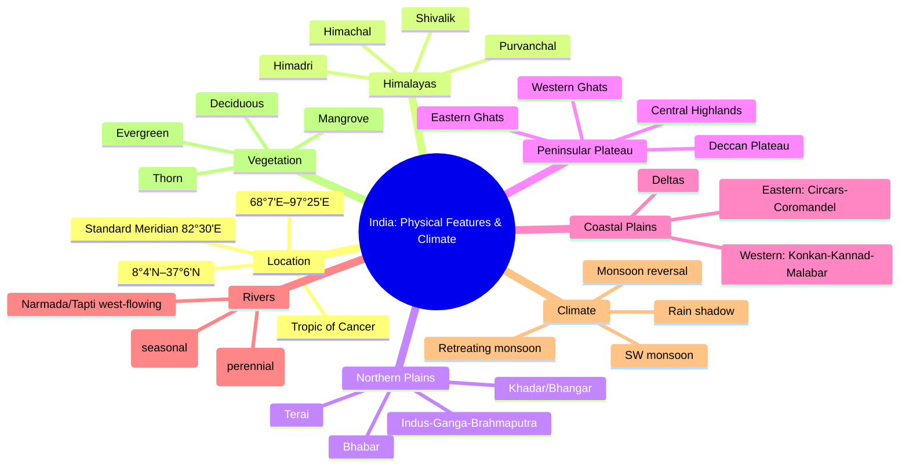

# Chapter 7: India — Physical Features & Climate
## High-Yield Facts
- India lies in the Northern and Eastern hemispheres.
- Latitudinal extent: 8°4'N to 37°6'N; longitudinal extent: 68°7'E to 97°25'E.
- Tropic of Cancer (23°30'N) divides India into tropical and sub-tropical parts.
- Standard Meridian is 82°30'E, giving IST (UTC+5:30).
- India’s peninsular location gives it a central position in the Indian Ocean.
- The Himalayas are young fold mountains formed by Indo-Eurasian plate collision.
- Himadri is the highest Himalayan range with permanent snow and glaciers.
- Shivaliks are the outermost foothills made of unconsolidated sediments.
- Purvanchal hills include Patkai, Naga and Lushai.
- Northern Plains are formed by alluvium from Indus, Ganga and Brahmaputra rivers.
- Bhabar is a porous pebble belt; Terai is marshy with tall grasses.
- Khadar is new alluvium; Bhangar is old alluvium.
- Peninsular Plateau is the oldest landmass of India, part of Gondwana.
- Central Highlands include Malwa, Bundelkhand and Chota Nagpur plateau.
- Deccan Plateau is basaltic and formed by lava flows.
- Western Ghats are higher and continuous; Eastern Ghats are lower and broken.
- Nilgiri hills are the meeting point of Eastern and Western Ghats.
- Western Coastal Plains are narrow; Eastern Coastal Plains are wider with deltas.
- Andaman & Nicobar Islands are volcanic; Lakshadweep Islands are coral.
- Himalayan rivers are perennial and form extensive flood plains and deltas.
- Peninsular rivers are seasonal and mostly rain-fed.
- Narmada and Tapti flow west through rift valleys to the Arabian Sea.
- Godavari is the largest peninsular river.
- India has a monsoon-type climate with seasonal reversal of winds.
- South-west monsoon arrives in Kerala around 1 June.
- Retreating monsoon brings rain to Tamil Nadu in October-November.
- Orographic rainfall occurs on windward slopes; leeward sides are rain-shadow.
- Mawsynram/Cherrapunji receive some of the highest rainfall globally.
- Vegetation depends on rainfall, temperature, soil and altitude.
- Tropical deciduous forests are the most widespread type in India.

## Notes (Expert Revision)
### 1. Location & Extent of India

**Executive summary:** India stretches from 8°4'N to 37°6'N and 68°7'E to 97°25'E, centrally placed in the Indian Ocean.

**Must know**
• Latitudinal extent: 8°4'N (Kanyakumari) to 37°6'N (Kashmir)
• Longitudinal extent: 68°7'E (Gujarat) to 97°25'E (Arunachal Pradesh)
• Tropic of Cancer (23°30'N) bisects India into tropical and sub-tropical halves
• Standard Meridian: 82°30'E, basis of IST (UTC+5:30)
• Central location gives India sea routes to West Asia, Africa and Europe

India is located in the Northern and Eastern hemispheres. Its peninsular shape projects into the Indian Ocean, giving it a strategic position on ancient and modern sea routes. The Tropic of Cancer passes through the middle of the country, creating contrasts in climate and day length between north and south. Longitudinally, India spans almost 30 degrees; hence a standard meridian (82°30'E) was chosen to maintain a single time zone (IST).

### 2. The Himalayas

**Executive summary:** The Himalayas are young fold mountains formed by Indo-Eurasian plate collision and divided into Himadri, Himachal and Shivalik.

**Must know**
• Himadri (Greater Himalaya): highest, snow-bound, source of glaciers
• Himachal (Lesser Himalaya): ranges like Pir Panjal and Dhauladhar
• Shivalik (Outer Himalaya): low foothills with unconsolidated sediments
• Purvanchal hills extend eastwards (Patkai, Naga, Lushai)
• Act as a climatic barrier and source of perennial rivers

The Himalayas were formed by the collision of the Indian and Eurasian plates and are among the youngest fold mountains. They consist of three parallel ranges: Himadri (highest and snow-covered), Himachal (middle ranges with valleys and hill stations) and the Shivaliks (outer foothills). Eastwards they bend into the Purvanchal hills. The Himalayas block cold continental winds and force monsoon winds to rise, causing heavy rainfall on the southern slopes.

### 3. Northern Plains

**Executive summary:** The Northern Plains are formed by alluvium from the Indus, Ganga and Brahmaputra systems, creating India's most fertile belt.

**Must know**
• Extends from Punjab to Assam; broad, flat and densely populated
• Formed by alluvial deposits brought by Himalayan rivers
• Regional divisions: Punjab Plains, Ganga Plains, Brahmaputra Plains
• Bhabar (pebbly belt) and Terai (marshy belt) along the foothills
• Khadar (new alluvium) and Bhangar (old alluvium)

The Northern Plains lie south of the Himalayas and stretch from Punjab in the west to Assam in the east. They are created by thick deposits of alluvium laid by the Indus, Ganga and Brahmaputra river systems. The plains are agriculturally productive and densely populated. Along the foothills are distinct belts: the porous Bhabar, the marshy Terai, and further south the fertile alluvial plains with Khadar and Bhangar soils.

### 4. Peninsular Plateau

**Executive summary:** The Peninsular Plateau is an ancient, stable block of igneous and metamorphic rocks, divided into Central Highlands and Deccan Plateau.

**Must know**
• Oldest landmass of India; part of Gondwana
• Central Highlands include Malwa, Bundelkhand, Chota Nagpur
• Deccan Plateau south of Narmada; basaltic lava flows
• Western Ghats are higher and continuous; Eastern Ghats are lower and discontinuous
• Nilgiri hills form the meeting point of both Ghats

The Peninsular Plateau is one of the oldest landmasses, formed from hard crystalline rocks. It is relatively stable, with broad plateaus and residual hills. The plateau is divided into the Central Highlands in the north and the Deccan Plateau in the south. The Western Ghats form a steep escarpment along the western coast, while the Eastern Ghats are lower and broken, merging into the plateau. The Nilgiri hills link the two.

### 5. Coastal Plains & Islands

**Executive summary:** India has narrow western and broader eastern coastal plains, along with the Andaman & Nicobar and Lakshadweep Islands.

**Must know**
• Western Coastal Plains: narrow, Konkan–Kannad–Malabar sections
• Eastern Coastal Plains: wider, includes the Northern Circars and Coromandel
• Eastern coast has large deltas (Mahanadi, Godavari, Krishna, Kaveri)
• Andaman & Nicobar Islands in Bay of Bengal; volcanic origin
• Lakshadweep Islands in Arabian Sea; coral origin

The Western Coastal Plains are narrow due to the proximity of the Western Ghats, while the Eastern Coastal Plains are wider and more depositional, with large river deltas. The Andaman & Nicobar Islands are a chain of volcanic islands in the Bay of Bengal, while Lakshadweep comprises coral islands in the Arabian Sea. India’s coastal plains support ports, fisheries and major urban centres.

### 6. Rivers of India

**Executive summary:** India’s rivers are broadly Himalayan (perennial) and Peninsular (seasonal), shaping plains, deltas and agriculture.

**Must know**
• Himalayan rivers: Indus, Ganga, Brahmaputra; snow-fed and perennial
• Peninsular rivers: Godavari, Krishna, Mahanadi (east-flowing) and Narmada, Tapti (west-flowing)
• Himalayan rivers form extensive flood plains and deltaic regions
• Peninsular rivers have shorter courses and seasonal flow
• Rivers are vital for irrigation, hydropower and transport

Himalayan rivers are long, snow-fed and carry heavy loads of silt, forming broad flood plains and deltas. The Indus system includes Jhelum, Chenab, Ravi, Beas and Sutlej; the Ganga system includes Yamuna, Ghaghara, Gandak and Kosi. The Brahmaputra flows as Tsangpo in Tibet and Jamuna in Bangladesh. Peninsular rivers are rain-fed and flow over hard rock beds, forming waterfalls and narrow valleys.

### 7. Climate & Monsoon

**Executive summary:** India has a monsoon-type climate with seasonal reversal of winds and four main seasons.

**Must know**
• Seasons: cold weather, hot weather, south-west monsoon, retreating monsoon
• Monsoon winds reverse direction seasonally due to land-sea temperature contrast
• Arabian Sea and Bay of Bengal branches bring rain from June to September
• Orographic rainfall on windward slopes; rain-shadow on leeward side
• Retreating monsoon causes rain in Tamil Nadu (Oct-Nov)

India’s climate is dominated by the monsoon, defined by seasonal reversal of winds. During summer, low pressure over the north attracts moist winds from the oceans, bringing heavy rainfall. The Arabian Sea branch strikes the Western Ghats first, while the Bay of Bengal branch moves towards the northeast and then westwards along the Himalayas. In winter, dry winds blow from land to sea. The retreating monsoon causes rainfall on the Coromandel Coast.

### 8. Natural Vegetation & Wildlife

**Executive summary:** India’s vegetation ranges from tropical evergreen to alpine forests, influenced by rainfall, altitude and soil.

**Must know**
• Tropical evergreen: heavy rainfall areas of Western Ghats and NE India
• Tropical deciduous: most widespread, found in central and northern India
• Thorn and scrub: arid and semi-arid regions of Rajasthan and Gujarat
• Mangroves: tidal deltas like Sundarbans
• Wildlife protection through national parks, sanctuaries and Project Tiger

Natural vegetation varies with climate and relief. Dense evergreen forests occur in high rainfall areas; deciduous forests dominate the peninsular and northern plains; thorn forests cover arid regions. Mangroves thrive in deltaic and tidal environments. India protects its biodiversity through national parks, sanctuaries and biosphere reserves. Project Tiger (1973) and other conservation efforts focus on protecting endangered species.

## Mind Map

## Cheat Sheet

- India lies between 8°4'N–37°6'N and 68°7'E–97°25'E.
- Tropic of Cancer (23°30'N) divides India into tropical and sub-tropical parts.
- Standard Meridian 82°30'E gives IST = UTC+5:30.
- Himalayas are young fold mountains from Indo-Eurasian collision.
- Three Himalayan ranges: Himadri, Himachal, Shivalik.
- Purvanchal hills include Patkai, Naga, Lushai.
- Northern Plains formed by Indus, Ganga, Brahmaputra alluvium.
- Bhabar = porous pebble belt; Terai = marshy belt.
- Khadar = new alluvium; Bhangar = old alluvium.
- Peninsular Plateau is ancient, stable, crystalline rock mass.
- Central Highlands: Malwa, Bundelkhand, Chota Nagpur.
- Deccan Plateau is basaltic; black soil is common.
- Western Ghats higher/continuous; Eastern Ghats lower/discontinuous.
- Nilgiri Hills connect Eastern and Western Ghats.
- Western Coastal Plains: Konkan-Kannad-Malabar, narrow with estuaries.
- Eastern Coastal Plains: Circars-Coromandel, wider with large deltas.
- Andaman & Nicobar = volcanic; Lakshadweep = coral.
- Himalayan rivers are perennial; peninsular rivers are seasonal.
- Narmada and Tapti are west-flowing rift-valley rivers.
- Godavari is the largest peninsular river.
- Monsoon climate = seasonal reversal of winds.
- SW monsoon arrives around 1 June in Kerala.
- Retreating monsoon brings Oct-Nov rain to Tamil Nadu.
- Evergreen forests in Western Ghats and NE India; deciduous most widespread.
- Thorn forests in arid Rajasthan; mangroves in Sundarbans.

## One Word (30)

- **Tropic of Cancer** — Latitude 23°30'N dividing India into two climatic halves
- **Standard Meridian** — Longitude 82°30'E used for Indian Standard Time
- **IST** — Indian Standard Time, UTC+5:30
- **Himadri** — Highest Himalayan range with permanent snow
- **Himachal** — Middle Himalayan range with valleys and hill stations
- **Shivalik** — Outer Himalayan foothills of unconsolidated sediments
- **Purvanchal** — Eastern extension of the Himalayas
- **Northern Plains** — Alluvial plains formed by Indus, Ganga and Brahmaputra
- **Bhabar** — Pebbly porous belt at Himalayan foothills
- **Terai** — Marshy belt with tall grasses south of Bhabar
- **Khadar** — New fertile alluvium deposited by rivers
- **Bhangar** — Old alluvium with kankar nodules
- **Peninsular Plateau** — Ancient crystalline rock region of India
- **Central Highlands** — Northern part of Peninsular Plateau
- **Deccan Plateau** — Southern plateau formed by basaltic lava
- **Western Ghats** — High, continuous mountains along west coast
- **Eastern Ghats** — Lower, discontinuous hills along east coast
- **Nilgiri Hills** — Meeting point of Eastern and Western Ghats
- **Konkan** — Northern section of western coastal plains
- **Malabar** — Southern section of western coastal plains
- **Coromandel** — Southern section of eastern coastal plains
- **Andaman & Nicobar** — Volcanic island group in Bay of Bengal
- **Lakshadweep** — Coral islands in Arabian Sea
- **Perennial rivers** — Rivers flowing year-round, snow-fed
- **Rift valley** — Tectonic depression through which Narmada flows
- **Monsoon** — Seasonal reversal of winds causing rainfall
- **Orographic rainfall** — Rainfall caused by mountains forcing air to rise
- **Rain shadow** — Dry leeward area with low rainfall
- **Mangrove** — Salt-tolerant tidal forest in deltas
- **Project Tiger** — 1973 conservation programme for tigers
