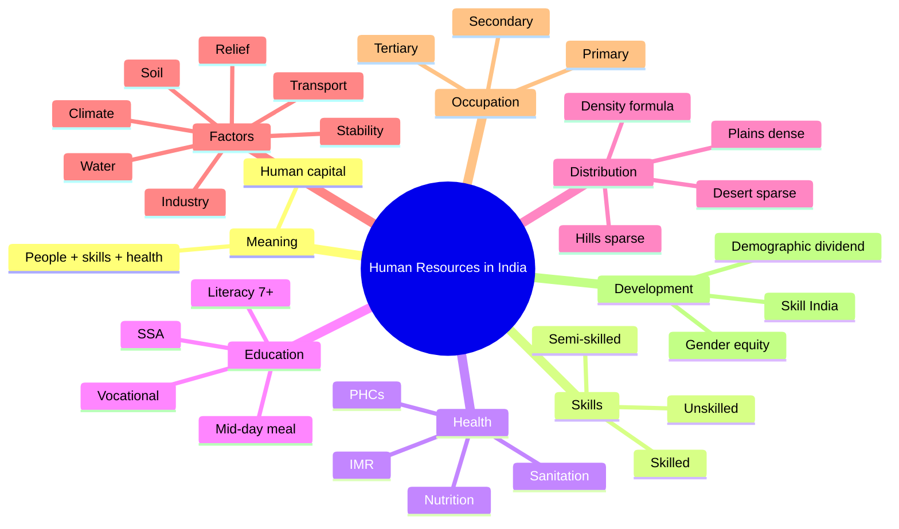

# Chapter 8: Human Resources in India
## High-Yield Facts
- Human resources are people with knowledge, skills, health and abilities that support development.
- Population becomes an asset only when it is educated, healthy and skilled.
- Human capital is created through investment in education, health, nutrition and training.
- Skilled labour requires education or training; unskilled labour needs minimal training.
- Semi-skilled workers have partial training and operate machines or vehicles.
- Good health reduces absenteeism and increases productivity.
- Health indicators include life expectancy, IMR and maternal health.
- Education raises productivity and occupational mobility.
- Female education improves family health and child care.
- Literacy is measured for population aged 7 years and above.
- Census in India is conducted every 10 years.
- The 2011 Census was the 15th census of India.
- Population density is population per square kilometre.
- India's population distribution is highly uneven.
- Northern Plains and coastal regions are densely populated.
- Himalayas, Thar Desert and interior plateaus are sparsely populated.
- Bihar has the highest population density among Indian states.
- Relief, climate, soil and water are key physical factors of distribution.
- Industries, transport and urban markets attract population.
- Political stability and security encourage settlement.
- Occupational structure divides work into primary, secondary and tertiary.
- Primary sector still employs the largest share in India.
- Tertiary sector is expanding with urbanisation and services.
- Migration has push factors (poverty, joblessness) and pull factors (jobs, services).
- Disguised unemployment is common in agriculture.
- A young working-age population can yield a demographic dividend.
- Skill India and vocational training improve employability.
- Balanced regional development reduces excessive rural-urban migration.
- Human resource development improves productivity and quality of life.
- Gender equality strengthens the human resource base.

## Notes (Expert Revision)
### 1. What are Human Resources?

**Executive summary:** Human resources are the people of a country with their knowledge, skills, health and abilities that drive economic and social development.

**Must know**
• Population becomes a resource when it is educated, healthy and productive
• Human resources are dynamic and can be improved through training
• People are both producers and consumers in the economy
• Human capital is built by investment in health, education and skills
• Quality of human resources matters more than mere numbers

Human resources are the people of a nation who possess knowledge, skills, health and abilities that enable them to work and contribute to development. A large population is not automatically an asset; it becomes a resource when it is educated, healthy and skilled. Human resources are dynamic because education, training and experience can improve productivity. In geography, we study how people interact with their environment and how their abilities shape economic growth. Human capital is created when society invests in education, health care, nutrition and skill development.

### 2. Skilled vs Unskilled Labour

**Executive summary:** Skilled labour requires training or education; unskilled labour needs minimal training and relies mainly on physical effort.

**Must know**
• Skilled workers: trained, qualified, higher productivity and wages
• Unskilled workers: little training, lower wages, higher vulnerability
• Semi-skilled workers need some training (drivers, machine operators)
• Skill development reduces unemployment and underemployment
• India has a large informal workforce needing upskilling

Skilled labour refers to workers who have received education or training to perform specialized tasks, such as electricians, nurses, programmers or machinists. Unskilled labour involves tasks that require little training and depend mostly on physical effort, such as manual loading or basic farm work. Semi-skilled workers need some training but not extensive qualifications. A country with more skilled workers has higher productivity and innovation. Therefore, skill development and vocational training are essential to convert a large workforce into a productive human resource base.

### 3. Health as Human Resource

**Executive summary:** Health is a basic component of human resource quality because a healthy population works efficiently and learns better.

**Must know**
• Good health reduces absenteeism and increases productivity
• Nutrition, sanitation and safe drinking water sustain health
• Public health infrastructure includes hospitals, PHCs and immunisation
• Health indicators: life expectancy, IMR and maternal health
• Health spending is an investment in human capital

Health is a crucial part of human resource quality. Healthy people can work longer hours, learn new skills and contribute effectively to the economy. Malnutrition, disease and poor sanitation reduce productivity and raise dependency. Access to safe drinking water, immunisation and public health facilities like Primary Health Centres (PHCs) are essential. Health indicators such as life expectancy, infant mortality rate and maternal health show the quality of health services. Therefore, investment in health is as important as investment in education.

### 4. Education as Human Resource

**Executive summary:** Education improves knowledge, skills and values, raising productivity, innovation and employability.

**Must know**
• Literacy enables participation in modern economic life
• Education raises productivity and occupational mobility
• Female education improves family health and child care
• Formal and vocational education together build employable skills
• Government schemes expand access to schooling

Education transforms people into productive human resources by improving knowledge, skills and values. Literacy empowers citizens to access information, use technology and participate in economic activities. Education also increases occupational mobility, allowing people to move from low-paid work to skilled jobs. Female education has multiple benefits: improved family health, lower infant mortality and better child education. Along with formal schooling, vocational training provides job-oriented skills. Initiatives such as Sarva Shiksha Abhiyan and the mid-day meal scheme aim to expand access and reduce dropouts.

### 5. Population Distribution in India

**Executive summary:** India's population is unevenly distributed, with dense concentration in plains and sparse settlements in mountains and deserts.

**Must know**
• Northern Plains and coastal regions are densely populated
• Himalayas, Thar Desert and interior plateaus are sparsely populated
• Population distribution depends on physical and economic factors
• Population density = population per unit area
• Bihar and West Bengal show very high densities

Population distribution refers to how people are spread across the country's land area. In India, distribution is highly uneven. The Northern Plains, coastal belts and major urban-industrial regions have very high densities due to fertile soil, flat land, water availability and jobs. In contrast, the Himalayas, Thar Desert, and parts of the Deccan Plateau have low densities because of rugged terrain, aridity or poor soils. Population density is measured as the number of people per square kilometre. Bihar has the highest population density among Indian states.

### 6. Factors Affecting Distribution

**Executive summary:** Relief, climate, soil, water, minerals, transport and economic opportunities shape population distribution.

**Must know**
• Physical: relief, climate, soil fertility, water availability
• Economic: industries, trade, transport and urban markets
• Social-political: peace, security and stable governance
• Historical factors: old trade routes and colonial port cities
• Resource-rich areas attract migration and settlement

Population distribution is influenced by several factors. Physical factors such as relief, climate, soil fertility and water availability are primary determinants. Plains with fertile soil and adequate water attract dense settlement, while mountains and deserts do not. Economic factors such as industrial development, transport networks and urban markets attract people by offering jobs and services. Social and political stability makes regions safer and more attractive. Historical trade routes and port cities also grew into large population centres. Thus, distribution reflects both natural and human factors.

### 7. Occupational Structure

**Executive summary:** Occupational structure shows the distribution of workers among primary, secondary and tertiary activities.

**Must know**
• Primary: agriculture, fishing, forestry, mining
• Secondary: manufacturing, construction, processing
• Tertiary: services like trade, education, health, transport
• India still has a large share in primary sector
• With development, tertiary share increases

Occupational structure refers to the proportion of people engaged in different types of economic activities. Primary activities involve extracting natural resources, such as farming, fishing and mining. Secondary activities include manufacturing and construction, where raw materials are processed. Tertiary activities provide services such as trade, education, health care, transport and banking. India still employs a large share of its workforce in the primary sector, though the tertiary sector has been growing rapidly. In developed economies, the tertiary sector dominates.

### 8. Developing Human Resources

**Executive summary:** Human resource development focuses on education, health, skills and employment to improve productivity and quality of life.

**Must know**
• Investment in education and health builds human capital
• Skill India and vocational training improve employability
• Balanced regional development reduces migration pressures
• Population becomes a demographic dividend when skilled
• Gender equality improves overall human resource quality

Developing human resources means improving the quality of people through education, health care, skill development and employment opportunities. Government programmes such as Skill India and National Skill Development Mission aim to train youth for modern jobs. Balanced regional development reduces excessive migration and spreads opportunities. A young working-age population can become a demographic dividend only if it is healthy and skilled. Gender equality, especially in education and employment, strengthens the human resource base and improves social indicators.

## Mind Map

## Cheat Sheet

- Human resources = people with knowledge, skills, health and abilities.
- Population becomes an asset when educated, healthy and skilled.
- Human capital is built through education, health and training.
- Skilled labour needs training; unskilled labour needs minimal training.
- Health improves productivity and reduces absenteeism.
- Health indicators: life expectancy, IMR, maternal health.
- Education raises productivity and occupational mobility.
- Literacy is counted for population aged 7+ years.
- Census is conducted every 10 years in India.
- Population density = people per square kilometre.
- Northern Plains and coasts are densely populated.
- Himalayas, Thar Desert and interior plateaus are sparse.
- Bihar has the highest population density among states.
- Physical factors: relief, climate, soil, water.
- Economic factors: industry, transport, markets.
- Political stability and security attract settlement.
- Primary sector: agriculture, fishing, mining.
- Secondary sector: manufacturing and construction.
- Tertiary sector: services like trade, transport, education and health.
- India still has a large share in the primary sector.
- Tertiary sector share rises with development.
- Migration has push (poverty) and pull (jobs) factors.
- Disguised unemployment is common in agriculture.
- Skill India and vocational training boost employability.
- Demographic dividend requires skills and jobs.

## One Word (30)

- **Human resources** — People with knowledge, skills and health who contribute to development
- **Human capital** — Value of people's skills, education and health
- **Skilled labour** — Workforce with specialized education or training
- **Unskilled labour** — Workforce needing minimal training and doing manual tasks
- **Semi-skilled labour** — Workers with partial training for specific tasks
- **Health** — Physical and mental well-being that supports productivity
- **Literacy** — Ability to read and write with understanding
- **Literacy rate** — Percentage of literate people aged 7+ years
- **Population density** — People per square kilometre of area
- **Population distribution** — Pattern of population spread across a region
- **Census** — Official population count conducted every 10 years
- **Sex ratio** — Number of females per 1000 males
- **IMR** — Infant mortality rate: infant deaths per 1000 births
- **Life expectancy** — Average years a person is expected to live
- **Occupational structure** — Distribution of workers by economic sector
- **Primary sector** — Activities that extract natural resources
- **Secondary sector** — Activities that process raw materials
- **Tertiary sector** — Service activities like trade and transport
- **Migration** — Movement of people from one place to another
- **Push factors** — Conditions that force people to leave a place
- **Pull factors** — Conditions that attract people to a place
- **Disguised unemployment** — More workers than needed in a job
- **Underemployment** — Working below one's capacity or skills
- **Urbanisation** — Growth of urban population and cities
- **Demographic dividend** — Economic benefit of a large skilled workforce
- **Vocational training** — Job-oriented skill training
- **Skill India** — Government programme for skill development
- **SSA** — Sarva Shiksha Abhiyan for universal elementary education
- **Mid-day meal** — School meal scheme to improve nutrition
- **Balanced development** — Reducing regional inequalities in growth
