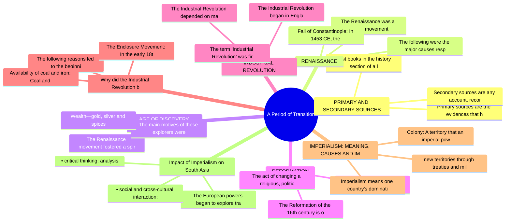

# Chapter 1: A Period of Transition

## High-Yield Facts
- Primary sources are the evidences that historians use to know about events, people and their everyday life in the past. The study of primary sources is crucial to the study of history as they provide first-hand and original account of the past. Oral histories, objects, artefacts, photographs and documents such as newspapers, census records, diaries, journals and inventories are primary sources.
- Secondary sources are any account, record or evidence derived from interpreting and analysing an original or primary source.
- Most books in the history section of a library are secondary sources. Your history textbook is also a secondary source.
- The Renaissance was a cultural movement that began in Florence (Italy) in the late Middle Ages, and then spread to the rest of Europe. This movement influenced literature, philosophy, art, politics, science and religion. It saw revolutions in the intellectual, social and political domains. However, it is also known for its artistic developments.
- The following were the major causes responsible for the Renaissance:
- Fall of Constantinople: In 1453 CE, the Ottoman Turks attacked and occupied Constantinople, which was a famous centre of learning. Many Greek scholars fled and took shelter in Italy. As a result, universities of Florence, Venice and Milan in Italy became important centres of education.
- The Renaissance movement fostered a spirit of adventure among the people of Europe. With the fall of Constantinople, the Turks controlled the sea and land routes to the East. Thus, a class of 'explorers' came to the forefront, and new lands were discovered. These European explorers were searching for fame, glory and wealth. They travelled to unknown lands and seas, facing hardships. Their discovery took them to the land east of Europe—to India and China and the New World, i.e., America.
- The main motives of these explorers were as follows:
- The Reformation of the 16th century is one of the greatest events in the history of the world.
- Reformation comes from the word 'reform', which means making changes in something to make it correct and acceptable.
- The act of changing a religious, political or social institution or system can be called a reformation.
- The Industrial Revolution began in England in the 18th century and later spread to other parts of the world. By harnessing fossil fuels to power engines, factories and machines, the Industrial Revolution transformed the agriculture-based economy into a manufacturing-based economy. It thus gave birth to the modern world.
- The term ‘Industrial Revolution’ was first popularised by Arnold Toynbee, a British economic historian. Toynbee explained the economic development of Britain from 1760 to 1840. The Industrial Revolution was characterised by the use of steam-powered engines, machines and the spread of factories. The goods were mass-produced and mechanised transport was used.
- The Industrial Revolution depended on machines such as the steam engine and cotton mill. It also brought about the rapid shift from villages to towns and cities.
- The following reasons led to the beginning of the Industrial Revolution in Britain first:
- The Enclosure Movement: In the early 18th century, Britain was an agricultural society. Around 80 per cent of farmers had small holdings in rural areas on which they grew and harvested small crops and raised small herds of livestock. Alongside, there were big landlords who could increase production by introducing machines on land. However, machines could not be introduced on the small strips of land. Thus, the need was to consolidate the holdings. The Acts passed by the British Parliament allowed the landlords to buy the small strips of land and enclose it with a boundary. Machines were introduced on this enclosed land. As a result, the production increased greatly. Hence, it is often said that revolution in agriculture resulted in the Industrial Revolution.
- Availability of coal and iron: Coal and iron, essential resources for the Industrial Revolution to take off, were available in plenty in Britain during that period.
- Imperialism means one country's domination of the political, economic and social spheres of another country. In recent times, imperialism has become synonymous with western control over the countries of Asia and Africa. Imperial nations gained
- new territories through treaties and military conquests. The different forms of imperialism are as follows:
- Colony: A territory that an imperial power ruled directly through colonial officials
- The European powers began to explore trading opportunities in Asia in the 1500s. The British and the French emerged as major rivals for control of the trade in India. The British defeated the French in 1760 and subsequently, expanded their territory in India through wars, diplomacy and commercial activities.
- social and cross-cultural interaction: global awareness
- 1. 'The Industrial Revolution gave rise to imperialism, which led to the exploitation of the colonies'. Do you support the statement? Give reasons for your answer.
- 2. Which of the following statements is not a cause for the rise of imperialism? Give at least one reason for your answer.
- a. The outbreak of the First and Second World Wars resulted in imperialism.
- 1. Differentiate between primary and secondary sources.
- 2. Describe the characteristics of the Renaissance Movement.
- 3. Why is the Reformation of the 16th century regarded as one the greatest events in world history?

## Notes (Expert Revision)
### 1. PRIMARY AND SECONDARY SOURCES

**Executive summary:** Primary sources are the evidences that historians use to know about events, people and their everyday life in the past. The study of primary sources is crucial to the study of hist

**Must know**
• Primary sources are the evidences that historians use to know about events, people and their everyday life in the past. The study of primary sources is crucial to the study of history as they provide first-hand and original account of the past. Oral histories, objects, artefacts, photographs and documents such as newspapers, census records, diaries, journals and inventories are primary sources.
• Secondary sources are any account, record or evidence derived from interpreting and analysing an original or primary source.
• Most books in the history section of a library are secondary sources. Your history textbook is also a secondary source.

Primary sources are the evidences that historians use to know about events, people and their everyday life in the past. The study of primary sources is crucial to the study of history as they provide first-hand and original account of the past. Oral histories, objects, artefacts, photographs and documents such as newspapers, census records, diaries, journals and inventories are primary sources.

Secondary sources are any account, record or evidence derived from interpreting and analysing an original or primary source.

Most books in the history section of a library are secondary sources. Your history textbook is also a secondary source.

### 2. RENAISSANCE

**Executive summary:** The Renaissance was a cultural movement that began in Florence (Italy) in the late Middle Ages, and then spread to the rest of Europe. This movement influenced literature, philosop

**Must know**
• The Renaissance was a cultural movement that began in Florence (Italy) in the late Middle Ages, and then spread to the rest of Europe. This movement influenced literature, philosophy, art, politics, science and religion. It saw revolutions in the intellectual, social and political domains. However, it is also known for its artistic developments.
• The following were the major causes responsible for the Renaissance:
• Fall of Constantinople: In 1453 CE, the Ottoman Turks attacked and occupied Constantinople, which was a famous centre of learning. Many Greek scholars fled and took shelter in Italy. As a result, universities of Florence, Venice and Milan in Italy became important centres of education.
• Rise of a new nobility: An increase in trade led to the emergence of a new class of nobles (who were actually merchants and not nobles by birth), who patronised learning.
• Discovery of new routes: Due to the fall of Constantinople, trade was hampered. In order to ensure profitable trade, new routes were discovered, along with new lands. These voyages of discovery opened up new centres of trade, which also became sites of cultural exchange.
• Crusades: Crusades, the Holy Wars to save Christianity from the onslaught of Turks, brought Europe in close contact with the Arabs, who had made great advancements in the field of science and philosophy.

The Renaissance was a cultural movement that began in Florence (Italy) in the late Middle Ages, and then spread to the rest of Europe. This movement influenced literature, philosophy, art, politics, science and religion. It saw revolutions in the intellectual, social and political domains. However, it is also known for its artistic developments.

The following were the major causes responsible for the Renaissance:

Fall of Constantinople: In 1453 CE, the Ottoman Turks attacked and occupied Constantinople, which was a famous centre of learning. Many Greek scholars fled and took shelter in Italy. As a result, universities of Florence, Venice and Milan in Italy became important centres of education.

Rise of a new nobility: An increase in trade led to the emergence of a new class of nobles (who were actually merchants and not nobles by birth), who patronised learning.

Discovery of new routes: Due to the fall of Constantinople, trade was hampered. In order to ensure profitable trade, new routes were discovered, along with new lands. These voyages of discovery opened up new centres of trade, which also became sites of cultural exchange.

Crusades: Crusades, the Holy Wars to save Christianity from the onslaught of Turks, brought Europe in close contact with the Arabs, who had made great advancements in the field of science and philosophy.

Invention of the printing press: The invention of the printing press by Johannes Gutenberg accelerated the Renaissance movement. Printing helped in spreading ideas to different parts of

Europe. Translation of the Bible and other important works made people aware, and they now began to question the validity of age-old practices and beliefs.

### 3. AGE OF DISCOVERY AND EXPLORATIONS

**Executive summary:** The Renaissance movement fostered a spirit of adventure among the people of Europe. With the fall of Constantinople, the Turks controlled the sea and land routes to the East. Thus,

**Must know**
• The Renaissance movement fostered a spirit of adventure among the people of Europe. With the fall of Constantinople, the Turks controlled the sea and land routes to the East. Thus, a class of 'explorers' came to the forefront, and new lands were discovered. These European explorers were searching for fame, glory and wealth. They travelled to unknown lands and seas, facing hardships. Their discovery took them to the land east of Europe—to India and China and the New World, i.e., America.
• The main motives of these explorers were as follows:
• Wealth—gold, silver and spices
• Increasing power in Europe
• Increasing opportunities for trade
• Spreading Christianity

The Renaissance movement fostered a spirit of adventure among the people of Europe. With the fall of Constantinople, the Turks controlled the sea and land routes to the East. Thus, a class of 'explorers' came to the forefront, and new lands were discovered. These European explorers were searching for fame, glory and wealth. They travelled to unknown lands and seas, facing hardships. Their discovery took them to the land east of Europe—to India and China and the New World, i.e., America.

The main motives of these explorers were as follows:

Wealth—gold, silver and spices

Increasing power in Europe

Increasing opportunities for trade

Spreading Christianity

Building European empires in different parts of the world

The European explorers predominantly came from four countries—England, Portugal, Spain and France. The growth in geographical knowledge and the invention of new scientific instruments, such as the mariner's compass and adjustable sails, made explorations much easier.

### 4. REFORMATION

**Executive summary:** The Reformation of the 16th century is one of the greatest events in the history of the world.

**Must know**
• The Reformation of the 16th century is one of the greatest events in the history of the world.
• Reformation comes from the word 'reform', which means making changes in something to make it correct and acceptable.
• The act of changing a religious, political or social institution or system can be called a reformation.
• Reformation began as an attempt by the Protestants to reform the Catholic Church.
• The Protestant Reformation was the 16th-century religious, political, intellectual and cultural upheaval in Europe that began in Germany under Martin Luther and soon spread to other parts of Europe.
• Reformers, along with Luther, Calvin from France and King Henry VIII of England, challenged the authority of the pope and questioned the authority of the church in interpreting the Bible. What ensued were protests, wars and finally, the Counter Reformation by the Roman Catholic Church.

The Reformation of the 16th century is one of the greatest events in the history of the world.

Reformation comes from the word 'reform', which means making changes in something to make it correct and acceptable.

The act of changing a religious, political or social institution or system can be called a reformation.

Reformation began as an attempt by the Protestants to reform the Catholic Church.

The Protestant Reformation was the 16th-century religious, political, intellectual and cultural upheaval in Europe that began in Germany under Martin Luther and soon spread to other parts of Europe.

Reformers, along with Luther, Calvin from France and King Henry VIII of England, challenged the authority of the pope and questioned the authority of the church in interpreting the Bible. What ensued were protests, wars and finally, the Counter Reformation by the Roman Catholic Church.

##### Dating the Reformation

Historians usually mark the year 1517, with the publication of Martin Luther's Ninety-five Theses, as the beginning of Reformation. The end can be taken as 1555, with the Peace of Augsburg, which allowed Lutheran as well as Catholic churches to coexist in Germany.

### 5. INDUSTRIAL REVOLUTION

**Executive summary:** The Industrial Revolution began in England in the 18th century and later spread to other parts of the world. By harnessing fossil fuels to power engines, factories and machines, th

**Must know**
• The Industrial Revolution began in England in the 18th century and later spread to other parts of the world. By harnessing fossil fuels to power engines, factories and machines, the Industrial Revolution transformed the agriculture-based economy into a manufacturing-based economy. It thus gave birth to the modern world.
• The term ‘Industrial Revolution’ was first popularised by Arnold Toynbee, a British economic historian. Toynbee explained the economic development of Britain from 1760 to 1840. The Industrial Revolution was characterised by the use of steam-powered engines, machines and the spread of factories. The goods were mass-produced and mechanised transport was used.
• The Industrial Revolution depended on machines such as the steam engine and cotton mill. It also brought about the rapid shift from villages to towns and cities.

The Industrial Revolution began in England in the 18th century and later spread to other parts of the world. By harnessing fossil fuels to power engines, factories and machines, the Industrial Revolution transformed the agriculture-based economy into a manufacturing-based economy. It thus gave birth to the modern world.

The term ‘Industrial Revolution’ was first popularised by Arnold Toynbee, a British economic historian. Toynbee explained the economic development of Britain from 1760 to 1840. The Industrial Revolution was characterised by the use of steam-powered engines, machines and the spread of factories. The goods were mass-produced and mechanised transport was used.

The Industrial Revolution depended on machines such as the steam engine and cotton mill. It also brought about the rapid shift from villages to towns and cities.

### 6. Why did the Industrial Revolution begin in Britain?

**Executive summary:** The following reasons led to the beginning of the Industrial Revolution in Britain first:

**Must know**
• The following reasons led to the beginning of the Industrial Revolution in Britain first:
• The Enclosure Movement: In the early 18th century, Britain was an agricultural society. Around 80 per cent of farmers had small holdings in rural areas on which they grew and harvested small crops and raised small herds of livestock. Alongside, there were big landlords who could increase production by introducing machines on land. However, machines could not be introduced on the small strips of land. Thus, the need was to consolidate the holdings. The Acts passed by the British Parliament allowed the landlords to buy the small strips of land and enclose it with a boundary. Machines were introduced on this enclosed land. As a result, the production increased greatly. Hence, it is often said that revolution in agriculture resulted in the Industrial Revolution.
• Availability of coal and iron: Coal and iron, essential resources for the Industrial Revolution to take off, were available in plenty in Britain during that period.
• Transportation: The steam engine invented by James Watt rapidly improved the transportation system. Goods and people could be carried far and faster.
• Vast overseas market: During that period, Britain was a big colonial power. The colonies of Britain in India and Africa became a huge market for Britain's finished products.
• Stable government: The stable government in Britain led to stability in administration. Traders and manufacturers could work freely. They produced in bulk, marketed their goods abroad and made huge profits. This resulted in investments in machinery for further production.

The following reasons led to the beginning of the Industrial Revolution in Britain first:

The Enclosure Movement: In the early 18th century, Britain was an agricultural society. Around 80 per cent of farmers had small holdings in rural areas on which they grew and harvested small crops and raised small herds of livestock. Alongside, there were big landlords who could increase production by introducing machines on land. However, machines could not be introduced on the small strips of land. Thus, the need was to consolidate the holdings. The Acts passed by the British Parliament allowed the landlords to buy the small strips of land and enclose it with a boundary. Machines were introduced on this enclosed land. As a result, the production increased greatly. Hence, it is often said that revolution in agriculture resulted in the Industrial Revolution.

Availability of coal and iron: Coal and iron, essential resources for the Industrial Revolution to take off, were available in plenty in Britain during that period.

Transportation: The steam engine invented by James Watt rapidly improved the transportation system. Goods and people could be carried far and faster.

Vast overseas market: During that period, Britain was a big colonial power. The colonies of Britain in India and Africa became a huge market for Britain's finished products.

Stable government: The stable government in Britain led to stability in administration. Traders and manufacturers could work freely. They produced in bulk, marketed their goods abroad and made huge profits. This resulted in investments in machinery for further production.

Britain's prosperous middle class: The rising class of entrepreneurs invested in new business and factories. The merchants also began to sell machine-

produced goods in Britain and the rest of the world.

### 7. IMPERIALISM: MEANING, CAUSES AND IMPACT

**Executive summary:** Imperialism means one country's domination of the political, economic and social spheres of another country. In recent times, imperialism has become synonymous with western control

**Must know**
• Imperialism means one country's domination of the political, economic and social spheres of another country. In recent times, imperialism has become synonymous with western control over the countries of Asia and Africa. Imperial nations gained
• new territories through treaties and military conquests. The different forms of imperialism are as follows:
• Colony: A territory that an imperial power ruled directly through colonial officials
• Protectorate: Had its own government, but its policies were guided by a foreign power
• Sphere of influence: A region of a country in which the imperial power had exclusive trading rights
• ##### Reasons for Rise of Imperialism

Imperialism means one country's domination of the political, economic and social spheres of another country. In recent times, imperialism has become synonymous with western control over the countries of Asia and Africa. Imperial nations gained

new territories through treaties and military conquests. The different forms of imperialism are as follows:

Colony: A territory that an imperial power ruled directly through colonial officials

Protectorate: Had its own government, but its policies were guided by a foreign power

Sphere of influence: A region of a country in which the imperial power had exclusive trading rights

##### Reasons for Rise of Imperialism

The Industrial Revolution created a great demand for raw materials and expanded markets, and pushed the newly industrialised countries to seek more and more colonies. The imperialist countries also needed cheap labour from their colonies. Therefore, they required a strong military to protect their economic interests.

Nationalist fervour prompted the rival European countries to compete with each other and scramble for new colonies.

### 8. Impact of Imperialism on South Asian Countries

**Executive summary:** The European powers began to explore trading opportunities in Asia in the 1500s. The British and the French emerged as major rivals for control of the trade in India. The British d

**Must know**
• The European powers began to explore trading opportunities in Asia in the 1500s. The British and the French emerged as major rivals for control of the trade in India. The British defeated the French in 1760 and subsequently, expanded their territory in India through wars, diplomacy and commercial activities.
• • social and cross-cultural interaction: global awareness
• • critical thinking: analysis
• Do you think that imperialism still exists in the world? Give reasons for your answer.
• The British also made inroads into Burma in the 1820s. Over the next 60 years, they gained full control over Burma.
• Maldives was a British protectorate from 1887 to 1965. The British colonised Maldives because it straddled the trade routes from Europe and Africa to the East.

The European powers began to explore trading opportunities in Asia in the 1500s. The British and the French emerged as major rivals for control of the trade in India. The British defeated the French in 1760 and subsequently, expanded their territory in India through wars, diplomacy and commercial activities.

• social and cross-cultural interaction: global awareness

• critical thinking: analysis

Do you think that imperialism still exists in the world? Give reasons for your answer.

The British also made inroads into Burma in the 1820s. Over the next 60 years, they gained full control over Burma.

Maldives was a British protectorate from 1887 to 1965. The British colonised Maldives because it straddled the trade routes from Europe and Africa to the East.

Ceylon (now Sri Lanka) was first controlled by the Portuguese and later the Dutch, which took it over in 1658. The Dutch surrendered it to the British in 1796. In 1802, Ceylon was made an official British colony.

The positive and negative impacts of imperialism are summarised in the following table.

### 9. II. Reflective Learning HOTS

**Executive summary:** 1. 'The Industrial Revolution gave rise to imperialism, which led to the exploitation of the colonies'. Do you support the statement? Give reasons for your answer.

**Must know**
• 1. 'The Industrial Revolution gave rise to imperialism, which led to the exploitation of the colonies'. Do you support the statement? Give reasons for your answer.
• 2. Which of the following statements is not a cause for the rise of imperialism? Give at least one reason for your answer.
• a. The outbreak of the First and Second World Wars resulted in imperialism.
• b. There was an increase in demand for raw materials and cheap labour due to the Industrial Revolution.
• c. The newly industrialised countries needed more markets for their finished products.

1. 'The Industrial Revolution gave rise to imperialism, which led to the exploitation of the colonies'. Do you support the statement? Give reasons for your answer.

2. Which of the following statements is not a cause for the rise of imperialism? Give at least one reason for your answer.

a. The outbreak of the First and Second World Wars resulted in imperialism.

b. There was an increase in demand for raw materials and cheap labour due to the Industrial Revolution.

c. The newly industrialised countries needed more markets for their finished products.

### 10. III. Answer the following questions in detail.

**Executive summary:** 1. Differentiate between primary and secondary sources.

**Must know**
• 1. Differentiate between primary and secondary sources.
• 2. Describe the characteristics of the Renaissance Movement.
• 3. Why is the Reformation of the 16th century regarded as one the greatest events in world history?
• 4. How did the Industrial Revolution change the social and economic structure of Britain?
• 5. What were the main factors for the rise of imperialism in 1800s?

1. Differentiate between primary and secondary sources.

2. Describe the characteristics of the Renaissance Movement.

3. Why is the Reformation of the 16th century regarded as one the greatest events in world history?

4. How did the Industrial Revolution change the social and economic structure of Britain?

5. What were the main factors for the rise of imperialism in 1800s?

## Mind Map

## Cheat Sheet

- Primary sources are the evidences that historians use to know about events, people and their everyday life in the past. The study of primary sources is crucial to the study of history as they provide first-hand and original account of the past. Oral histories, objects, artefacts, photographs and documents such as newspapers, census records, diaries, journals and inventories are primary sources.
- Secondary sources are any account, record or evidence derived from interpreting and analysing an original or primary source.
- Most books in the history section of a library are secondary sources. Your history textbook is also a secondary source.
- The Renaissance was a cultural movement that began in Florence (Italy) in the late Middle Ages, and then spread to the rest of Europe. This movement influenced literature, philosophy, art, politics, science and religion. It saw revolutions in the intellectual, social and political domains. However, it is also known for its artistic developments.
- The following were the major causes responsible for the Renaissance:
- Fall of Constantinople: In 1453 CE, the Ottoman Turks attacked and occupied Constantinople, which was a famous centre of learning. Many Greek scholars fled and took shelter in Italy. As a result, universities of Florence, Venice and Milan in Italy became important centres of education.
- The Renaissance movement fostered a spirit of adventure among the people of Europe. With the fall of Constantinople, the Turks controlled the sea and land routes to the East. Thus, a class of 'explorers' came to the forefront, and new lands were discovered. These European explorers were searching for fame, glory and wealth. They travelled to unknown lands and seas, facing hardships. Their discovery took them to the land east of Europe—to India and China and the New World, i.e., America.
- The main motives of these explorers were as follows:
- The Reformation of the 16th century is one of the greatest events in the history of the world.
- Reformation comes from the word 'reform', which means making changes in something to make it correct and acceptable.
- The act of changing a religious, political or social institution or system can be called a reformation.
- The Industrial Revolution began in England in the 18th century and later spread to other parts of the world. By harnessing fossil fuels to power engines, factories and machines, the Industrial Revolution transformed the agriculture-based economy into a manufacturing-based economy. It thus gave birth to the modern world.
- The term ‘Industrial Revolution’ was first popularised by Arnold Toynbee, a British economic historian. Toynbee explained the economic development of Britain from 1760 to 1840. The Industrial Revolution was characterised by the use of steam-powered engines, machines and the spread of factories. The goods were mass-produced and mechanised transport was used.
- The Industrial Revolution depended on machines such as the steam engine and cotton mill. It also brought about the rapid shift from villages to towns and cities.
- The following reasons led to the beginning of the Industrial Revolution in Britain first:
- The Enclosure Movement: In the early 18th century, Britain was an agricultural society. Around 80 per cent of farmers had small holdings in rural areas on which they grew and harvested small crops and raised small herds of livestock. Alongside, there were big landlords who could increase production by introducing machines on land. However, machines could not be introduced on the small strips of land. Thus, the need was to consolidate the holdings. The Acts passed by the British Parliament allowed the landlords to buy the small strips of land and enclose it with a boundary. Machines were introduced on this enclosed land. As a result, the production increased greatly. Hence, it is often said that revolution in agriculture resulted in the Industrial Revolution.
- Availability of coal and iron: Coal and iron, essential resources for the Industrial Revolution to take off, were available in plenty in Britain during that period.
- Imperialism means one country's domination of the political, economic and social spheres of another country. In recent times, imperialism has become synonymous with western control over the countries of Asia and Africa. Imperial nations gained
- new territories through treaties and military conquests. The different forms of imperialism are as follows:
- Colony: A territory that an imperial power ruled directly through colonial officials
- The European powers began to explore trading opportunities in Asia in the 1500s. The British and the French emerged as major rivals for control of the trade in India. The British defeated the French in 1760 and subsequently, expanded their territory in India through wars, diplomacy and commercial activities.
- social and cross-cultural interaction: global awareness
- 1. 'The Industrial Revolution gave rise to imperialism, which led to the exploitation of the colonies'. Do you support the statement? Give reasons for your answer.
- 2. Which of the following statements is not a cause for the rise of imperialism? Give at least one reason for your answer.

## One Word (30)

- **Diet of Worms** — meeting of the Diet (assembly) of the Holy Roman Empire held at Worms, Germany Excommunicated: to officially say that so
- **Factory system** — a system of manufacturing using machinery and division of labour, which began in the 18th century in Britain at the begi
- **Grecian** — related to the style of ancient Greece
- **Humanists** — people who believe that solving human problems with the help of reason is more important than religious beliefs; they la
- **Socialism** — a political system that aims to create a society in which everyone has equal opportunities, and industries are owned or 
- **Upheaval** — a sudden or violent change, especially one that affects people's lives
- **Urbanisation** — the process in which towns and cities grow bigger and people shift from rural to urban areas
- **Primary sources** — Primary sources are the evidences that historians use to know about events, people and their everyday life in the past. 
- **Secondary sources** — Secondary sources are any account, record or evidence derived from interpreting and analysing an original or primary sou
- **The Renaissance** — The Renaissance was a cultural movement that began in Florence (Italy) in the late Middle Ages, and then spread to the r
- **The following** — The following were the major causes responsible for the Renaissance:
- **The main motives of these explorers** — The main motives of these explorers were as follows:
- **The Reformation of the 16th century** — The Reformation of the 16th century is one of the greatest events in the history of the world.
- **The term ‘Industrial Revolution’** — The term ‘Industrial Revolution’ was first popularised by Arnold Toynbee, a British economic historian. Toynbee explaine
- **Imperialism** — Imperialism means one country's domination of the political, economic and social spheres of another country. In recent t
- **2. Which of the following statements** — 2. Which of the following statements is not a cause for the rise of imperialism? Give at least one reason for your answe
- **Availability of coal** — Availability of coal and iron: Coal and iron, essential resources for the Industrial Revolution to t
- **Imperialism means one** — Imperialism means one country's domination of the political, economic and social spheres of another 
- **new territories through** — new territories through treaties and military conquests. The different forms of imperialism are as f
- **Colony: A territory** — Colony: A territory that an imperial power ruled directly through colonial officials
- **The European powers** — The European powers began to explore trading opportunities in Asia in the 1500s. The British and the
- **social and cross-cultural** — social and cross-cultural interaction: global awareness
- **1. 'The Industrial** — 1. 'The Industrial Revolution gave rise to imperialism, which led to the exploitation of the colonie
- **2. Which of** — 2. Which of the following statements is not a cause for the rise of imperialism? Give at least one r
- **a. The outbreak** — a. The outbreak of the First and Second World Wars resulted in imperialism.
- **1. Differentiate between** — 1. Differentiate between primary and secondary sources.
- **2. Describe the** — 2. Describe the characteristics of the Renaissance Movement.
- **3. Why is** — 3. Why is the Reformation of the 16th century regarded as one the greatest events in world history?
- **Primary sources are** — Primary sources are the evidences that historians use to know about events, people and their everyda
- **Secondary sources are** — Secondary sources are any account, record or evidence derived from interpreting and analysing an ori
