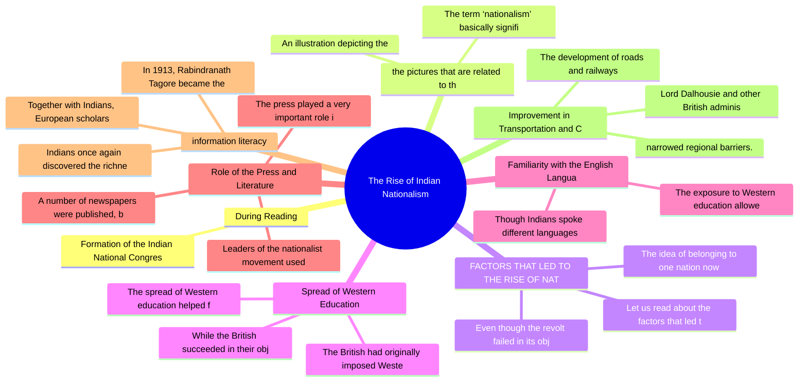

# Chapter 11: The Rise of Indian Nationalism

## High-Yield Facts
- Formation of the Indian National Congress in 1885 to organise public opinion
- The term ‘nationalism’ basically signifies a great love for one’s motherland and the desire to liberate it from foreign rule. The end of the 19th century and the beginning of the 20th century witnessed the rise of nationalist feelings among many Indians. These feelings ultimately led to the birth of the Indian national movement.
- Let us read about the factors that led to the rise of nationalism.
- Even though the revolt failed in its objective of expelling the British from India, it created in Indian minds the idea of unity and sacrifice for the nation.
- The idea of belonging to one nation now gained ground.
- The spread of Western education helped foster the spirit of nationalism.
- The British had originally imposed Western education in order to create a class of clerks for their administration.
- While the British succeeded in their objectives, Western education brought to Indian minds the modern ideas of freedom, liberty and fraternity.
- The exposure to Western education allowed many Indians to learn the English language. It became the language of communication among educated people across the country.
- Though Indians spoke different languages in their own regions, they often used English to express their views and exchange ideas with those belonging to other regions. This developed a sense of unity among different regional groups.
- The press played a very important role in arousing nationalist feelings.
- A number of newspapers were published, both in English and in the vernacular languages.
- Leaders of the nationalist movement used the vernacular press to spread modern ideas and national awareness. They discussed British policies and the evils of the British Raj.
- In 1913, Rabindranath Tagore became the first non-European to win the Nobel Prize for Literature.
- Together with Indians, European scholars such as Alexander Cunningham, William Jones and James Prinsep researched India's past and revealed its rich heritage.
- Indians once again discovered the richness of Vedic philosophy, the wisdom of rulers such as Chandragupta Maurya, and the glory of the Gupta dynasty and the Mughal Empire. These rediscoveries helped Indians develop a sense of pride and self-confidence to demand freedom from the British rule.
- Lord Dalhousie and other British administrators took an active interest in establishing an effective system of transport and communication.
- The development of roads and railways
- The British considered the Indians to be an inferior and uncivilised race.
- Indians were humiliated, looked down upon and treated with contempt.
- Racial discrimination by the British was greatly resented by Indians. Certain instances of racial discrimination were as follows:
- Lord Ripon, who succeeded Lord Lytton as the Viceroy, tried to address some of the grievances of the Indians.
- A bill, known as the Ilbert Bill, was introduced in 1883 by C.P. Ilbert, a Law Member of the Government of India.
- The bill proposed that senior Indian magistrates could preside over cases involving Europeans accused of crimes in India.

## Notes (Expert Revision)
### 1. During Reading

**Executive summary:** Formation of the Indian National Congress in 1885 to organise public opinion

**Must know**
• Formation of the Indian National Congress in 1885 to organise public opinion

Formation of the Indian National Congress in 1885 to organise public opinion

### 2. the pictures that are related to the causes for the growth of nationalism in Ind

**Executive summary:** An illustration depicting the

**Must know**
• An illustration depicting the
• The term ‘nationalism’ basically signifies a great love for one’s motherland and the desire to liberate it from foreign rule. The end of the 19th century and the beginning of the 20th century witnessed the rise of nationalist feelings among many Indians. These feelings ultimately led to the birth of the Indian national movement.

An illustration depicting the

The term ‘nationalism’ basically signifies a great love for one’s motherland and the desire to liberate it from foreign rule. The end of the 19th century and the beginning of the 20th century witnessed the rise of nationalist feelings among many Indians. These feelings ultimately led to the birth of the Indian national movement.

### 3. FACTORS THAT LED TO THE RISE OF NATIONALISM

**Executive summary:** Let us read about the factors that led to the rise of nationalism.

**Must know**
• Let us read about the factors that led to the rise of nationalism.
• Even though the revolt failed in its objective of expelling the British from India, it created in Indian minds the idea of unity and sacrifice for the nation.
• The idea of belonging to one nation now gained ground.
• Martyrs of the revolt became household names and inspired many Indians, young and old, to join the nationalist movement.

Let us read about the factors that led to the rise of nationalism.

Even though the revolt failed in its objective of expelling the British from India, it created in Indian minds the idea of unity and sacrifice for the nation.

The idea of belonging to one nation now gained ground.

Martyrs of the revolt became household names and inspired many Indians, young and old, to join the nationalist movement.

### 4. Spread of Western Education

**Executive summary:** The spread of Western education helped foster the spirit of nationalism.

**Must know**
• The spread of Western education helped foster the spirit of nationalism.
• The British had originally imposed Western education in order to create a class of clerks for their administration.
• While the British succeeded in their objectives, Western education brought to Indian minds the modern ideas of freedom, liberty and fraternity.
• The educated Indians also learnt about the success of the French Revolution and the American War of Independence, and they dreamed of a strong, united and free India. They learnt to take pride in India's glorious past and to oppose British perception of Indians as an inferior race. Many of these educated Indians rose to become leaders of the national movement.

The spread of Western education helped foster the spirit of nationalism.

The British had originally imposed Western education in order to create a class of clerks for their administration.

While the British succeeded in their objectives, Western education brought to Indian minds the modern ideas of freedom, liberty and fraternity.

The educated Indians also learnt about the success of the French Revolution and the American War of Independence, and they dreamed of a strong, united and free India. They learnt to take pride in India's glorious past and to oppose British perception of Indians as an inferior race. Many of these educated Indians rose to become leaders of the national movement.

### 5. Familiarity with the English Language

**Executive summary:** The exposure to Western education allowed many Indians to learn the English language. It became the language of communication among educated people across the country.

**Must know**
• The exposure to Western education allowed many Indians to learn the English language. It became the language of communication among educated people across the country.
• Though Indians spoke different languages in their own regions, they often used English to express their views and exchange ideas with those belonging to other regions. This developed a sense of unity among different regional groups.

The exposure to Western education allowed many Indians to learn the English language. It became the language of communication among educated people across the country.

Though Indians spoke different languages in their own regions, they often used English to express their views and exchange ideas with those belonging to other regions. This developed a sense of unity among different regional groups.

### 6. Role of the Press and Literature

**Executive summary:** The press played a very important role in arousing nationalist feelings.

**Must know**
• The press played a very important role in arousing nationalist feelings.
• A number of newspapers were published, both in English and in the vernacular languages.
• Leaders of the nationalist movement used the vernacular press to spread modern ideas and national awareness. They discussed British policies and the evils of the British Raj.
• The idea of democracy was also discussed in the vernacular press.
• Nationalist literature, such as Bankim Chandra Chattopadhyay's Anandamath and Rabindranath Tagore's Ghare Baire, led to a cultural awakening of the people. These works acquainted Indians with their rich cultural heritage and aroused their nationalist aspirations.

The press played a very important role in arousing nationalist feelings.

A number of newspapers were published, both in English and in the vernacular languages.

Leaders of the nationalist movement used the vernacular press to spread modern ideas and national awareness. They discussed British policies and the evils of the British Raj.

The idea of democracy was also discussed in the vernacular press.

Nationalist literature, such as Bankim Chandra Chattopadhyay's Anandamath and Rabindranath Tagore's Ghare Baire, led to a cultural awakening of the people. These works acquainted Indians with their rich cultural heritage and aroused their nationalist aspirations.

### 7. information literacy

**Executive summary:** In 1913, Rabindranath Tagore became the first non-European to win the Nobel Prize for Literature.

**Must know**
• In 1913, Rabindranath Tagore became the first non-European to win the Nobel Prize for Literature.
• Together with Indians, European scholars such as Alexander Cunningham, William Jones and James Prinsep researched India's past and revealed its rich heritage.
• Indians once again discovered the richness of Vedic philosophy, the wisdom of rulers such as Chandragupta Maurya, and the glory of the Gupta dynasty and the Mughal Empire. These rediscoveries helped Indians develop a sense of pride and self-confidence to demand freedom from the British rule.

In 1913, Rabindranath Tagore became the first non-European to win the Nobel Prize for Literature.

Together with Indians, European scholars such as Alexander Cunningham, William Jones and James Prinsep researched India's past and revealed its rich heritage.

Indians once again discovered the richness of Vedic philosophy, the wisdom of rulers such as Chandragupta Maurya, and the glory of the Gupta dynasty and the Mughal Empire. These rediscoveries helped Indians develop a sense of pride and self-confidence to demand freedom from the British rule.

### 8. Improvement in Transportation and Communication

**Executive summary:** Lord Dalhousie and other British administrators took an active interest in establishing an effective system of transport and communication.

**Must know**
• Lord Dalhousie and other British administrators took an active interest in establishing an effective system of transport and communication.
• The development of roads and railways
• narrowed regional barriers.
• People travelled easily from one part of the country to another. They could meet and exchange ideas with each other. This made them realise that they shared common problems and that their goals were also the same.
• The Victoria Terminus, known today as the Chhatrapati Shivaji Terminus, is a UNESCO World Heritage Site and one of the earliest railway stations of India. It was built to improve the transport system in India.

Lord Dalhousie and other British administrators took an active interest in establishing an effective system of transport and communication.

The development of roads and railways

narrowed regional barriers.

People travelled easily from one part of the country to another. They could meet and exchange ideas with each other. This made them realise that they shared common problems and that their goals were also the same.

The Victoria Terminus, known today as the Chhatrapati Shivaji Terminus, is a UNESCO World Heritage Site and one of the earliest railway stations of India. It was built to improve the transport system in India.

### 9. acial Discrimination by the British

**Executive summary:** The British considered the Indians to be an inferior and uncivilised race.

**Must know**
• The British considered the Indians to be an inferior and uncivilised race.
• Indians were humiliated, looked down upon and treated with contempt.
• Racial discrimination by the British was greatly resented by Indians. Certain instances of racial discrimination were as follows:
• High-ranking positions in the Indian administration and government were only reserved for the British.
• Indians were debarred from using railway coaches, hospitals, parks and clubs reserved exclusively for the British.
• These racial policies antagonised many Indians, particularly the educated intelligentsia. It was this class that united the people against the British.

The British considered the Indians to be an inferior and uncivilised race.

Indians were humiliated, looked down upon and treated with contempt.

Racial discrimination by the British was greatly resented by Indians. Certain instances of racial discrimination were as follows:

High-ranking positions in the Indian administration and government were only reserved for the British.

Indians were debarred from using railway coaches, hospitals, parks and clubs reserved exclusively for the British.

These racial policies antagonised many Indians, particularly the educated intelligentsia. It was this class that united the people against the British.

##### Repressive Policies of Lord Lytton

Lord Lytton was the Viceroy of India between 1876 and 1880. Certain acts passed by him went against the interests of the Indians and caused great agitation. Some of his repressive policies were as follows:

### 10. Immediate Cause: The Ilbert Bill Controversy

**Executive summary:** Lord Ripon, who succeeded Lord Lytton as the Viceroy, tried to address some of the grievances of the Indians.

**Must know**
• Lord Ripon, who succeeded Lord Lytton as the Viceroy, tried to address some of the grievances of the Indians.
• A bill, known as the Ilbert Bill, was introduced in 1883 by C.P. Ilbert, a Law Member of the Government of India.
• The bill proposed that senior Indian magistrates could preside over cases involving Europeans accused of crimes in India.
• The Anglo-Indian officials and non-officials opposed the bill violently. Therefore, the bill had to be modified in favour of the European subjects.
• This controversy convinced many Indians that they would have to fight for their rights. They decided to form an organised political body, which would protect the interests of the Indians.

Lord Ripon, who succeeded Lord Lytton as the Viceroy, tried to address some of the grievances of the Indians.

A bill, known as the Ilbert Bill, was introduced in 1883 by C.P. Ilbert, a Law Member of the Government of India.

The bill proposed that senior Indian magistrates could preside over cases involving Europeans accused of crimes in India.

The Anglo-Indian officials and non-officials opposed the bill violently. Therefore, the bill had to be modified in favour of the European subjects.

This controversy convinced many Indians that they would have to fight for their rights. They decided to form an organised political body, which would protect the interests of the Indians.

## Mind Map

## Cheat Sheet

- Formation of the Indian National Congress in 1885 to organise public opinion
- The term ‘nationalism’ basically signifies a great love for one’s motherland and the desire to liberate it from foreign rule. The end of the 19th century and the beginning of the 20th century witnessed the rise of nationalist feelings among many Indians. These feelings ultimately led to the birth of the Indian national movement.
- Let us read about the factors that led to the rise of nationalism.
- Even though the revolt failed in its objective of expelling the British from India, it created in Indian minds the idea of unity and sacrifice for the nation.
- The idea of belonging to one nation now gained ground.
- The spread of Western education helped foster the spirit of nationalism.
- The British had originally imposed Western education in order to create a class of clerks for their administration.
- While the British succeeded in their objectives, Western education brought to Indian minds the modern ideas of freedom, liberty and fraternity.
- The exposure to Western education allowed many Indians to learn the English language. It became the language of communication among educated people across the country.
- Though Indians spoke different languages in their own regions, they often used English to express their views and exchange ideas with those belonging to other regions. This developed a sense of unity among different regional groups.
- The press played a very important role in arousing nationalist feelings.
- A number of newspapers were published, both in English and in the vernacular languages.
- Leaders of the nationalist movement used the vernacular press to spread modern ideas and national awareness. They discussed British policies and the evils of the British Raj.
- In 1913, Rabindranath Tagore became the first non-European to win the Nobel Prize for Literature.
- Together with Indians, European scholars such as Alexander Cunningham, William Jones and James Prinsep researched India's past and revealed its rich heritage.
- Indians once again discovered the richness of Vedic philosophy, the wisdom of rulers such as Chandragupta Maurya, and the glory of the Gupta dynasty and the Mughal Empire. These rediscoveries helped Indians develop a sense of pride and self-confidence to demand freedom from the British rule.
- Lord Dalhousie and other British administrators took an active interest in establishing an effective system of transport and communication.
- The development of roads and railways
- The British considered the Indians to be an inferior and uncivilised race.
- Indians were humiliated, looked down upon and treated with contempt.
- Racial discrimination by the British was greatly resented by Indians. Certain instances of racial discrimination were as follows:
- Lord Ripon, who succeeded Lord Lytton as the Viceroy, tried to address some of the grievances of the Indians.
- A bill, known as the Ilbert Bill, was introduced in 1883 by C.P. Ilbert, a Law Member of the Government of India.
- The bill proposed that senior Indian magistrates could preside over cases involving Europeans accused of crimes in India.

## One Word (30)

- **A number of newspapers** — A number of newspapers were published, both in English and in the vernacular languages.
- **Racial discrimination by the British** — Racial discrimination by the British was greatly resented by Indians. Certain instances of racial discrimination were as
- **A bill, known as the Ilbert Bill,** — A bill, known as the Ilbert Bill, was introduced in 1883 by C.P. Ilbert, a Law Member of the Government of India.
- **Even though the** — Even though the revolt failed in its objective of expelling the British from India, it created in In
- **The idea of** — The idea of belonging to one nation now gained ground.
- **The spread of** — The spread of Western education helped foster the spirit of nationalism.
- **The British had** — The British had originally imposed Western education in order to create a class of clerks for their 
- **While the British** — While the British succeeded in their objectives, Western education brought to Indian minds the moder
- **The exposure to** — The exposure to Western education allowed many Indians to learn the English language. It became the 
- **Though Indians spoke** — Though Indians spoke different languages in their own regions, they often used English to express th
- **The press played** — The press played a very important role in arousing nationalist feelings.
- **A number of** — A number of newspapers were published, both in English and in the vernacular languages.
- **Leaders of the** — Leaders of the nationalist movement used the vernacular press to spread modern ideas and national aw
- **In 1913, Rabindranath** — In 1913, Rabindranath Tagore became the first non-European to win the Nobel Prize for Literature.
- **Together with Indians,** — Together with Indians, European scholars such as Alexander Cunningham, William Jones and James Prins
- **Indians once again** — Indians once again discovered the richness of Vedic philosophy, the wisdom of rulers such as Chandra
- **Lord Dalhousie and** — Lord Dalhousie and other British administrators took an active interest in establishing an effective
- **The development of** — The development of roads and railways
- **The British considered** — The British considered the Indians to be an inferior and uncivilised race.
- **Indians were humiliated,** — Indians were humiliated, looked down upon and treated with contempt.
- **Racial discrimination by** — Racial discrimination by the British was greatly resented by Indians. Certain instances of racial di
- **Lord Ripon, who** — Lord Ripon, who succeeded Lord Lytton as the Viceroy, tried to address some of the grievances of the
- **A bill, known** — A bill, known as the Ilbert Bill, was introduced in 1883 by C.P. Ilbert, a Law Member of the Governm
- **The bill proposed** — The bill proposed that senior Indian magistrates could preside over cases involving Europeans accuse
- **Formation of the** — Formation of the Indian National Congress in 1885 to organise public opinion
- **The term ‘nationalism’** — The term ‘nationalism’ basically signifies a great love for one’s motherland and the desire to liber
- **Let us read** — Let us read about the factors that led to the rise of nationalism.
- **Even though the** — Even though the revolt failed in its objective of expelling the British from India, it created in In
- **The idea of** — The idea of belonging to one nation now gained ground.
- **The spread of** — The spread of Western education helped foster the spirit of nationalism.
