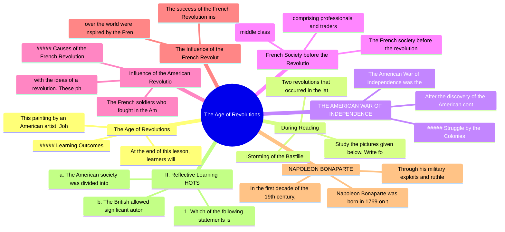

# Chapter 2: The Age of Revolutions

## High-Yield Facts
- This painting by an American artist, John Trumbull, depicts the death of General Joseph Warren at the Battle of Bunker Hill that took place in 1775. This battle is also called the Battle of Breed's Hill. It was the first major battle of the American Revolution.
- At the end of this lesson, learners will be able to:
- Study the pictures given below. Write for the picture showing an event from the American Revolution and for the picture showing an event from the French Revolution. In what ways were both the events shown here similar?
- Two revolutions that occurred in the late 18th century introduced the ideas of equality, freedom and democracy to the Western world. The American Revolution was one of the earliest revolutions to take place in the modern world. During this revolution, the Americans rejected colonial rule and chose the path of democracy. On the other hand, the French Revolution was the result of social, religious and economic injustices, and led to the end of the monarchy.
- The American War of Independence was the world's first organised political upheaval in which 13 British colonies in North America rejected the governance of the Parliament of Great Britain and the British monarchy to become the United States of America.
- After the discovery of the American continent in the 16th century, 13 British colonies had been established along the Atlantic Coast of North America by 1733.
- The French society before the revolution was arranged in order of rank and was divided into three main classes called Estates. Look at the diagram below to know about the three Estates.
- comprising professionals and traders
- with the ideas of a revolution. These philosophers, through their writings, discussed the injustice prevalent in the French society and politics. They inspired the middle class with their ideas of liberty, equality and fraternity, which went on to become the slogan of the French Revolution.
- ##### Causes of the French Revolution
- The French soldiers who fought in the American Revolution were inspired by its success. They in turn motivated their own people to fight against the indifferent and unjust government.
- The success of the French Revolution inspired people in other European countries. They rose in revolt to overthrow the tyrannical, autocratic rulers, and established new political and social systems based on the principles of liberty, equality and fraternity. Democracy became the new form of government. Mass movements all
- over the world were inspired by the French Revolution, and people imbibed the spirit of nationalism.
- Napoleon Bonaparte was born in 1769 on the Mediterranean island of Corsica. In 1785, Napoleon was commissioned as lieutenant in the French army. He won the confidence of his people and seniors with his energy and ability to make quick decisions. He rose through the ranks of the French army.
- Through his military exploits and ruthless efficiency, Napoleon rose from obscurity to become Napoleon I, the Emperor of France.
- In the first decade of the 19th century, the French army, under Napoleon’s command, engaged in a series of conflicts. Known as the Napoleonic Wars, these campaigns targeted every major European power.
- 1. Which of the following statements is true for the American Revolution? Give at least one reason for your answer.
- a. The American society was divided into three classes before the American War of Independence.
- b. The British allowed significant autonomy to the American Colonies to govern themselves.
- 1. What is 'No taxation without representation'?
- 3. Name two important French philosophers who played a major role in the revolutionary movement.
- When the king decided to tax the landowners, the nobles refused to support this measure. The entire burden of taxation, therefore, fell on the Third Estate, and they were taxed on everything, including necessities such as salt. They were also denied most privileges. The worst affected were the poor peasants. The bourgeoisie or the middle class had acquired wealth, but were deprived of their political rights. It was the discontented bourgeoisie who took up the leadership to initiate the French Revolution.
- 1. How did the Third Estate suffer?
- 2. Who formed the French society before the revolution?

## Notes (Expert Revision)
### 1. The Age of Revolutions

**Executive summary:** This painting by an American artist, John Trumbull, depicts the death of General Joseph Warren at the Battle of Bunker Hill that took place in 1775. This battle is also called the 

**Must know**
• This painting by an American artist, John Trumbull, depicts the death of General Joseph Warren at the Battle of Bunker Hill that took place in 1775. This battle is also called the Battle of Breed's Hill. It was the first major battle of the American Revolution.
• ##### Learning Outcomes
• At the end of this lesson, learners will be able to:
• analyse why some colonies in America fought the American War of Independence.
• assess how the United States of America was formed.
• discuss the causes behind the French Revolution.

This painting by an American artist, John Trumbull, depicts the death of General Joseph Warren at the Battle of Bunker Hill that took place in 1775. This battle is also called the Battle of Breed's Hill. It was the first major battle of the American Revolution.

##### Learning Outcomes

At the end of this lesson, learners will be able to:

analyse why some colonies in America fought the American War of Independence.

assess how the United States of America was formed.

discuss the causes behind the French Revolution.

trace the outbreak and evaluate the impact of the French Revolution.

outline the main developments in the post-Revolution period, with special reference to Napoleon Bonaparte.

### 2. During Reading

**Executive summary:** Study the pictures given below. Write for the picture showing an event from the American Revolution and for the picture showing an event from the French Revolution. In what ways we

**Must know**
• Study the pictures given below. Write for the picture showing an event from the American Revolution and for the picture showing an event from the French Revolution. In what ways were both the events shown here similar?
• □ Storming of the Bastille
• Two revolutions that occurred in the late 18th century introduced the ideas of equality, freedom and democracy to the Western world. The American Revolution was one of the earliest revolutions to take place in the modern world. During this revolution, the Americans rejected colonial rule and chose the path of democracy. On the other hand, the French Revolution was the result of social, religious and economic injustices, and led to the end of the monarchy.
• Pulling down the statue of King George III

Study the pictures given below. Write for the picture showing an event from the American Revolution and for the picture showing an event from the French Revolution. In what ways were both the events shown here similar?

□ Storming of the Bastille

Two revolutions that occurred in the late 18th century introduced the ideas of equality, freedom and democracy to the Western world. The American Revolution was one of the earliest revolutions to take place in the modern world. During this revolution, the Americans rejected colonial rule and chose the path of democracy. On the other hand, the French Revolution was the result of social, religious and economic injustices, and led to the end of the monarchy.

Pulling down the statue of King George III

### 3. THE AMERICAN WAR OF INDEPENDENCE

**Executive summary:** The American War of Independence was the world's first organised political upheaval in which 13 British colonies in North America rejected the governance of the Parliament of Great

**Must know**
• The American War of Independence was the world's first organised political upheaval in which 13 British colonies in North America rejected the governance of the Parliament of Great Britain and the British monarchy to become the United States of America.
• ##### Struggle by the Colonies
• After the discovery of the American continent in the 16th century, 13 British colonies had been established along the Atlantic Coast of North America by 1733.
• Each of these colonies had its own assembly of elected representatives. However, their control remained with the British Parliament as the governor of these colonies were appointed by the British.
• The settlers in these colonies were independent and resourceful. They were prosperous and had established a flourishing overseas trade.
• The British government felt that profits made in the colonies rightfully belonged to Great Britain. They imposed a series of heavy taxes, followed by laws that were aimed at putting economic restrictions on the way businesses were conducted in the colonies. These measures proved to be extremely unpopular in America.

The American War of Independence was the world's first organised political upheaval in which 13 British colonies in North America rejected the governance of the Parliament of Great Britain and the British monarchy to become the United States of America.

##### Struggle by the Colonies

After the discovery of the American continent in the 16th century, 13 British colonies had been established along the Atlantic Coast of North America by 1733.

Each of these colonies had its own assembly of elected representatives. However, their control remained with the British Parliament as the governor of these colonies were appointed by the British.

The settlers in these colonies were independent and resourceful. They were prosperous and had established a flourishing overseas trade.

The British government felt that profits made in the colonies rightfully belonged to Great Britain. They imposed a series of heavy taxes, followed by laws that were aimed at putting economic restrictions on the way businesses were conducted in the colonies. These measures proved to be extremely unpopular in America.

By 1763, Great Britain possessed vast territories in North America.

The British expected the colonies to contribute towards the defence of their territories. The colonists in turn demanded the right of representation in the British Parliament. The colonists took up the slogan, ‘No taxation without representation’.

### 4. French Society before the Revolution

**Executive summary:** The French society before the revolution was arranged in order of rank and was divided into three main classes called Estates. Look at the diagram below to know about the three Est

**Must know**
• The French society before the revolution was arranged in order of rank and was divided into three main classes called Estates. Look at the diagram below to know about the three Estates.
• bourgeoisie (middle class)
• comprising professionals and traders
• The three Estates in French Society before the revolution
• A majority of the French farming land was owned either by the aristocrats (nobility) or the clergy. The first two Estates in French society enjoyed the following privileges:
• The sole right to command army regiments and hold leading positions in government

The French society before the revolution was arranged in order of rank and was divided into three main classes called Estates. Look at the diagram below to know about the three Estates.

bourgeoisie (middle class)

comprising professionals and traders

The three Estates in French Society before the revolution

A majority of the French farming land was owned either by the aristocrats (nobility) or the clergy. The first two Estates in French society enjoyed the following privileges:

The sole right to command army regiments and hold leading positions in government

Exemption from direct taxation

The privilege of opposing the king's decision to tax landowners

### 5. Influence of the American Revolution

**Executive summary:** with the ideas of a revolution. These philosophers, through their writings, discussed the injustice prevalent in the French society and politics. They inspired the middle class wit

**Must know**
• with the ideas of a revolution. These philosophers, through their writings, discussed the injustice prevalent in the French society and politics. They inspired the middle class with their ideas of liberty, equality and fraternity, which went on to become the slogan of the French Revolution.
• ##### Causes of the French Revolution
• The French soldiers who fought in the American Revolution were inspired by its success. They in turn motivated their own people to fight against the indifferent and unjust government.
• food shortage, rising prices for food and unemployment.
• The immediate cause was the near collapse of government finances. Bad harvests and a slowdown in manufacturing led to
• Since the reign of Louis XIV, France had spent a fortune on wars in Europe and to acquire its colonies.

with the ideas of a revolution. These philosophers, through their writings, discussed the injustice prevalent in the French society and politics. They inspired the middle class with their ideas of liberty, equality and fraternity, which went on to become the slogan of the French Revolution.

##### Causes of the French Revolution

The French soldiers who fought in the American Revolution were inspired by its success. They in turn motivated their own people to fight against the indifferent and unjust government.

food shortage, rising prices for food and unemployment.

The immediate cause was the near collapse of government finances. Bad harvests and a slowdown in manufacturing led to

Since the reign of Louis XIV, France had spent a fortune on wars in Europe and to acquire its colonies.

King Louis XVI and his queen, Marie Antoinette, led very extravagant lives, which put a strain on the royal treasury.

The king enjoyed absolute power, and his word was the Law. He was not answerable to the people.

### 6. The Influence of the French Revolution

**Executive summary:** The success of the French Revolution inspired people in other European countries. They rose in revolt to overthrow the tyrannical, autocratic rulers, and established new political 

**Must know**
• The success of the French Revolution inspired people in other European countries. They rose in revolt to overthrow the tyrannical, autocratic rulers, and established new political and social systems based on the principles of liberty, equality and fraternity. Democracy became the new form of government. Mass movements all
• over the world were inspired by the French Revolution, and people imbibed the spirit of nationalism.

The success of the French Revolution inspired people in other European countries. They rose in revolt to overthrow the tyrannical, autocratic rulers, and established new political and social systems based on the principles of liberty, equality and fraternity. Democracy became the new form of government. Mass movements all

over the world were inspired by the French Revolution, and people imbibed the spirit of nationalism.

### 7. NAPOLEON BONAPARTE

**Executive summary:** Napoleon Bonaparte was born in 1769 on the Mediterranean island of Corsica. In 1785, Napoleon was commissioned as lieutenant in the French army. He won the confidence of his people

**Must know**
• Napoleon Bonaparte was born in 1769 on the Mediterranean island of Corsica. In 1785, Napoleon was commissioned as lieutenant in the French army. He won the confidence of his people and seniors with his energy and ability to make quick decisions. He rose through the ranks of the French army.
• Through his military exploits and ruthless efficiency, Napoleon rose from obscurity to become Napoleon I, the Emperor of France.
• In the first decade of the 19th century, the French army, under Napoleon’s command, engaged in a series of conflicts. Known as the Napoleonic Wars, these campaigns targeted every major European power.
• In 1799, Napoleon took part in the coup d'état that overthrew the government of the Directory. A new government called the consulate was proclaimed.
• In 1805, Napoleon defeated the combined forces of Austria and Russia at the Battle of Austerlitz. In 1806, Prussia, and in 1807, Russia were defeated by Napoleon. By 1810, Napoleon had unified and dominated most of Europe.
• In 1813, major European powers, namely, Britain, Austria and Prussia formed a coalition and defeated Napoleon's forces at Leipzig. The following year, the coalition invaded France, defeated Napoleon and exiled him to the island of Elba.

Napoleon Bonaparte was born in 1769 on the Mediterranean island of Corsica. In 1785, Napoleon was commissioned as lieutenant in the French army. He won the confidence of his people and seniors with his energy and ability to make quick decisions. He rose through the ranks of the French army.

Through his military exploits and ruthless efficiency, Napoleon rose from obscurity to become Napoleon I, the Emperor of France.

In the first decade of the 19th century, the French army, under Napoleon’s command, engaged in a series of conflicts. Known as the Napoleonic Wars, these campaigns targeted every major European power.

In 1799, Napoleon took part in the coup d'état that overthrew the government of the Directory. A new government called the consulate was proclaimed.

In 1805, Napoleon defeated the combined forces of Austria and Russia at the Battle of Austerlitz. In 1806, Prussia, and in 1807, Russia were defeated by Napoleon. By 1810, Napoleon had unified and dominated most of Europe.

In 1813, major European powers, namely, Britain, Austria and Prussia formed a coalition and defeated Napoleon's forces at Leipzig. The following year, the coalition invaded France, defeated Napoleon and exiled him to the island of Elba.

Less than a year later, Napoleon escaped from Elba and gathered a small army. But he was defeated at the Battle of Waterloo in 1815. Napoleon spent the last six years of his life under British supervision on the island of St. Helena, where he died in 1821.

### 8. II. Reflective Learning HOTS

**Executive summary:** 1. Which of the following statements is true for the American Revolution? Give at least one reason for your answer.

**Must know**
• 1. Which of the following statements is true for the American Revolution? Give at least one reason for your answer.
• a. The American society was divided into three classes before the American War of Independence.
• b. The British allowed significant autonomy to the American Colonies to govern themselves.
• c. The Declaration of Independence became an inspiration for other nations to free themselves from colonial rule.

1. Which of the following statements is true for the American Revolution? Give at least one reason for your answer.

a. The American society was divided into three classes before the American War of Independence.

b. The British allowed significant autonomy to the American Colonies to govern themselves.

c. The Declaration of Independence became an inspiration for other nations to free themselves from colonial rule.

### 9. III. Answer the following questions in brief.

**Executive summary:** 1. What is 'No taxation without representation'?

**Must know**
• 1. What is 'No taxation without representation'?
• 2. What was Boston Massacre?
• 3. Name two important French philosophers who played a major role in the revolutionary movement.
• 4. Mention any two causes of the French Revolution.
• 5. What was the Tennis Court Oath?
• IV. With reference to the American Revolution, answer the following questions:

1. What is 'No taxation without representation'?

2. What was Boston Massacre?

3. Name two important French philosophers who played a major role in the revolutionary movement.

4. Mention any two causes of the French Revolution.

5. What was the Tennis Court Oath?

IV. With reference to the American Revolution, answer the following questions:

a. What were Intolerable Acts?

b. Describe the events of the Boston Tea Party.

### 10. VI. Read the paragraph and answer the questions that follow.

**Executive summary:** When the king decided to tax the landowners, the nobles refused to support this measure. The entire burden of taxation, therefore, fell on the Third Estate, and they were taxed on 

**Must know**
• When the king decided to tax the landowners, the nobles refused to support this measure. The entire burden of taxation, therefore, fell on the Third Estate, and they were taxed on everything, including necessities such as salt. They were also denied most privileges. The worst affected were the poor peasants. The bourgeoisie or the middle class had acquired wealth, but were deprived of their political rights. It was the discontented bourgeoisie who took up the leadership to initiate the French Revolution.
• 1. How did the Third Estate suffer?
• 2. Who formed the French society before the revolution?
• VII. Answer the following questions in detail.
• 1. What was the result of the American and French Revolutions?
• 2. Write a note on Napoleon Bonaparte.

When the king decided to tax the landowners, the nobles refused to support this measure. The entire burden of taxation, therefore, fell on the Third Estate, and they were taxed on everything, including necessities such as salt. They were also denied most privileges. The worst affected were the poor peasants. The bourgeoisie or the middle class had acquired wealth, but were deprived of their political rights. It was the discontented bourgeoisie who took up the leadership to initiate the French Revolution.

1. How did the Third Estate suffer?

2. Who formed the French society before the revolution?

VII. Answer the following questions in detail.

1. What was the result of the American and French Revolutions?

2. Write a note on Napoleon Bonaparte.

for experiential learning

art-integrated learning

## Mind Map

## Cheat Sheet

- This painting by an American artist, John Trumbull, depicts the death of General Joseph Warren at the Battle of Bunker Hill that took place in 1775. This battle is also called the Battle of Breed's Hill. It was the first major battle of the American Revolution.
- At the end of this lesson, learners will be able to:
- Study the pictures given below. Write for the picture showing an event from the American Revolution and for the picture showing an event from the French Revolution. In what ways were both the events shown here similar?
- Two revolutions that occurred in the late 18th century introduced the ideas of equality, freedom and democracy to the Western world. The American Revolution was one of the earliest revolutions to take place in the modern world. During this revolution, the Americans rejected colonial rule and chose the path of democracy. On the other hand, the French Revolution was the result of social, religious and economic injustices, and led to the end of the monarchy.
- The American War of Independence was the world's first organised political upheaval in which 13 British colonies in North America rejected the governance of the Parliament of Great Britain and the British monarchy to become the United States of America.
- After the discovery of the American continent in the 16th century, 13 British colonies had been established along the Atlantic Coast of North America by 1733.
- The French society before the revolution was arranged in order of rank and was divided into three main classes called Estates. Look at the diagram below to know about the three Estates.
- comprising professionals and traders
- with the ideas of a revolution. These philosophers, through their writings, discussed the injustice prevalent in the French society and politics. They inspired the middle class with their ideas of liberty, equality and fraternity, which went on to become the slogan of the French Revolution.
- ##### Causes of the French Revolution
- The French soldiers who fought in the American Revolution were inspired by its success. They in turn motivated their own people to fight against the indifferent and unjust government.
- The success of the French Revolution inspired people in other European countries. They rose in revolt to overthrow the tyrannical, autocratic rulers, and established new political and social systems based on the principles of liberty, equality and fraternity. Democracy became the new form of government. Mass movements all
- over the world were inspired by the French Revolution, and people imbibed the spirit of nationalism.
- Napoleon Bonaparte was born in 1769 on the Mediterranean island of Corsica. In 1785, Napoleon was commissioned as lieutenant in the French army. He won the confidence of his people and seniors with his energy and ability to make quick decisions. He rose through the ranks of the French army.
- Through his military exploits and ruthless efficiency, Napoleon rose from obscurity to become Napoleon I, the Emperor of France.
- In the first decade of the 19th century, the French army, under Napoleon’s command, engaged in a series of conflicts. Known as the Napoleonic Wars, these campaigns targeted every major European power.
- 1. Which of the following statements is true for the American Revolution? Give at least one reason for your answer.
- a. The American society was divided into three classes before the American War of Independence.
- b. The British allowed significant autonomy to the American Colonies to govern themselves.
- 1. What is 'No taxation without representation'?
- 3. Name two important French philosophers who played a major role in the revolutionary movement.
- When the king decided to tax the landowners, the nobles refused to support this measure. The entire burden of taxation, therefore, fell on the Third Estate, and they were taxed on everything, including necessities such as salt. They were also denied most privileges. The worst affected were the poor peasants. The bourgeoisie or the middle class had acquired wealth, but were deprived of their political rights. It was the discontented bourgeoisie who took up the leadership to initiate the French Revolution.
- 1. How did the Third Estate suffer?
- 2. Who formed the French society before the revolution?

## One Word (30)

- **Bill of Rights** — the first 10 amendments to the US Constitution, adopted in 1791; constitutes a collection of guarantees of individual ri
- **Colonists** — settlers who migrated to America and set up permanent colonies there
- **Declaration of Independence** — a resolution adopted by American colonists at Philadelphia in 1776; it stated their right to free themselves from the Br
- **First Estate** — a class in French society; it consisted of the clergy
- **Guillotined** — to behead a person by using a machine with a heavy and sharp blade
- **Liberty, Equality, Fraternity** — popular ideas during the French Revolution; emphasised freedom, equal status and brotherhood among the French
- **Militia** — a group of ordinary people trained as soldiers to fight in an emergency
- **National Assembly** — formed of members elected from the Third Estate in France
- **No taxation without representation** — a slogan of the American colonists that originated during 1750s and 1760s; it demanded the right of self-governance in l
- **Punitive** — relating to or causing punishment or great difficulty
- **Second Estate** — a class in French society; it consisted of the nobles and their families
- **Third Estate** — a class consisting of peasants, artisans, workers, and the middle-class merchants, manufacturers, professionals in the F
- **The American War of Independence** — The American War of Independence was the world's first organised political upheaval in which 13 British colonies in Nort
- **The French society before the revolution** — The French society before the revolution was arranged in order of rank and was divided into three main classes called Es
- **over the world** — over the world were inspired by the French Revolution, and people imbibed the spirit of nationalism.
- **Napoleon Bonaparte** — Napoleon Bonaparte was born in 1769 on the Mediterranean island of Corsica. In 1785, Napoleon was commissioned as lieute
- **1. Which of the following statements** — 1. Which of the following statements is true for the American Revolution? Give at least one reason for your answer.
- **a. The American society** — a. The American society was divided into three classes before the American War of Independence.
- **b. The British** — b. The British allowed significant autonomy to the American Colonies to govern themselves.
- **1. What is** — 1. What is 'No taxation without representation'?
- **3. Name two** — 3. Name two important French philosophers who played a major role in the revolutionary movement.
- **When the king** — When the king decided to tax the landowners, the nobles refused to support this measure. The entire 
- **1. How did** — 1. How did the Third Estate suffer?
- **2. Who formed** — 2. Who formed the French society before the revolution?
- **This painting by** — This painting by an American artist, John Trumbull, depicts the death of General Joseph Warren at th
- **At the end** — At the end of this lesson, learners will be able to:
- **Study the pictures** — Study the pictures given below. Write for the picture showing an event from the American Revolution 
- **Two revolutions that** — Two revolutions that occurred in the late 18th century introduced the ideas of equality, freedom and
- **The American War** — The American War of Independence was the world's first organised political upheaval in which 13 Brit
- **After the discovery** — After the discovery of the American continent in the 16th century, 13 British colonies had been esta
