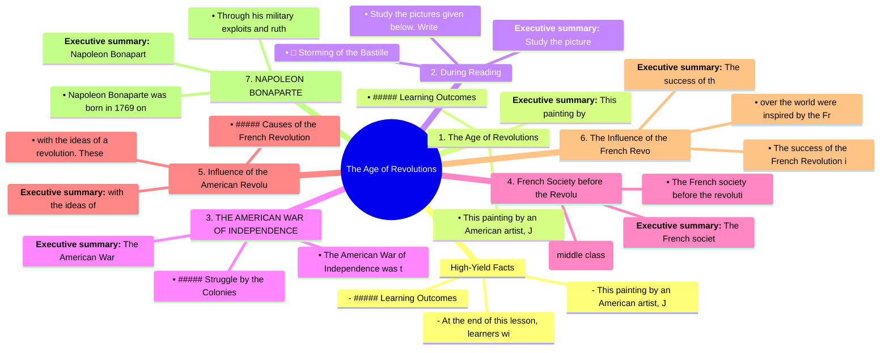

# Chapter 2: The Age of Revolutions

## High-Yield Facts
- - This painting by an American artist, John Trumbull, depicts the death of General Joseph Warren at the Battle of Bunker Hill that took place in 1775. This battle is also called the Battle of Breed's Hill. It was the first major battle of the American Revolution.
- - ##### Learning Outcomes
- - At the end of this lesson, learners will be able to:
- **Executive summary:** This painting by an American artist, John Trumbull, depicts the death of General Joseph Warren at the Battle of Bunker Hill that took place in 1775. This battle is also called the
- • This painting by an American artist, John Trumbull, depicts the death of General Joseph Warren at the Battle of Bunker Hill that took place in 1775. This battle is also called the Battle of Breed's Hill. It was the first major battle of the American Revolution.
- • ##### Learning Outcomes
- **Executive summary:** Study the pictures given below. Write for the picture showing an event from the American Revolution and for the picture showing an event from the French Revolution. In what ways we
- • Study the pictures given below. Write for the picture showing an event from the American Revolution and for the picture showing an event from the French Revolution. In what ways were both the events shown here similar?
- • □ Storming of the Bastille
- **Executive summary:** The American War of Independence was the world's first organised political upheaval in which 13 British colonies in North America rejected the governance of the Parliament of Great
- • The American War of Independence was the world's first organised political upheaval in which 13 British colonies in North America rejected the governance of the Parliament of Great Britain and the British monarchy to become the United States of America.
- • ##### Struggle by the Colonies
- **Executive summary:** The French society before the revolution was arranged in order of rank and was divided into three main classes called Estates. Look at the diagram below to know about the three Est
- • The French society before the revolution was arranged in order of rank and was divided into three main classes called Estates. Look at the diagram below to know about the three Estates.
- • bourgeoisie (middle class)
- **Executive summary:** with the ideas of a revolution. These philosophers, through their writings, discussed the injustice prevalent in the French society and politics. They inspired the middle class wit
- • with the ideas of a revolution. These philosophers, through their writings, discussed the injustice prevalent in the French society and politics. They inspired the middle class with their ideas of liberty, equality and fraternity, which went on to become the slogan of the French Revolution.
- • ##### Causes of the French Revolution
- **Executive summary:** The success of the French Revolution inspired people in other European countries. They rose in revolt to overthrow the tyrannical, autocratic rulers, and established new political
- • The success of the French Revolution inspired people in other European countries. They rose in revolt to overthrow the tyrannical, autocratic rulers, and established new political and social systems based on the principles of liberty, equality and fraternity. Democracy became the new form of government. Mass movements all
- • over the world were inspired by the French Revolution, and people imbibed the spirit of nationalism.
- **Executive summary:** Napoleon Bonaparte was born in 1769 on the Mediterranean island of Corsica. In 1785, Napoleon was commissioned as lieutenant in the French army. He won the confidence of his people
- • Napoleon Bonaparte was born in 1769 on the Mediterranean island of Corsica. In 1785, Napoleon was commissioned as lieutenant in the French army. He won the confidence of his people and seniors with his energy and ability to make quick decisions. He rose through the ranks of the French army.
- • Through his military exploits and ruthless efficiency, Napoleon rose from obscurity to become Napoleon I, the Emperor of France.
- **Executive summary:** Bill of Rights: the first 10 amendments to the US Constitution, adopted in 1791; constitutes a collection of guarantees of individual rights and limitations on federal and state go
- • Bill of Rights: the first 10 amendments to the US Constitution, adopted in 1791; constitutes a collection of guarantees of individual rights and limitations on federal and state governments
- • Colonists: settlers who migrated to America and set up permanent colonies there
- **Executive summary:** 1. Which of the following statements is true for the American Revolution? Give at least one reason for your answer.
- • 1. Which of the following statements is true for the American Revolution? Give at least one reason for your answer.
- • a. The American society was divided into three classes before the American War of Independence.

## Notes (Expert Revision)
### 1. High-Yield Facts

**Executive summary:** - This painting by an American artist, John Trumbull, depicts the death of General Joseph Warren at the Battle of Bunker Hill that took place in 1775. This battle is also called th

**Must know**
• - This painting by an American artist, John Trumbull, depicts the death of General Joseph Warren at the Battle of Bunker Hill that took place in 1775. This battle is also called the Battle of Breed's Hill. It was the first major battle of the American Revolution.
• - ##### Learning Outcomes
• - At the end of this lesson, learners will be able to:
• - Study the pictures given below. Write for the picture showing an event from the American Revolution and for the picture showing an event from the French Revolution. In what ways were both the events shown here similar?
• - □ Storming of the Bastille
• - Two revolutions that occurred in the late 18th century introduced the ideas of equality, freedom and democracy to the Western world. The American Revolution was one of the earliest revolutions to take place in the modern world. During this revolution, the Americans rejected colonial rule and chose the path of democracy. On the other hand, the French Revolution was the result of social, religious and economic injustices, and led to the end of the monarchy.

- This painting by an American artist, John Trumbull, depicts the death of General Joseph Warren at the Battle of Bunker Hill that took place in 1775. This battle is also called the Battle of Breed's Hill. It was the first major battle of the American Revolution.

- ##### Learning Outcomes

- At the end of this lesson, learners will be able to:

- Study the pictures given below. Write for the picture showing an event from the American Revolution and for the picture showing an event from the French Revolution. In what ways were both the events shown here similar?

- □ Storming of the Bastille

- Two revolutions that occurred in the late 18th century introduced the ideas of equality, freedom and democracy to the Western world. The American Revolution was one of the earliest revolutions to take place in the modern world. During this revolution, the Americans rejected colonial rule and chose the path of democracy. On the other hand, the French Revolution was the result of social, religious and economic injustices, and led to the end of the monarchy.

- The American War of Independence was the world's first organised political upheaval in which 13 British colonies in North America rejected the governance of the Parliament of Great Britain and the British monarchy to become the United States of America.

- ##### Struggle by the Colonies

### 2. 1. The Age of Revolutions

**Executive summary:** **Executive summary:** This painting by an American artist, John Trumbull, depicts the death of General Joseph Warren at the Battle of Bunker Hill that took place in 1775. This bat

**Must know**
• **Executive summary:** This painting by an American artist, John Trumbull, depicts the death of General Joseph Warren at the Battle of Bunker Hill that took place in 1775. This battle is also called the
• • This painting by an American artist, John Trumbull, depicts the death of General Joseph Warren at the Battle of Bunker Hill that took place in 1775. This battle is also called the Battle of Breed's Hill. It was the first major battle of the American Revolution.
• • ##### Learning Outcomes
• • At the end of this lesson, learners will be able to:
• • analyse why some colonies in America fought the American War of Independence.
• • assess how the United States of America was formed.

**Executive summary:** This painting by an American artist, John Trumbull, depicts the death of General Joseph Warren at the Battle of Bunker Hill that took place in 1775. This battle is also called the

• This painting by an American artist, John Trumbull, depicts the death of General Joseph Warren at the Battle of Bunker Hill that took place in 1775. This battle is also called the Battle of Breed's Hill. It was the first major battle of the American Revolution.

• ##### Learning Outcomes

• At the end of this lesson, learners will be able to:

• analyse why some colonies in America fought the American War of Independence.

• assess how the United States of America was formed.

• discuss the causes behind the French Revolution.

This painting by an American artist, John Trumbull, depicts the death of General Joseph Warren at the Battle of Bunker Hill that took place in 1775. This battle is also called the Battle of Breed's Hill. It was the first major battle of the American Revolution.

### 3. 2. During Reading

**Executive summary:** **Executive summary:** Study the pictures given below. Write for the picture showing an event from the American Revolution and for the picture showing an event from the French Revo

**Must know**
• **Executive summary:** Study the pictures given below. Write for the picture showing an event from the American Revolution and for the picture showing an event from the French Revolution. In what ways we
• • Study the pictures given below. Write for the picture showing an event from the American Revolution and for the picture showing an event from the French Revolution. In what ways were both the events shown here similar?
• • □ Storming of the Bastille
• • Two revolutions that occurred in the late 18th century introduced the ideas of equality, freedom and democracy to the Western world. The American Revolution was one of the earliest revolutions to take place in the modern world. During this revolution, the Americans rejected colonial rule and chose the path of democracy. On the other hand, the French Revolution was the result of social, religious and economic injustices, and led to the end of the monarchy.
• • Pulling down the statue of King George III
• Study the pictures given below. Write for the picture showing an event from the American Revolution and for the picture showing an event from the French Revolution. In what ways were both the events shown here similar?

**Executive summary:** Study the pictures given below. Write for the picture showing an event from the American Revolution and for the picture showing an event from the French Revolution. In what ways we

• Study the pictures given below. Write for the picture showing an event from the American Revolution and for the picture showing an event from the French Revolution. In what ways were both the events shown here similar?

• □ Storming of the Bastille

• Two revolutions that occurred in the late 18th century introduced the ideas of equality, freedom and democracy to the Western world. The American Revolution was one of the earliest revolutions to take place in the modern world. During this revolution, the Americans rejected colonial rule and chose the path of democracy. On the other hand, the French Revolution was the result of social, religious and economic injustices, and led to the end of the monarchy.

• Pulling down the statue of King George III

Study the pictures given below. Write for the picture showing an event from the American Revolution and for the picture showing an event from the French Revolution. In what ways were both the events shown here similar?

□ Storming of the Bastille

Two revolutions that occurred in the late 18th century introduced the ideas of equality, freedom and democracy to the Western world. The American Revolution was one of the earliest revolutions to take place in the modern world. During this revolution, the Americans rejected colonial rule and chose the path of democracy. On the other hand, the French Revolution was the result of social, religious and economic injustices, and led to the end of the monarchy.

### 4. 3. THE AMERICAN WAR OF INDEPENDENCE

**Executive summary:** **Executive summary:** The American War of Independence was the world's first organised political upheaval in which 13 British colonies in North America rejected the governance of 

**Must know**
• **Executive summary:** The American War of Independence was the world's first organised political upheaval in which 13 British colonies in North America rejected the governance of the Parliament of Great
• • The American War of Independence was the world's first organised political upheaval in which 13 British colonies in North America rejected the governance of the Parliament of Great Britain and the British monarchy to become the United States of America.
• • ##### Struggle by the Colonies
• • After the discovery of the American continent in the 16th century, 13 British colonies had been established along the Atlantic Coast of North America by 1733.
• • Each of these colonies had its own assembly of elected representatives. However, their control remained with the British Parliament as the governor of these colonies were appointed by the British.
• • The settlers in these colonies were independent and resourceful. They were prosperous and had established a flourishing overseas trade.

**Executive summary:** The American War of Independence was the world's first organised political upheaval in which 13 British colonies in North America rejected the governance of the Parliament of Great

• The American War of Independence was the world's first organised political upheaval in which 13 British colonies in North America rejected the governance of the Parliament of Great Britain and the British monarchy to become the United States of America.

• ##### Struggle by the Colonies

• After the discovery of the American continent in the 16th century, 13 British colonies had been established along the Atlantic Coast of North America by 1733.

• Each of these colonies had its own assembly of elected representatives. However, their control remained with the British Parliament as the governor of these colonies were appointed by the British.

• The settlers in these colonies were independent and resourceful. They were prosperous and had established a flourishing overseas trade.

• The British government felt that profits made in the colonies rightfully belonged to Great Britain. They imposed a series of heavy taxes, followed by laws that were aimed at putting economic restrictions on the way businesses were conducted in the colonies. These measures proved to be extremely unpopular in America.

The American War of Independence was the world's first organised political upheaval in which 13 British colonies in North America rejected the governance of the Parliament of Great Britain and the British monarchy to become the United States of America.

### 5. 4. French Society before the Revolution

**Executive summary:** **Executive summary:** The French society before the revolution was arranged in order of rank and was divided into three main classes called Estates. Look at the diagram below to k

**Must know**
• **Executive summary:** The French society before the revolution was arranged in order of rank and was divided into three main classes called Estates. Look at the diagram below to know about the three Est
• • The French society before the revolution was arranged in order of rank and was divided into three main classes called Estates. Look at the diagram below to know about the three Estates.
• • bourgeoisie (middle class)
• • comprising professionals and traders
• • The three Estates in French Society before the revolution
• • A majority of the French farming land was owned either by the aristocrats (nobility) or the clergy. The first two Estates in French society enjoyed the following privileges:

**Executive summary:** The French society before the revolution was arranged in order of rank and was divided into three main classes called Estates. Look at the diagram below to know about the three Est

• The French society before the revolution was arranged in order of rank and was divided into three main classes called Estates. Look at the diagram below to know about the three Estates.

• bourgeoisie (middle class)

• comprising professionals and traders

• The three Estates in French Society before the revolution

• A majority of the French farming land was owned either by the aristocrats (nobility) or the clergy. The first two Estates in French society enjoyed the following privileges:

• The sole right to command army regiments and hold leading positions in government

The French society before the revolution was arranged in order of rank and was divided into three main classes called Estates. Look at the diagram below to know about the three Estates.

### 6. 5. Influence of the American Revolution

**Executive summary:** **Executive summary:** with the ideas of a revolution. These philosophers, through their writings, discussed the injustice prevalent in the French society and politics. They inspir

**Must know**
• **Executive summary:** with the ideas of a revolution. These philosophers, through their writings, discussed the injustice prevalent in the French society and politics. They inspired the middle class wit
• • with the ideas of a revolution. These philosophers, through their writings, discussed the injustice prevalent in the French society and politics. They inspired the middle class with their ideas of liberty, equality and fraternity, which went on to become the slogan of the French Revolution.
• • ##### Causes of the French Revolution
• • The French soldiers who fought in the American Revolution were inspired by its success. They in turn motivated their own people to fight against the indifferent and unjust government.
• • food shortage, rising prices for food and unemployment.
• • The immediate cause was the near collapse of government finances. Bad harvests and a slowdown in manufacturing led to

**Executive summary:** with the ideas of a revolution. These philosophers, through their writings, discussed the injustice prevalent in the French society and politics. They inspired the middle class wit

• with the ideas of a revolution. These philosophers, through their writings, discussed the injustice prevalent in the French society and politics. They inspired the middle class with their ideas of liberty, equality and fraternity, which went on to become the slogan of the French Revolution.

• ##### Causes of the French Revolution

• The French soldiers who fought in the American Revolution were inspired by its success. They in turn motivated their own people to fight against the indifferent and unjust government.

• food shortage, rising prices for food and unemployment.

• The immediate cause was the near collapse of government finances. Bad harvests and a slowdown in manufacturing led to

• Since the reign of Louis XIV, France had spent a fortune on wars in Europe and to acquire its colonies.

with the ideas of a revolution. These philosophers, through their writings, discussed the injustice prevalent in the French society and politics. They inspired the middle class with their ideas of liberty, equality and fraternity, which went on to become the slogan of the French Revolution.

### 7. 6. The Influence of the French Revolution

**Executive summary:** **Executive summary:** The success of the French Revolution inspired people in other European countries. They rose in revolt to overthrow the tyrannical, autocratic rulers, and est

**Must know**
• **Executive summary:** The success of the French Revolution inspired people in other European countries. They rose in revolt to overthrow the tyrannical, autocratic rulers, and established new political
• • The success of the French Revolution inspired people in other European countries. They rose in revolt to overthrow the tyrannical, autocratic rulers, and established new political and social systems based on the principles of liberty, equality and fraternity. Democracy became the new form of government. Mass movements all
• • over the world were inspired by the French Revolution, and people imbibed the spirit of nationalism.
• The success of the French Revolution inspired people in other European countries. They rose in revolt to overthrow the tyrannical, autocratic rulers, and established new political and social systems based on the principles of liberty, equality and fraternity. Democracy became the new form of government. Mass movements all
• over the world were inspired by the French Revolution, and people imbibed the spirit of nationalism.

**Executive summary:** The success of the French Revolution inspired people in other European countries. They rose in revolt to overthrow the tyrannical, autocratic rulers, and established new political

• The success of the French Revolution inspired people in other European countries. They rose in revolt to overthrow the tyrannical, autocratic rulers, and established new political and social systems based on the principles of liberty, equality and fraternity. Democracy became the new form of government. Mass movements all

• over the world were inspired by the French Revolution, and people imbibed the spirit of nationalism.

The success of the French Revolution inspired people in other European countries. They rose in revolt to overthrow the tyrannical, autocratic rulers, and established new political and social systems based on the principles of liberty, equality and fraternity. Democracy became the new form of government. Mass movements all

over the world were inspired by the French Revolution, and people imbibed the spirit of nationalism.

### 8. 7. NAPOLEON BONAPARTE

**Executive summary:** **Executive summary:** Napoleon Bonaparte was born in 1769 on the Mediterranean island of Corsica. In 1785, Napoleon was commissioned as lieutenant in the French army. He won the c

**Must know**
• **Executive summary:** Napoleon Bonaparte was born in 1769 on the Mediterranean island of Corsica. In 1785, Napoleon was commissioned as lieutenant in the French army. He won the confidence of his people
• • Napoleon Bonaparte was born in 1769 on the Mediterranean island of Corsica. In 1785, Napoleon was commissioned as lieutenant in the French army. He won the confidence of his people and seniors with his energy and ability to make quick decisions. He rose through the ranks of the French army.
• • Through his military exploits and ruthless efficiency, Napoleon rose from obscurity to become Napoleon I, the Emperor of France.
• • In the first decade of the 19th century, the French army, under Napoleon’s command, engaged in a series of conflicts. Known as the Napoleonic Wars, these campaigns targeted every major European power.
• • In 1799, Napoleon took part in the coup d'état that overthrew the government of the Directory. A new government called the consulate was proclaimed.
• • In 1805, Napoleon defeated the combined forces of Austria and Russia at the Battle of Austerlitz. In 1806, Prussia, and in 1807, Russia were defeated by Napoleon. By 1810, Napoleon had unified and dominated most of Europe.

**Executive summary:** Napoleon Bonaparte was born in 1769 on the Mediterranean island of Corsica. In 1785, Napoleon was commissioned as lieutenant in the French army. He won the confidence of his people

• Napoleon Bonaparte was born in 1769 on the Mediterranean island of Corsica. In 1785, Napoleon was commissioned as lieutenant in the French army. He won the confidence of his people and seniors with his energy and ability to make quick decisions. He rose through the ranks of the French army.

• Through his military exploits and ruthless efficiency, Napoleon rose from obscurity to become Napoleon I, the Emperor of France.

• In the first decade of the 19th century, the French army, under Napoleon’s command, engaged in a series of conflicts. Known as the Napoleonic Wars, these campaigns targeted every major European power.

• In 1799, Napoleon took part in the coup d'état that overthrew the government of the Directory. A new government called the consulate was proclaimed.

• In 1805, Napoleon defeated the combined forces of Austria and Russia at the Battle of Austerlitz. In 1806, Prussia, and in 1807, Russia were defeated by Napoleon. By 1810, Napoleon had unified and dominated most of Europe.

• In 1813, major European powers, namely, Britain, Austria and Prussia formed a coalition and defeated Napoleon's forces at Leipzig. The following year, the coalition invaded France, defeated Napoleon and exiled him to the island of Elba.

Napoleon Bonaparte was born in 1769 on the Mediterranean island of Corsica. In 1785, Napoleon was commissioned as lieutenant in the French army. He won the confidence of his people and seniors with his energy and ability to make quick decisions. He rose through the ranks of the French army.

### 9. 8. KEYWORDS

**Executive summary:** **Executive summary:** Bill of Rights: the first 10 amendments to the US Constitution, adopted in 1791; constitutes a collection of guarantees of individual rights and limitations 

**Must know**
• **Executive summary:** Bill of Rights: the first 10 amendments to the US Constitution, adopted in 1791; constitutes a collection of guarantees of individual rights and limitations on federal and state go
• • Bill of Rights: the first 10 amendments to the US Constitution, adopted in 1791; constitutes a collection of guarantees of individual rights and limitations on federal and state governments
• • Colonists: settlers who migrated to America and set up permanent colonies there
• • Declaration of Independence: a resolution adopted by American colonists at Philadelphia in 1776; it stated their right to free themselves from the British rule
• • First Estate: a class in French society; it consisted of the clergy
• • Guillotined: to behead a person by using a machine with a heavy and sharp blade

**Executive summary:** Bill of Rights: the first 10 amendments to the US Constitution, adopted in 1791; constitutes a collection of guarantees of individual rights and limitations on federal and state go

• Bill of Rights: the first 10 amendments to the US Constitution, adopted in 1791; constitutes a collection of guarantees of individual rights and limitations on federal and state governments

• Colonists: settlers who migrated to America and set up permanent colonies there

• Declaration of Independence: a resolution adopted by American colonists at Philadelphia in 1776; it stated their right to free themselves from the British rule

• First Estate: a class in French society; it consisted of the clergy

• Guillotined: to behead a person by using a machine with a heavy and sharp blade

• Liberty, Equality, Fraternity: popular ideas during the French Revolution; emphasised freedom, equal status and brotherhood among the French

Bill of Rights: the first 10 amendments to the US Constitution, adopted in 1791; constitutes a collection of guarantees of individual rights and limitations on federal and state governments

### 10. 9. II. Reflective Learning HOTS

**Executive summary:** **Executive summary:** 1. Which of the following statements is true for the American Revolution? Give at least one reason for your answer.

**Must know**
• **Executive summary:** 1. Which of the following statements is true for the American Revolution? Give at least one reason for your answer.
• • 1. Which of the following statements is true for the American Revolution? Give at least one reason for your answer.
• • a. The American society was divided into three classes before the American War of Independence.
• • b. The British allowed significant autonomy to the American Colonies to govern themselves.
• • c. The Declaration of Independence became an inspiration for other nations to free themselves from colonial rule.
• 1. Which of the following statements is true for the American Revolution? Give at least one reason for your answer.

**Executive summary:** 1. Which of the following statements is true for the American Revolution? Give at least one reason for your answer.

• 1. Which of the following statements is true for the American Revolution? Give at least one reason for your answer.

• a. The American society was divided into three classes before the American War of Independence.

• b. The British allowed significant autonomy to the American Colonies to govern themselves.

• c. The Declaration of Independence became an inspiration for other nations to free themselves from colonial rule.

1. Which of the following statements is true for the American Revolution? Give at least one reason for your answer.

a. The American society was divided into three classes before the American War of Independence.

b. The British allowed significant autonomy to the American Colonies to govern themselves.

## Mind Map

## Cheat Sheet

- - This painting by an American artist, John Trumbull, depicts the death of General Joseph Warren at the Battle of Bunker Hill that took place in 1775. This battle is also called the Battle of Breed's Hill. It was the first major battle of the American Revolution.
- - ##### Learning Outcomes
- - At the end of this lesson, learners will be able to:
- **Executive summary:** This painting by an American artist, John Trumbull, depicts the death of General Joseph Warren at the Battle of Bunker Hill that took place in 1775. This battle is also called the
- • This painting by an American artist, John Trumbull, depicts the death of General Joseph Warren at the Battle of Bunker Hill that took place in 1775. This battle is also called the Battle of Breed's Hill. It was the first major battle of the American Revolution.
- • ##### Learning Outcomes
- **Executive summary:** Study the pictures given below. Write for the picture showing an event from the American Revolution and for the picture showing an event from the French Revolution. In what ways we
- • Study the pictures given below. Write for the picture showing an event from the American Revolution and for the picture showing an event from the French Revolution. In what ways were both the events shown here similar?
- • □ Storming of the Bastille
- **Executive summary:** The American War of Independence was the world's first organised political upheaval in which 13 British colonies in North America rejected the governance of the Parliament of Great
- • The American War of Independence was the world's first organised political upheaval in which 13 British colonies in North America rejected the governance of the Parliament of Great Britain and the British monarchy to become the United States of America.
- • ##### Struggle by the Colonies
- **Executive summary:** The French society before the revolution was arranged in order of rank and was divided into three main classes called Estates. Look at the diagram below to know about the three Est
- • The French society before the revolution was arranged in order of rank and was divided into three main classes called Estates. Look at the diagram below to know about the three Estates.
- • bourgeoisie (middle class)
- **Executive summary:** with the ideas of a revolution. These philosophers, through their writings, discussed the injustice prevalent in the French society and politics. They inspired the middle class wit
- • with the ideas of a revolution. These philosophers, through their writings, discussed the injustice prevalent in the French society and politics. They inspired the middle class with their ideas of liberty, equality and fraternity, which went on to become the slogan of the French Revolution.
- • ##### Causes of the French Revolution
- **Executive summary:** The success of the French Revolution inspired people in other European countries. They rose in revolt to overthrow the tyrannical, autocratic rulers, and established new political
- • The success of the French Revolution inspired people in other European countries. They rose in revolt to overthrow the tyrannical, autocratic rulers, and established new political and social systems based on the principles of liberty, equality and fraternity. Democracy became the new form of government. Mass movements all
- • over the world were inspired by the French Revolution, and people imbibed the spirit of nationalism.
- **Executive summary:** Napoleon Bonaparte was born in 1769 on the Mediterranean island of Corsica. In 1785, Napoleon was commissioned as lieutenant in the French army. He won the confidence of his people
- • Napoleon Bonaparte was born in 1769 on the Mediterranean island of Corsica. In 1785, Napoleon was commissioned as lieutenant in the French army. He won the confidence of his people and seniors with his energy and ability to make quick decisions. He rose through the ranks of the French army.
- • Through his military exploits and ruthless efficiency, Napoleon rose from obscurity to become Napoleon I, the Emperor of France.

## One Word (30)

- **• The American War of Independence** — • The American War of Independence was the world's first organised political upheaval in which 13 British colonies in No
- **• over the world** — • over the world were inspired by the French Revolution, and people imbibed the spirit of nationalism.
- **• Napoleon Bonaparte** — • Napoleon Bonaparte was born in 1769 on the Mediterranean island of Corsica. In 1785, Napoleon was commissioned as lieu
- **• 1. Which of the following statements** — • 1. Which of the following statements is true for the American Revolution? Give at least one reason for your answer.
- **• a. The American society** — • a. The American society was divided into three classes before the American War of Independence.
- **• ##### Learning** — • ##### Learning Outcomes
- ****Executive summary:** Study** — **Executive summary:** Study the pictures given below. Write for the picture showing an event from t
- **• Study the** — • Study the pictures given below. Write for the picture showing an event from the American Revolutio
- **• □ Storming** — • □ Storming of the Bastille
- ****Executive summary:** The** — **Executive summary:** The American War of Independence was the world's first organised political up
- **• The American** — • The American War of Independence was the world's first organised political upheaval in which 13 Br
- **• ##### Struggle** — • ##### Struggle by the Colonies
- ****Executive summary:** The** — **Executive summary:** The French society before the revolution was arranged in order of rank and wa
- **• The French** — • The French society before the revolution was arranged in order of rank and was divided into three 
- **• bourgeoisie (middle** — • bourgeoisie (middle class)
- ****Executive summary:** with** — **Executive summary:** with the ideas of a revolution. These philosophers, through their writings, d
- **• with the** — • with the ideas of a revolution. These philosophers, through their writings, discussed the injustic
- **• ##### Causes** — • ##### Causes of the French Revolution
- ****Executive summary:** The** — **Executive summary:** The success of the French Revolution inspired people in other European countr
- **• The success** — • The success of the French Revolution inspired people in other European countries. They rose in rev
- **• over the** — • over the world were inspired by the French Revolution, and people imbibed the spirit of nationalis
- ****Executive summary:** Napoleo** — **Executive summary:** Napoleon Bonaparte was born in 1769 on the Mediterranean island of Corsica. I
- **• Napoleon Bonaparte** — • Napoleon Bonaparte was born in 1769 on the Mediterranean island of Corsica. In 1785, Napoleon was 
- **• Through his** — • Through his military exploits and ruthless efficiency, Napoleon rose from obscurity to become Napo
- ****Executive summary:** Bill** — **Executive summary:** Bill of Rights: the first 10 amendments to the US Constitution, adopted in 17
- **• Bill of** — • Bill of Rights: the first 10 amendments to the US Constitution, adopted in 1791; constitutes a col
- **• Colonists: settlers** — • Colonists: settlers who migrated to America and set up permanent colonies there
- ****Executive summary:** 1.** — **Executive summary:** 1. Which of the following statements is true for the American Revolution? Giv
- **• 1. Which** — • 1. Which of the following statements is true for the American Revolution? Give at least one reason
- **• a. The** — • a. The American society was divided into three classes before the American War of Independence.
