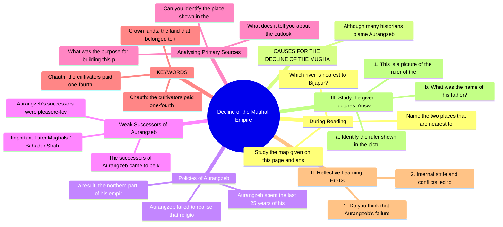

# Chapter 4: Decline of the Mughal Empire

## High-Yield Facts
- Study the map given on this page and answer the following questions:
- Name the two places that are nearest to Agra.
- Which river is nearest to Bijapur?
- Although many historians blame Aurangzeb for sowing the seeds of decline, the Mughal Empire continued for another 150 years after his death. Therefore, Aurangzeb cannot be solely held responsible for the deterioration of such a huge empire. There were other causes as well, which contributed to its decline.
- Aurangzeb failed to realise that religious tolerance was essential for the proper governance of such an extensive and diverse empire. Aurangzeb's intolerant attitude and rigid religious policies alienated the non-Muslim sections of the population. He also re-imposed the jizyah and the pilgrimage tax on non-Muslims. His policies led to serious revolts in the empire. While Akbar had won over the Rajputs, who constituted a pillar of support and strength for his empire, the Rajputs, Sikhs, Jats and Satnamis revolted during Aurangzeb's reign.
- Aurangzeb spent the last 25 years of his reign trying to subdue and subjugate the Marathas in the Deccan. These campaigns were also a financial drain on the treasury. As
- a result, the northern part of his empire became a centre of . The nobles declared themselves independent. There was a total breakdown of administration.
- Aurangzeb's successors were pleasere-loving, weak and incompetent, and could not manage the huge empire. As a result, the nobles became more powerful and wanted control over the administration of the empire. They became ambitious and began to manipulate the Mughal rulers. Soon, the distant governors, taking advantage of the weakness of the central authority, declared themselves independent.
- The successors of Aurangzeb came to be known as the Later Mughals. The first was Bahadur Shah I and the last Mughal emperor was Bahadur Shah II, also called Bahadur Shah Zafar. The names of the important Mughal emperors who followed Bahadur Shah I are mentioned below.
- Important Later Mughals 1. Bahadur Shah I (1707-12) 2. Jahandar Shah (1712-13) 3. Farrukhsiyar (1713-19) 4. Muhammad Shah (1719-48) 5. Ahmad Shah Bahadur (1748-54) 6. Alamgir II (1754-59) 7. Shah Alam II (1759-1806) 8. Akbar II (1806-37) 9. Bahadur Shah Zafar (1837-58)
- Can you identify the place shown in the given picture? It was built by the Rajput ruler Maharaja Jai Singh in Jaipur. Jai Singh became the ruler of Amber (now Jaipur) in 1699. He was a wise and just ruler who introduced several reforms, such as discouraging the practice of sati.
- What was the purpose for building this place?
- What does it tell you about the outlook of the ruler who built it?
- Chauth: the cultivators paid one-fourth of their total revenue to the Marathas
- Chauth: the cultivators paid one-fourth of their total revenue to the marathas
- Crown lands: the land that belonged to the emperor; the revenue from this land went directly to the royal treasury
- 1. Do you think that Aurangzeb's failure to realise the fact that religious tolerance is essential to govern a diverse empire was one of the causes of the decline of the Mughal Empire? Give reasons for your answer.
- 2. Internal strife and conflicts led to the annexation of the Rajput kingdoms under the British rule. Do you support the statement? Give reasons for your answer.
- 1. This is a picture of the ruler of the kingdom of Mysore who died defending his capital against the British.
- a. Identify the ruler shown in the picture.
- b. What was the name of his father?
- 1. Into how many groups were the nobles divided in the Mughal court? Name these groups.
- (2.) Why can Aurangzeb not be solely held responsible for the decline of the Mughal Empire?
- 3. Discuss two achievements of Balaji Vishwanath.
- - initiative and self-direction: research
- - creativity: imagination
- Search for paintings and sketches that show the rulers you have read about in this chapter. You can use the Internet as most of these pictures are in the public domain. Try to find close-up pictures of the faces and print them. Handcraft frames for these pictures, using recyclable and dry-waste materials. Display these in your classroom in the form of a portrait gallery.

## Notes (Expert Revision)
### 1. During Reading

**Executive summary:** Study the map given on this page and answer the following questions:

**Must know**
• Study the map given on this page and answer the following questions:
• Name the two places that are nearest to Agra.
• Which river is nearest to Bijapur?
• Which physical feature lies to the west of the Maratha Kingdom?
• Did the Mughals gain control of the entire peninsular region of India?
• In Class 8, we will be studying the Modern Period in Indian history.

Study the map given on this page and answer the following questions:

Name the two places that are nearest to Agra.

Which river is nearest to Bijapur?

Which physical feature lies to the west of the Maratha Kingdom?

Did the Mughals gain control of the entire peninsular region of India?

In Class 8, we will be studying the Modern Period in Indian history.

The Medieval Period in Indian history gradually drew to a close following the death of Aurangzeb, which also marked the decline of the Mughal Empire. The decline of the Mughals in the early 18th century was followed by the growing power of foreign companies such as the English East India Company (EEIC), the French East India Company, and the Dutch and the Portuguese trading companies in India.

The English gradually gained political control over India and established their supremacy over different parts of the country. These events occurred towards the end of the 17th century and the early 18th century. Most historians consider the mid-18th century as the beginning of the Modern Period in India.

### 2. CAUSES FOR THE DECLINE OF THE MUGHAL EMPIRE

**Executive summary:** Although many historians blame Aurangzeb for sowing the seeds of decline, the Mughal Empire continued for another 150 years after his death. Therefore, Aurangzeb cannot be solely h

**Must know**
• Although many historians blame Aurangzeb for sowing the seeds of decline, the Mughal Empire continued for another 150 years after his death. Therefore, Aurangzeb cannot be solely held responsible for the deterioration of such a huge empire. There were other causes as well, which contributed to its decline.

Although many historians blame Aurangzeb for sowing the seeds of decline, the Mughal Empire continued for another 150 years after his death. Therefore, Aurangzeb cannot be solely held responsible for the deterioration of such a huge empire. There were other causes as well, which contributed to its decline.

### 3. Policies of Aurangzeb

**Executive summary:** Aurangzeb failed to realise that religious tolerance was essential for the proper governance of such an extensive and diverse empire. Aurangzeb's intolerant attitude and rigid reli

**Must know**
• Aurangzeb failed to realise that religious tolerance was essential for the proper governance of such an extensive and diverse empire. Aurangzeb's intolerant attitude and rigid religious policies alienated the non-Muslim sections of the population. He also re-imposed the jizyah and the pilgrimage tax on non-Muslims. His policies led to serious revolts in the empire. While Akbar had won over the Rajputs, who constituted a pillar of support and strength for his empire, the Rajputs, Sikhs, Jats and Satnamis revolted during Aurangzeb's reign.
• Aurangzeb spent the last 25 years of his reign trying to subdue and subjugate the Marathas in the Deccan. These campaigns were also a financial drain on the treasury. As
• a result, the northern part of his empire became a centre of . The nobles declared themselves independent. There was a total breakdown of administration.

Aurangzeb failed to realise that religious tolerance was essential for the proper governance of such an extensive and diverse empire. Aurangzeb's intolerant attitude and rigid religious policies alienated the non-Muslim sections of the population. He also re-imposed the jizyah and the pilgrimage tax on non-Muslims. His policies led to serious revolts in the empire. While Akbar had won over the Rajputs, who constituted a pillar of support and strength for his empire, the Rajputs, Sikhs, Jats and Satnamis revolted during Aurangzeb's reign.

Aurangzeb spent the last 25 years of his reign trying to subdue and subjugate the Marathas in the Deccan. These campaigns were also a financial drain on the treasury. As

a result, the northern part of his empire became a centre of . The nobles declared themselves independent. There was a total breakdown of administration.

### 4. Weak Successors of Aurangzeb

**Executive summary:** Aurangzeb's successors were pleasere-loving, weak and incompetent, and could not manage the huge empire. As a result, the nobles became more powerful and wanted control over the ad

**Must know**
• Aurangzeb's successors were pleasere-loving, weak and incompetent, and could not manage the huge empire. As a result, the nobles became more powerful and wanted control over the administration of the empire. They became ambitious and began to manipulate the Mughal rulers. Soon, the distant governors, taking advantage of the weakness of the central authority, declared themselves independent.
• The successors of Aurangzeb came to be known as the Later Mughals. The first was Bahadur Shah I and the last Mughal emperor was Bahadur Shah II, also called Bahadur Shah Zafar. The names of the important Mughal emperors who followed Bahadur Shah I are mentioned below.
• Important Later Mughals 1. Bahadur Shah I (1707-12) 2. Jahandar Shah (1712-13) 3. Farrukhsiyar (1713-19) 4. Muhammad Shah (1719-48) 5. Ahmad Shah Bahadur (1748-54) 6. Alamgir II (1754-59) 7. Shah Alam II (1759-1806) 8. Akbar II (1806-37) 9. Bahadur Shah Zafar (1837-58)
• ##### Wars of Succession
• The Mughals did not have clear rules for succession. After the death of a Mughal emperor, many of his relatives laid claim to the throne. This resulted in wars of
• Analysising Primary sources CENTURY SKILLS Media literacy: observed This is a picture of the Mughal emperor Aurangzeb in his court. Can you identify Aurangzeb? How is he different from the others present at the court? How does the Mughal court appear to you? In what ways do you think the court could have been different during the time of the Later Mughals? succession amongst the claimants. These wars drained the resources of the empire, making it unstable and weak. Politics at the Mughal Court were not enough jagirs available. This led to conflict among the mansabdars for the control of jagirs. Moreover, the mansabdars did not maintain the required number of troops resulting in a decline in the strength of the Mughal army. Since the Later Mughals were weak rulers, there was much political rivalry in their courts. The nobles in the Mughal court were invited into four groups: Iranis from Persia Lack of Military Reforms Turanis from Transoxiana The Mughal army did not evolve with the times. No effort was made to reform, modernise or strengthen the army, which continued to use old equipment and techniques. The Mughals did not have a navy, nor did they make any effort to form one. The Europeans, however, had a strong navy, which they used to gain advantage over their rivals. These drawbacks of the Mughal military administration also led to the downfall of the Mughal Empire, Afghans from the mountainous border regions across the Indus re was a constant power struggle Hindustanis een these factions of nobles to assert supremacy. Their mutual jealousies valries also contributed to the collapse Mughal administrative system, and ely affected the functioning of the il Empire, Jagirdari Crisis e of the Mansabdari System The jagirdari system provided jagirs or land grants to the jagirdars or landlords in return for their services. This led to a scramble for better tracts of land among the jagirdars. Since the Later Mughals were often controlled by the nobles, the Mughal emperors ended up giving away the crown lands (land directly by ansabdari system was introduced ar. Under him, this system worked ely. However, after Akbar, the number sabdars grew significantly, and there

Aurangzeb's successors were pleasere-loving, weak and incompetent, and could not manage the huge empire. As a result, the nobles became more powerful and wanted control over the administration of the empire. They became ambitious and began to manipulate the Mughal rulers. Soon, the distant governors, taking advantage of the weakness of the central authority, declared themselves independent.

The successors of Aurangzeb came to be known as the Later Mughals. The first was Bahadur Shah I and the last Mughal emperor was Bahadur Shah II, also called Bahadur Shah Zafar. The names of the important Mughal emperors who followed Bahadur Shah I are mentioned below.

Important Later Mughals 1. Bahadur Shah I (1707-12) 2. Jahandar Shah (1712-13) 3. Farrukhsiyar (1713-19) 4. Muhammad Shah (1719-48) 5. Ahmad Shah Bahadur (1748-54) 6. Alamgir II (1754-59) 7. Shah Alam II (1759-1806) 8. Akbar II (1806-37) 9. Bahadur Shah Zafar (1837-58)

##### Wars of Succession

The Mughals did not have clear rules for succession. After the death of a Mughal emperor, many of his relatives laid claim to the throne. This resulted in wars of

Analysising Primary sources CENTURY SKILLS Media literacy: observed This is a picture of the Mughal emperor Aurangzeb in his court. Can you identify Aurangzeb? How is he different from the others present at the court? How does the Mughal court appear to you? In what ways do you think the court could have been different during the time of the Later Mughals? succession amongst the claimants. These wars drained the resources of the empire, making it unstable and weak. Politics at the Mughal Court were not enough jagirs available. This led to conflict among the mansabdars for the control of jagirs. Moreover, the mansabdars did not maintain the required number of troops resulting in a decline in the strength of the Mughal army. Since the Later Mughals were weak rulers, there was much political rivalry in their courts. The nobles in the Mughal court were invited into four groups: Iranis from Persia Lack of Military Reforms Turanis from Transoxiana The Mughal army did not evolve with the times. No effort was made to reform, modernise or strengthen the army, which continued to use old equipment and techniques. The Mughals did not have a navy, nor did they make any effort to form one. The Europeans, however, had a strong navy, which they used to gain advantage over their rivals. These drawbacks of the Mughal military administration also led to the downfall of the Mughal Empire, Afghans from the mountainous border regions across the Indus re was a constant power struggle Hindustanis een these factions of nobles to assert supremacy. Their mutual jealousies valries also contributed to the collapse Mughal administrative system, and ely affected the functioning of the il Empire, Jagirdari Crisis e of the Mansabdari System The jagirdari system provided jagirs or land grants to the jagirdars or landlords in return for their services. This led to a scramble for better tracts of land among the jagirdars. Since the Later Mughals were often controlled by the nobles, the Mughal emperors ended up giving away the crown lands (land directly by ansabdari system was introduced ar. Under him, this system worked ely. However, after Akbar, the number sabdars grew significantly, and there

Analysing Primary Sources

This is a picture of the Mughal emperor Aurangzeb in his court. Can you identify Aurangzeb? How is he different from the others present at the court? How does the Mughal court appear to you? In what ways do you think the court could have been different during the time of the Later Mughals? succession amongst the claimants. These wars drained the resources of the empire, making it unstable and weak. Politics at the Mughal Court Since the Later Mughals were weak rulers, there was much political rivalry in their courts. The nobles in the Mughal court were divided into four groups: Iranis from Persia Turanis from Transoxiana Afghans from the mountainous border regions across the Indus Hindustanis There was a constant power struggle between these factions of nobles to assert their supremacy. Their mutual jealousies and rivalries also contributed to the collapse of the Mughal administrative system, and adversely affected the functioning of the Mughal Empire. Failure of the Mansabdari System The mansabdari system was introduced by Akbar. Under him, this system worked efficiently. However, after Akbar, the number of mansabdars grew significantly, and there were noுத் b jagirs available. This led to a scramble for their services. This led to a better tract of land among the jagirdars. Since the Later Mughals were often controlled by the nobles, the Mughal emperors ended up giving away the crown lands (land directly from the Mughal army). Lack of Military Reforms The Mughal army did not evolve with the times. No effort was made to reform modernise or strengthen the army, which continued to use old equipment and techniques. The Mughals did not have a navy, nor did they make any effort to form one. The Europeans, however, had a strong navy, which they used to gain advantage over their rivals. These drawbacks of the Mughal military administration also led to the downfall of the Mughal Empire. Jagirdari Crisis The jagirdari system provided jagirs or land grants to the jagirdars or landlords in return for their services. This led to a scramble for better tract of land among the jagirdars. Since the Later Mughals were often controlled by the nobles, the Mughal emperors were given away to the Mughal army. History

### 5. Analysing Primary Sources

**Executive summary:** Can you identify the place shown in the given picture? It was built by the Rajput ruler Maharaja Jai Singh in Jaipur. Jai Singh became the ruler of Amber (now Jaipur) in 1699. He w

**Must know**
• Can you identify the place shown in the given picture? It was built by the Rajput ruler Maharaja Jai Singh in Jaipur. Jai Singh became the ruler of Amber (now Jaipur) in 1699. He was a wise and just ruler who introduced several reforms, such as discouraging the practice of sati.
• What was the purpose for building this place?
• What does it tell you about the outlook of the ruler who built it?
• The Rajput states of Jaipur, Mewar and Marwar took advantage of the Mughal decline and asserted their independence as well. However, the Rajputs could never put up a united front and continued to follow independent policies for their own individual kingdoms. As a result of internal strife and conflicts, the Rajput kingdoms, which had been the pillars of the Mughal Empire, became prey to the British expansionist policies.
• ##### The Sikh Kingdom
• After the invasion of the Mughal Empire by Nadir Shah and Ahmad Shah Abdali, Mughal hold over Punjab weakened considerably. The Sikhs took advantage of this situation and took control of Punjab and Jammu. They organised themselves into a confederacy of twelve misls or groups. Ranjit Singh, the leader of one of the misls, brought all the Sikhs under his control and declared himself the master of Punjab.

Can you identify the place shown in the given picture? It was built by the Rajput ruler Maharaja Jai Singh in Jaipur. Jai Singh became the ruler of Amber (now Jaipur) in 1699. He was a wise and just ruler who introduced several reforms, such as discouraging the practice of sati.

What was the purpose for building this place?

What does it tell you about the outlook of the ruler who built it?

The Rajput states of Jaipur, Mewar and Marwar took advantage of the Mughal decline and asserted their independence as well. However, the Rajputs could never put up a united front and continued to follow independent policies for their own individual kingdoms. As a result of internal strife and conflicts, the Rajput kingdoms, which had been the pillars of the Mughal Empire, became prey to the British expansionist policies.

##### The Sikh Kingdom

After the invasion of the Mughal Empire by Nadir Shah and Ahmad Shah Abdali, Mughal hold over Punjab weakened considerably. The Sikhs took advantage of this situation and took control of Punjab and Jammu. They organised themselves into a confederacy of twelve misls or groups. Ranjit Singh, the leader of one of the misls, brought all the Sikhs under his control and declared himself the master of Punjab.

In 1809, Ranjit Singh signed the Treaty of Amritsar with the British. It is also referred to as the treaty of ‘perpetual friendship’. According to this treaty, the Sutlej River formed the boundary between the British and the Sikh territories. Ranjit Singh went on to conquer territories in the west and the north, so that when he died in 1839, his territories extended from the Khyber Pass in the north to Sindh in the south. After the death of Ranjit Singh, Punjab was annexed to the British Empire.

### 6. KEYWORDS

**Executive summary:** Chauth: the cultivators paid one-fourth of their total revenue to the Marathas

**Must know**
• Chauth: the cultivators paid one-fourth of their total revenue to the Marathas
• Chauth: the cultivators paid one-fourth of their total revenue to the marathas
• Crown lands: the land that belonged to the emperor; the revenue from this land went directly to the royal treasury
• Guerrilla warfare: a form of irregular warfare in which a small group of armed nighters use military tactics, including ambushes, raids, the element of surprise and mobility, to dominate a larger and less mobile traditional army
• Iranis, Turanis, Afghans and Hindustanis: four groups of nobles in the Mughal court who fought for political control
• Later Mughals: Aurangzeb's successors from 1707 to 1858

Chauth: the cultivators paid one-fourth of their total revenue to the Marathas

Chauth: the cultivators paid one-fourth of their total revenue to the marathas

Crown lands: the land that belonged to the emperor; the revenue from this land went directly to the royal treasury

Guerrilla warfare: a form of irregular warfare in which a small group of armed nighters use military tactics, including ambushes, raids, the element of surprise and mobility, to dominate a larger and less mobile traditional army

Iranis, Turanis, Afghans and Hindustanis: four groups of nobles in the Mughal court who fought for political control

Later Mughals: Aurangzeb's successors from 1707 to 1858

Maratha Confederacy: a loose union of the chiefs of the four houses of the Gaekwaas, the Holkars, the Sindhias and the Bhonsles

Modern Period: period from the mid-18th century, beginning with the decline of the Mughal Empire. Peshwa: the Prime Minister who actually controlled the Maratha kingdoms, while the real ruler was only a figurehead.

### 7. II. Reflective Learning HOTS

**Executive summary:** 1. Do you think that Aurangzeb's failure to realise the fact that religious tolerance is essential to govern a diverse empire was one of the causes of the decline of the Mughal Emp

**Must know**
• 1. Do you think that Aurangzeb's failure to realise the fact that religious tolerance is essential to govern a diverse empire was one of the causes of the decline of the Mughal Empire? Give reasons for your answer.
• 2. Internal strife and conflicts led to the annexation of the Rajput kingdoms under the British rule. Do you support the statement? Give reasons for your answer.

1. Do you think that Aurangzeb's failure to realise the fact that religious tolerance is essential to govern a diverse empire was one of the causes of the decline of the Mughal Empire? Give reasons for your answer.

2. Internal strife and conflicts led to the annexation of the Rajput kingdoms under the British rule. Do you support the statement? Give reasons for your answer.

### 8. III. Study the given pictures. Answer the questions that follow.

**Executive summary:** 1. This is a picture of the ruler of the kingdom of Mysore who died defending his capital against the British.

**Must know**
• 1. This is a picture of the ruler of the kingdom of Mysore who died defending his capital against the British.
• a. Identify the ruler shown in the picture.
• b. What was the name of his father?
• 2. This is a picture of the grandson of the founder of the independent kingdom of Awadh.
• a. What is the name of the person in the picture?
• b. What was his father's name?

1. This is a picture of the ruler of the kingdom of Mysore who died defending his capital against the British.

a. Identify the ruler shown in the picture.

b. What was the name of his father?

2. This is a picture of the grandson of the founder of the independent kingdom of Awadh.

a. What is the name of the person in the picture?

b. What was his father's name?

c. Name the capital of his kingdom.

### 9. IV. Answer the following questions in detail.

**Executive summary:** 1. Into how many groups were the nobles divided in the Mughal court? Name these groups.

**Must know**
• 1. Into how many groups were the nobles divided in the Mughal court? Name these groups.
• (2.) Why can Aurangzeb not be solely held responsible for the decline of the Mughal Empire?
• 3. Discuss two achievements of Balaji Vishwanath.
• (4.) Describe the rule of Nizam-ul-Mulk Asaf Jah. What were his successors called?
• 5. Who was Burhan-ul-Mulk Saadat Khan? Name the ruler who succeeded him.
• The decline of the Mughal Empire gave rise to regional kingdoms. In this context, answer the following questions:

1. Into how many groups were the nobles divided in the Mughal court? Name these groups.

(2.) Why can Aurangzeb not be solely held responsible for the decline of the Mughal Empire?

3. Discuss two achievements of Balaji Vishwanath.

(4.) Describe the rule of Nizam-ul-Mulk Asaf Jah. What were his successors called?

5. Who was Burhan-ul-Mulk Saadat Khan? Name the ruler who succeeded him.

The decline of the Mughal Empire gave rise to regional kingdoms. In this context, answer the following questions:

1. How did the Marathas establish a pan-Indian empire?

2. Name some of the other regional kingdoms that rose after the decline of the Mughal rule.

### 10. A Portrait Gallery

**Executive summary:** - initiative and self-direction: research

**Must know**
• - initiative and self-direction: research
• - creativity: imagination
• Search for paintings and sketches that show the rulers you have read about in this chapter. You can use the Internet as most of these pictures are in the public domain. Try to find close-up pictures of the faces and print them. Handcraft frames for these pictures, using recyclable and dry-waste materials. Display these in your classroom in the form of a portrait gallery.
• You can even conduct a guided tour for students of other classes. Explain the history of each of the rulers on display to them, as a museum guide would do.
• cross-curricular connect: Science
• Design an Astronomical Observatory

- initiative and self-direction: research

- creativity: imagination

Search for paintings and sketches that show the rulers you have read about in this chapter. You can use the Internet as most of these pictures are in the public domain. Try to find close-up pictures of the faces and print them. Handcraft frames for these pictures, using recyclable and dry-waste materials. Display these in your classroom in the form of a portrait gallery.

You can even conduct a guided tour for students of other classes. Explain the history of each of the rulers on display to them, as a museum guide would do.

cross-curricular connect: Science

Design an Astronomical Observatory

- initiative and self-direction: research

- creativity: imagination

## Mind Map

## Cheat Sheet

- Study the map given on this page and answer the following questions:
- Name the two places that are nearest to Agra.
- Which river is nearest to Bijapur?
- Although many historians blame Aurangzeb for sowing the seeds of decline, the Mughal Empire continued for another 150 years after his death. Therefore, Aurangzeb cannot be solely held responsible for the deterioration of such a huge empire. There were other causes as well, which contributed to its decline.
- Aurangzeb failed to realise that religious tolerance was essential for the proper governance of such an extensive and diverse empire. Aurangzeb's intolerant attitude and rigid religious policies alienated the non-Muslim sections of the population. He also re-imposed the jizyah and the pilgrimage tax on non-Muslims. His policies led to serious revolts in the empire. While Akbar had won over the Rajputs, who constituted a pillar of support and strength for his empire, the Rajputs, Sikhs, Jats and Satnamis revolted during Aurangzeb's reign.
- Aurangzeb spent the last 25 years of his reign trying to subdue and subjugate the Marathas in the Deccan. These campaigns were also a financial drain on the treasury. As
- a result, the northern part of his empire became a centre of . The nobles declared themselves independent. There was a total breakdown of administration.
- Aurangzeb's successors were pleasere-loving, weak and incompetent, and could not manage the huge empire. As a result, the nobles became more powerful and wanted control over the administration of the empire. They became ambitious and began to manipulate the Mughal rulers. Soon, the distant governors, taking advantage of the weakness of the central authority, declared themselves independent.
- The successors of Aurangzeb came to be known as the Later Mughals. The first was Bahadur Shah I and the last Mughal emperor was Bahadur Shah II, also called Bahadur Shah Zafar. The names of the important Mughal emperors who followed Bahadur Shah I are mentioned below.
- Important Later Mughals 1. Bahadur Shah I (1707-12) 2. Jahandar Shah (1712-13) 3. Farrukhsiyar (1713-19) 4. Muhammad Shah (1719-48) 5. Ahmad Shah Bahadur (1748-54) 6. Alamgir II (1754-59) 7. Shah Alam II (1759-1806) 8. Akbar II (1806-37) 9. Bahadur Shah Zafar (1837-58)
- Can you identify the place shown in the given picture? It was built by the Rajput ruler Maharaja Jai Singh in Jaipur. Jai Singh became the ruler of Amber (now Jaipur) in 1699. He was a wise and just ruler who introduced several reforms, such as discouraging the practice of sati.
- What was the purpose for building this place?
- What does it tell you about the outlook of the ruler who built it?
- Chauth: the cultivators paid one-fourth of their total revenue to the Marathas
- Chauth: the cultivators paid one-fourth of their total revenue to the marathas
- Crown lands: the land that belonged to the emperor; the revenue from this land went directly to the royal treasury
- 1. Do you think that Aurangzeb's failure to realise the fact that religious tolerance is essential to govern a diverse empire was one of the causes of the decline of the Mughal Empire? Give reasons for your answer.
- 2. Internal strife and conflicts led to the annexation of the Rajput kingdoms under the British rule. Do you support the statement? Give reasons for your answer.
- 1. This is a picture of the ruler of the kingdom of Mysore who died defending his capital against the British.
- a. Identify the ruler shown in the picture.
- b. What was the name of his father?
- 1. Into how many groups were the nobles divided in the Mughal court? Name these groups.
- (2.) Why can Aurangzeb not be solely held responsible for the decline of the Mughal Empire?
- 3. Discuss two achievements of Balaji Vishwanath.

## One Word (30)

- **Chauth** — the cultivators paid one-fourth of their total revenue to the Marathas
- **Chauth** — the cultivators paid one-fourth of their total revenue to the marathas
- **Crown lands** — the land that belonged to the emperor; the revenue from this land went directly to the royal treasury
- **Guerrilla warfare** — a form of irregular warfare in which a small group of armed nighters use military tactics, including ambushes, raids, th
- **Iranis, Turanis, Afghans and Hindustanis** — four groups of nobles in the Mughal court who fought for political control
- **Later Mughals** — Aurangzeb's successors from 1707 to 1858
- **Maratha Confederacy** — a loose union of the chiefs of the four houses of the Gaekwaas, the Holkars, the Sindhias and the Bhonsles
- **Modern Period** — period from the mid-18th century, beginning with the decline of the Mughal Empire. Peshwa: the Prime Minister who actual
- **Sardeshmukhi** — an additional one-tenth of land revenue assessment paid as a tribute to the Maratha king
- **Titular** — holding a position without any authority
- **Transoxiana** — a historical region of Turkistan in Central Asia, east of the Amu Darya and west of the Syr Darya rivers
- **Treaty of Amritsar** — a treaty signed in 1809 between the Sikh ruler Ranjit Singh and the British, also known as the treaty of 'perpetual frie
- **Name the two places that** — Name the two places that are nearest to Agra.
- **Which river** — Which river is nearest to Bijapur?
- **Aurangzeb's successors** — Aurangzeb's successors were pleasere-loving, weak and incompetent, and could not manage the huge empire. As a result, th
- **1. Into how many groups** — 1. Into how many groups were the nobles divided in the Mughal court? Name these groups.
- **1. Do you** — 1. Do you think that Aurangzeb's failure to realise the fact that religious tolerance is essential t
- **2. Internal strife** — 2. Internal strife and conflicts led to the annexation of the Rajput kingdoms under the British rule
- **1. This is** — 1. This is a picture of the ruler of the kingdom of Mysore who died defending his capital against th
- **a. Identify the** — a. Identify the ruler shown in the picture.
- **b. What was** — b. What was the name of his father?
- **1. Into how** — 1. Into how many groups were the nobles divided in the Mughal court? Name these groups.
- **(2.) Why can** — (2.) Why can Aurangzeb not be solely held responsible for the decline of the Mughal Empire?
- **3. Discuss two** — 3. Discuss two achievements of Balaji Vishwanath.
- **- initiative and** — - initiative and self-direction: research
- **- creativity: imagination** — - creativity: imagination
- **Search for paintings** — Search for paintings and sketches that show the rulers you have read about in this chapter. You can 
- **Study the map** — Study the map given on this page and answer the following questions:
- **Name the two** — Name the two places that are nearest to Agra.
- **Which river is** — Which river is nearest to Bijapur?
