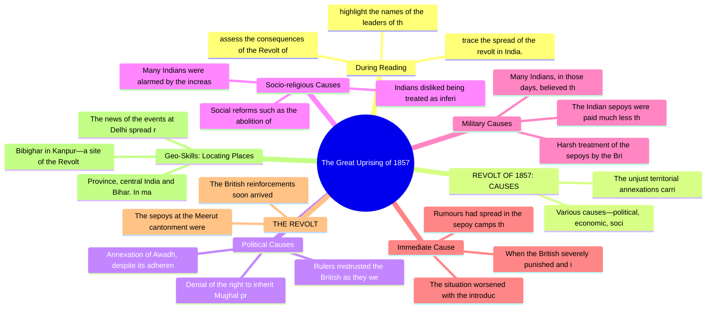

# Chapter 9: The Great Uprising of 1857

## High-Yield Facts
- highlight the names of the leaders of the revolt.
- trace the spread of the revolt in India.
- assess the consequences of the Revolt of 1857.
- Various causes—political, economic, socio-religious, military and immediate—were responsible for the uprising of 1857. These causes created much displeasure towards the British rule in India.
- The unjust territorial annexations carried out by Lord Dalhousie through the policy of Doctrine of Lapse created anger and resentment towards the British.
- Denial of the right to inherit Mughal property by Bahadur Shah's successors or to use imperial titles was a source of concern.
- Annexation of Awadh, despite its adherence to the Subsidiary Alliance, increased the insecurity of Indian rulers.
- Rulers mistrusted the British as they were quick to break treaties.
- Indians disliked being treated as inferior people and excluded from high administrative posts by the British.
- Many Indians were alarmed by the increasing activities of Christian missionaries in India.
- Social reforms such as the abolition of sati and widow remarriage were seen as the British's interference with traditional Indian values and customs.
- Harsh treatment of the sepoys by the British officers created discontent.
- Many Indians, in those days, believed that they would lose their caste and religion if they crossed the sea. In 1856, the Company passed an act, known as the General Service Enlistment Act. According to this Act, every new recruit had to serve overseas, if ordered. It hurt the religious sentiments of the sepoys.
- The Indian sepoys were paid much less than the British soldiers.
- The situation worsened with the introduction of Enfield rifles in the army. The greased cartridges for these rifles had to be bitten off before being inserted into the rifle.
- Rumours had spread in the sepoy camps that the grease contained fat from pigs and cows. Hindu and Muslim sepoys therefore objected to using them.
- When the British severely punished and imprisoned sepoys for refusal to use the cartridges, the sepoys were enraged.
- The sepoys at the Meerut cantonment were angered at the humiliating treatment of their fellow comrades. They rose in revolt, attacked the jail and freed the sepoys. Many of the sepoys marched to Delhi, where they were joined by the sepoys of the local army. The revolt spread throughout Delhi. The rebel forces proclaimed Bahadur Shah Zafar as the leader of the revolt and celebrated the revival of the Mughal Empire.
- The British reinforcements soon arrived from Punjab, and Delhi was recaptured. Hundreds of Indians were killed, and many were hanged without trials. Bahadur Shah was taken prisoner, tried and exiled to Rangoon in Burma (now Myanmar).
- The news of the events at Delhi spread rapidly, provoking uprisings among sepoys in many districts, including the North-Western
- Bibighar in Kanpur—a site of the Revolt of 1857
- Province, central India and Bihar. In many cases, it was the behaviour of the British military and civilian authorities that accelerated discontent among the Indians.
- In Arrah (Bihar), Kunwar Singh, a royal Kshatriya, played a leading part in the Revolt of 1857 at the age of 80 years.
- Jhansi was a princely state in south-western Pradesh. It Uttar annexed by was British in 1853. the British news of the When reached the revolt queen of Jhansi, Rani Lake, she quickly organised her troops. She was also
- ► Rani Lakshmibai of Jhansi
- The following were major causes for the failure of the revolt:
- The revolt lacked coordination, and the rebels had no common plan of action.

## Notes (Expert Revision)
### 1. During Reading

**Executive summary:** highlight the names of the leaders of the revolt.

**Must know**
• highlight the names of the leaders of the revolt.
• trace the spread of the revolt in India.
• assess the consequences of the Revolt of 1857.
• evaluate the nature of the uprising.
• Tick (√) the personalities who participated in the Revolt of 1857. Cross (x) those who did not.
• The Battle of Plassey marked the first step taken by the British to gain political control over India. During the next 100 years, the British used their financial and military strength to gain control over most of the Indian subcontinent.

highlight the names of the leaders of the revolt.

trace the spread of the revolt in India.

assess the consequences of the Revolt of 1857.

evaluate the nature of the uprising.

Tick (√) the personalities who participated in the Revolt of 1857. Cross (x) those who did not.

The Battle of Plassey marked the first step taken by the British to gain political control over India. During the next 100 years, the British used their financial and military strength to gain control over most of the Indian subcontinent.

The British methods were unfair, oppressive and exploitative, and there was enormous resentment against the British rulers among the Indians. This culminated in the Uprising of 1857, referred to by the British historians as the Sepoy Mutiny. For many Indians, it came to be known as the First War of Independence.

### 2. REVOLT OF 1857: CAUSES

**Executive summary:** Various causes—political, economic, socio-religious, military and immediate—were responsible for the uprising of 1857. These causes created much displeasure towards the British rul

**Must know**
• Various causes—political, economic, socio-religious, military and immediate—were responsible for the uprising of 1857. These causes created much displeasure towards the British rule in India.
• The unjust territorial annexations carried out by Lord Dalhousie through the policy of Doctrine of Lapse created anger and resentment towards the British.

Various causes—political, economic, socio-religious, military and immediate—were responsible for the uprising of 1857. These causes created much displeasure towards the British rule in India.

The unjust territorial annexations carried out by Lord Dalhousie through the policy of Doctrine of Lapse created anger and resentment towards the British.

### 3. Political Causes

**Executive summary:** Denial of the right to inherit Mughal property by Bahadur Shah's successors or to use imperial titles was a source of concern.

**Must know**
• Denial of the right to inherit Mughal property by Bahadur Shah's successors or to use imperial titles was a source of concern.
• Annexation of Awadh, despite its adherence to the Subsidiary Alliance, increased the insecurity of Indian rulers.
• Rulers mistrusted the British as they were quick to break treaties.
• ##### Economic Causes
• Heavy taxes due to the land revenue systems, such as the Permanent and Ryotwari Settlements, increased the misery of peasants.
• Peasants were forced to grow crops such as indigo, which suited the needs of the British economy.

Denial of the right to inherit Mughal property by Bahadur Shah's successors or to use imperial titles was a source of concern.

Annexation of Awadh, despite its adherence to the Subsidiary Alliance, increased the insecurity of Indian rulers.

Rulers mistrusted the British as they were quick to break treaties.

##### Economic Causes

Heavy taxes due to the land revenue systems, such as the Permanent and Ryotwari Settlements, increased the misery of peasants.

Peasants were forced to grow crops such as indigo, which suited the needs of the British economy.

British strategy of buying cheap raw materials from India and selling British manufactured goods at low rates damaged the Indian economy.

Livelihoods of artisans were adversely affected as they could not compete with duty-free British manufactured goods sold at cheaper rates.

### 4. Socio-religious Causes

**Executive summary:** Indians disliked being treated as inferior people and excluded from high administrative posts by the British.

**Must know**
• Indians disliked being treated as inferior people and excluded from high administrative posts by the British.
• Many Indians were alarmed by the increasing activities of Christian missionaries in India.
• Social reforms such as the abolition of sati and widow remarriage were seen as the British's interference with traditional Indian values and customs.
• Sections in Indian society objected to the prominence given to Western education at the cost of traditional learning.

Indians disliked being treated as inferior people and excluded from high administrative posts by the British.

Many Indians were alarmed by the increasing activities of Christian missionaries in India.

Social reforms such as the abolition of sati and widow remarriage were seen as the British's interference with traditional Indian values and customs.

Sections in Indian society objected to the prominence given to Western education at the cost of traditional learning.

### 5. Military Causes

**Executive summary:** Harsh treatment of the sepoys by the British officers created discontent.

**Must know**
• Harsh treatment of the sepoys by the British officers created discontent.
• Many Indians, in those days, believed that they would lose their caste and religion if they crossed the sea. In 1856, the Company passed an act, known as the General Service Enlistment Act. According to this Act, every new recruit had to serve overseas, if ordered. It hurt the religious sentiments of the sepoys.
• The Indian sepoys were paid much less than the British soldiers.

Harsh treatment of the sepoys by the British officers created discontent.

Many Indians, in those days, believed that they would lose their caste and religion if they crossed the sea. In 1856, the Company passed an act, known as the General Service Enlistment Act. According to this Act, every new recruit had to serve overseas, if ordered. It hurt the religious sentiments of the sepoys.

The Indian sepoys were paid much less than the British soldiers.

### 6. Immediate Cause

**Executive summary:** The situation worsened with the introduction of Enfield rifles in the army. The greased cartridges for these rifles had to be bitten off before being inserted into the rifle.

**Must know**
• The situation worsened with the introduction of Enfield rifles in the army. The greased cartridges for these rifles had to be bitten off before being inserted into the rifle.
• Rumours had spread in the sepoy camps that the grease contained fat from pigs and cows. Hindu and Muslim sepoys therefore objected to using them.
• When the British severely punished and imprisoned sepoys for refusal to use the cartridges, the sepoys were enraged.

The situation worsened with the introduction of Enfield rifles in the army. The greased cartridges for these rifles had to be bitten off before being inserted into the rifle.

Rumours had spread in the sepoy camps that the grease contained fat from pigs and cows. Hindu and Muslim sepoys therefore objected to using them.

When the British severely punished and imprisoned sepoys for refusal to use the cartridges, the sepoys were enraged.

### 7. THE REVOLT

**Executive summary:** The sepoys at the Meerut cantonment were angered at the humiliating treatment of their fellow comrades. They rose in revolt, attacked the jail and freed the sepoys. Many of the sep

**Must know**
• The sepoys at the Meerut cantonment were angered at the humiliating treatment of their fellow comrades. They rose in revolt, attacked the jail and freed the sepoys. Many of the sepoys marched to Delhi, where they were joined by the sepoys of the local army. The revolt spread throughout Delhi. The rebel forces proclaimed Bahadur Shah Zafar as the leader of the revolt and celebrated the revival of the Mughal Empire.
• The British reinforcements soon arrived from Punjab, and Delhi was recaptured. Hundreds of Indians were killed, and many were hanged without trials. Bahadur Shah was taken prisoner, tried and exiled to Rangoon in Burma (now Myanmar).

The sepoys at the Meerut cantonment were angered at the humiliating treatment of their fellow comrades. They rose in revolt, attacked the jail and freed the sepoys. Many of the sepoys marched to Delhi, where they were joined by the sepoys of the local army. The revolt spread throughout Delhi. The rebel forces proclaimed Bahadur Shah Zafar as the leader of the revolt and celebrated the revival of the Mughal Empire.

The British reinforcements soon arrived from Punjab, and Delhi was recaptured. Hundreds of Indians were killed, and many were hanged without trials. Bahadur Shah was taken prisoner, tried and exiled to Rangoon in Burma (now Myanmar).

### 8. Geo-Skills: Locating Places

**Executive summary:** The news of the events at Delhi spread rapidly, provoking uprisings among sepoys in many districts, including the North-Western

**Must know**
• The news of the events at Delhi spread rapidly, provoking uprisings among sepoys in many districts, including the North-Western
• Bibighar in Kanpur—a site of the Revolt of 1857
• Province, central India and Bihar. In many cases, it was the behaviour of the British military and civilian authorities that accelerated discontent among the Indians.
• After Delhi, a rebellion erupted in Awadh (modern-day Uttar Pradesh), which had been annexed by Lord Dalhousie. The rebel forces besieged the residence of the British Commissioner, Sir Henry Lawrence. With the arrival of British reinforcements, the rebels were defeated and Lucknow was recovered by the British.
• In Kanpur, sepoys rebelled and besieged the British entrenchment. The leader of the Kanpur Revolt was Nana Sahib, the adopted son of Baji Rao II. His victory was short-lived as the British soon recaptured Kanpur and Nana Sahib escaped. His general, Tantia Tope, continued the struggle.

The news of the events at Delhi spread rapidly, provoking uprisings among sepoys in many districts, including the North-Western

Bibighar in Kanpur—a site of the Revolt of 1857

Province, central India and Bihar. In many cases, it was the behaviour of the British military and civilian authorities that accelerated discontent among the Indians.

After Delhi, a rebellion erupted in Awadh (modern-day Uttar Pradesh), which had been annexed by Lord Dalhousie. The rebel forces besieged the residence of the British Commissioner, Sir Henry Lawrence. With the arrival of British reinforcements, the rebels were defeated and Lucknow was recovered by the British.

In Kanpur, sepoys rebelled and besieged the British entrenchment. The leader of the Kanpur Revolt was Nana Sahib, the adopted son of Baji Rao II. His victory was short-lived as the British soon recaptured Kanpur and Nana Sahib escaped. His general, Tantia Tope, continued the struggle.

### 9. Did You Know?

**Executive summary:** In Arrah (Bihar), Kunwar Singh, a royal Kshatriya, played a leading part in the Revolt of 1857 at the age of 80 years.

**Must know**
• In Arrah (Bihar), Kunwar Singh, a royal Kshatriya, played a leading part in the Revolt of 1857 at the age of 80 years.
• Jhansi was a princely state in south-western Pradesh. It Uttar annexed by was British in 1853. the British news of the When reached the revolt queen of Jhansi, Rani Lake, she quickly organised her troops. She was also
• ► Rani Lakshmibai of Jhansi
• troops. The supported by the rebels in the Bundelkhand region. By 1858, the East India Company's forces had begun their counteroffensive in Bundelkhand. Following a fierce battle at the fort of Jhansi, Lakshmibai refused to surrender and managed to escape.
• Along with Tantia Tope, Lakshmibai then mounted a successful assault on the city-fortress of Gwalior. The treasury and the arsenal of the fort were seized. After taking Gwalior, Lakshmibai marched east to confront a British counterattack. She fought a fierce battle, but was killed in the combat.

In Arrah (Bihar), Kunwar Singh, a royal Kshatriya, played a leading part in the Revolt of 1857 at the age of 80 years.

Jhansi was a princely state in south-western Pradesh. It Uttar annexed by was British in 1853. the British news of the When reached the revolt queen of Jhansi, Rani Lake, she quickly organised her troops. She was also

► Rani Lakshmibai of Jhansi

troops. The supported by the rebels in the Bundelkhand region. By 1858, the East India Company's forces had begun their counteroffensive in Bundelkhand. Following a fierce battle at the fort of Jhansi, Lakshmibai refused to surrender and managed to escape.

Along with Tantia Tope, Lakshmibai then mounted a successful assault on the city-fortress of Gwalior. The treasury and the arsenal of the fort were seized. After taking Gwalior, Lakshmibai marched east to confront a British counterattack. She fought a fierce battle, but was killed in the combat.

### 10. CAUSES FOR FAILURE OF THE REVOLT

**Executive summary:** The following were major causes for the failure of the revolt:

**Must know**
• The following were major causes for the failure of the revolt:
• The revolt lacked coordination, and the rebels had no common plan of action.

The following were major causes for the failure of the revolt:

The revolt lacked coordination, and the rebels had no common plan of action.

## Mind Map

## Cheat Sheet

- highlight the names of the leaders of the revolt.
- trace the spread of the revolt in India.
- assess the consequences of the Revolt of 1857.
- Various causes—political, economic, socio-religious, military and immediate—were responsible for the uprising of 1857. These causes created much displeasure towards the British rule in India.
- The unjust territorial annexations carried out by Lord Dalhousie through the policy of Doctrine of Lapse created anger and resentment towards the British.
- Denial of the right to inherit Mughal property by Bahadur Shah's successors or to use imperial titles was a source of concern.
- Annexation of Awadh, despite its adherence to the Subsidiary Alliance, increased the insecurity of Indian rulers.
- Rulers mistrusted the British as they were quick to break treaties.
- Indians disliked being treated as inferior people and excluded from high administrative posts by the British.
- Many Indians were alarmed by the increasing activities of Christian missionaries in India.
- Social reforms such as the abolition of sati and widow remarriage were seen as the British's interference with traditional Indian values and customs.
- Harsh treatment of the sepoys by the British officers created discontent.
- Many Indians, in those days, believed that they would lose their caste and religion if they crossed the sea. In 1856, the Company passed an act, known as the General Service Enlistment Act. According to this Act, every new recruit had to serve overseas, if ordered. It hurt the religious sentiments of the sepoys.
- The Indian sepoys were paid much less than the British soldiers.
- The situation worsened with the introduction of Enfield rifles in the army. The greased cartridges for these rifles had to be bitten off before being inserted into the rifle.
- Rumours had spread in the sepoy camps that the grease contained fat from pigs and cows. Hindu and Muslim sepoys therefore objected to using them.
- When the British severely punished and imprisoned sepoys for refusal to use the cartridges, the sepoys were enraged.
- The sepoys at the Meerut cantonment were angered at the humiliating treatment of their fellow comrades. They rose in revolt, attacked the jail and freed the sepoys. Many of the sepoys marched to Delhi, where they were joined by the sepoys of the local army. The revolt spread throughout Delhi. The rebel forces proclaimed Bahadur Shah Zafar as the leader of the revolt and celebrated the revival of the Mughal Empire.
- The British reinforcements soon arrived from Punjab, and Delhi was recaptured. Hundreds of Indians were killed, and many were hanged without trials. Bahadur Shah was taken prisoner, tried and exiled to Rangoon in Burma (now Myanmar).
- The news of the events at Delhi spread rapidly, provoking uprisings among sepoys in many districts, including the North-Western
- Bibighar in Kanpur—a site of the Revolt of 1857
- Province, central India and Bihar. In many cases, it was the behaviour of the British military and civilian authorities that accelerated discontent among the Indians.
- In Arrah (Bihar), Kunwar Singh, a royal Kshatriya, played a leading part in the Revolt of 1857 at the age of 80 years.
- Jhansi was a princely state in south-western Pradesh. It Uttar annexed by was British in 1853. the British news of the When reached the revolt queen of Jhansi, Rani Lake, she quickly organised her troops. She was also

## One Word (30)

- **Rulers mistrusted the British as they** — Rulers mistrusted the British as they were quick to break treaties.
- **Many Indians** — Many Indians were alarmed by the increasing activities of Christian missionaries in India.
- **The Indian sepoys** — The Indian sepoys were paid much less than the British soldiers.
- **The sepoys at the Meerut cantonment** — The sepoys at the Meerut cantonment were angered at the humiliating treatment of their fellow comrades. They rose in rev
- **The following** — The following were major causes for the failure of the revolt:
- **Denial of the** — Denial of the right to inherit Mughal property by Bahadur Shah's successors or to use imperial title
- **Annexation of Awadh,** — Annexation of Awadh, despite its adherence to the Subsidiary Alliance, increased the insecurity of I
- **Rulers mistrusted the** — Rulers mistrusted the British as they were quick to break treaties.
- **Indians disliked being** — Indians disliked being treated as inferior people and excluded from high administrative posts by the
- **Many Indians were** — Many Indians were alarmed by the increasing activities of Christian missionaries in India.
- **Social reforms such** — Social reforms such as the abolition of sati and widow remarriage were seen as the British's interfe
- **Harsh treatment of** — Harsh treatment of the sepoys by the British officers created discontent.
- **Many Indians, in** — Many Indians, in those days, believed that they would lose their caste and religion if they crossed 
- **The Indian sepoys** — The Indian sepoys were paid much less than the British soldiers.
- **The situation worsened** — The situation worsened with the introduction of Enfield rifles in the army. The greased cartridges f
- **Rumours had spread** — Rumours had spread in the sepoy camps that the grease contained fat from pigs and cows. Hindu and Mu
- **When the British** — When the British severely punished and imprisoned sepoys for refusal to use the cartridges, the sepo
- **The sepoys at** — The sepoys at the Meerut cantonment were angered at the humiliating treatment of their fellow comrad
- **The British reinforcements** — The British reinforcements soon arrived from Punjab, and Delhi was recaptured. Hundreds of Indians w
- **The news of** — The news of the events at Delhi spread rapidly, provoking uprisings among sepoys in many districts, 
- **Bibighar in Kanpur—a** — Bibighar in Kanpur—a site of the Revolt of 1857
- **Province, central India** — Province, central India and Bihar. In many cases, it was the behaviour of the British military and c
- **In Arrah (Bihar),** — In Arrah (Bihar), Kunwar Singh, a royal Kshatriya, played a leading part in the Revolt of 1857 at th
- **Jhansi was a** — Jhansi was a princely state in south-western Pradesh. It Uttar annexed by was British in 1853. the B
- **► Rani Lakshmibai** — ► Rani Lakshmibai of Jhansi
- **The following were** — The following were major causes for the failure of the revolt:
- **The revolt lacked** — The revolt lacked coordination, and the rebels had no common plan of action.
- **highlight the names** — highlight the names of the leaders of the revolt.
- **trace the spread** — trace the spread of the revolt in India.
- **assess the consequences** — assess the consequences of the Revolt of 1857.
